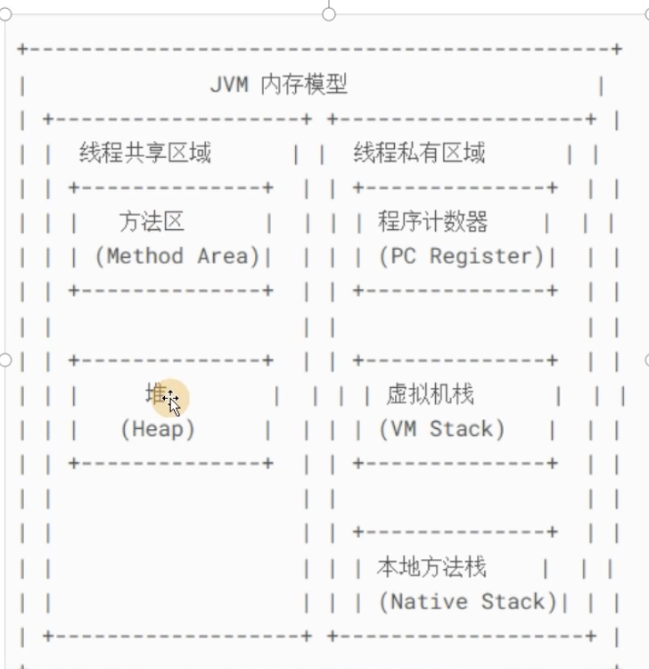
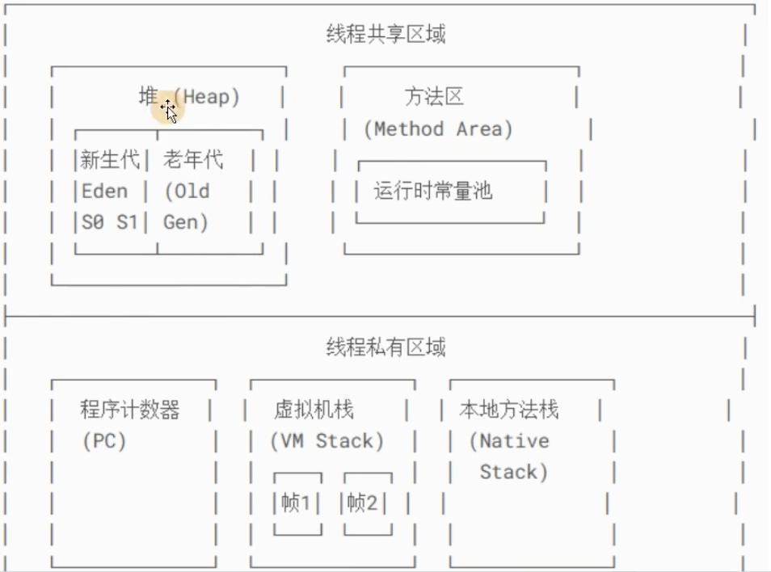
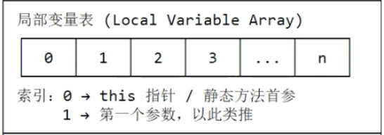

# JVM
## 1. JVM内存模型
1. 内存（运行时数据的区域）分为`线程共享区`和`线程私有区`
    - 
    - 
    1. 线程共享区
        1. 方法区 Method Area
            1. 存放`类的元信息`，Static`常量`， Final`静态变量`，JIT编译后的代码
            2. 包含一些子区域
                1. 运行时的常量池， 存放类，方法，字段的符号引用
            - 放满时，发生OutOfMemoryError（元空间异常）
        2. 堆 heap
            1. 存放所有 `对象实例`和`数组`(引用类型)
                - 字符串常量池（String Table）也在堆中
            2. `垃圾回收GC`的主要区域
                - 堆放满时，发生OutOfMemoryError
    2. 线程私有区
        1. 程序计数器 Program Counter Register
            - 存放下一条待执行的指令的内存地址，能确保`线程切换后`能回到正确的执行位置
        2. 虚拟机栈 VM Stack
            - 存储方法调用的栈帧 Stack Frame
            1. `栈帧`Stack Frame
                1. 局部变量表Local Variable Array，方法参数
                    - 
                2. 操作数栈Operand Stack： 加减乘除
                3. 动态链接Dynamic Link： 指向方法区该方法的引用
                4. 返回地址： 方法结束后，退出到原指令的位置
            2. 可能发生的异常：
                1. StackOverflowError， 栈深度超出限制，比如`无限递归`
                2. OutOfMemoryError
        3. 本地方法栈 Native Method Stack
            - 主要是存放供JVM调用的底层（C/C++）的Native方法

2. 面试题：JVM中堆和栈的区别
    1. 堆Heap
        1. 是线程的共享区域，整个JVM`只有一个堆`
        2. 存储对象实例（new关键字创建的）和数组
        3. 生命周期： 由GC管理
            1. 从new关键字开始创建对象
            2. 当对象不被任何引用链可达时，由GC在某个时间点回收，不能精确控制，可能产生碎片
                - 从GC Root出发，遍历引用连，若对象没有与GC Root链接，则判定可回收
        4. `线程不安全`
            1. 多个线程共享堆中的数据
            2. 需要用synchronized， volatile， 锁来确保并发安全
    2. 栈 VMStack
        1. 是线程私有区域， `每个线程都有一个独立的栈`
        2. 存储方法执行时的`栈帧`
        3. 生命周期： 方法执行时栈帧押入栈顶，执行结束后弹出销毁，不涉及GC,没有碎片话问题
        4. `线程安全`,线程之间不共享数据

## 2. Java对象结构
1. 内存中一个对象的结构由三部分组成
    1. 对象头（Object Header），包含两类信息
        1. Mark Word： 存储对象运行时的元数据
            1. 哈希码 HashCode
            2. GC分代年龄
            3. 锁状态标志（偏向锁，轻量级锁，重量级锁）
            4. 线程持有的锁/偏向线程ID
            5. 偏向时间戳
        2. 类型指针： 指向方法区中对象的类元数据（Class对象）
    2. 实例数据（Instance Data），这个存储的字段值（包含父类继承字段）
        - 字段的排列顺序受JVM分配策略影响
    3. 对齐填充（Padding）
        - JVM要求对象大小必须是`8字节的整数倍`，这能提高内存访问效率（CPU按块读取内存）
        1. 比如一个类包含int和String两个成员
            1. 对象头：12字节
            2. int： 4字节
            3. String（引用）：4字节
            4. 还需填充4个字节凑够24字节

## 3. 如何判断一个对象可以被回收， 你知道哪些回收算法
- https://www.bilibili.com/video/BV1RJ7r6HEv4?spm_id_from=333.788.videopod.episodes&vd_source=74a5ce1d05cd44013f5ebb561caa119a&p=6