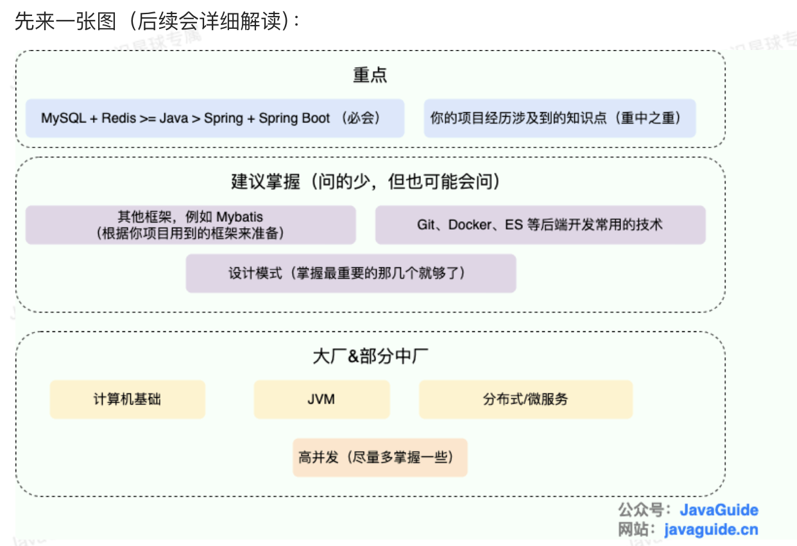

# 复习重点
- 
- 首先看这个: https://javaguide.cn/home.html#%E9%9B%86%E5%90%88
- 其次应该经常刷 知识星球的面试题区
    - https://wx.zsxq.com/group/48418884588288
1. 重点
    1. Mysql + Redis
    2. Java(基础,集合,并发)
    3. Spring + SpringBoot
    4. 项目中涉及的技术
2. 建议掌握
    1. 其他框架 MyBaits
    2. Git, Docker, ES等后端常用技术
    3. 设计模式
3. 大厂
    1. 计算机基础
    2. JVM
    3. 分布式/微服务
    4. 高并发
        - 高并发项目经验: https://www.yuque.com/snailclimb/mf2z3k/zcq5mh

# URL
1. 星球专栏一览
    - https://wx.zsxq.com/group/48418884588288/topic/118811814512212
    1. 后端面试高频系统设计&场景题》
    2. Java 必读源码系列, Dubbo 2.6.x 、Netty 4.x、SpringBoot2.1 
2. Java面试题汇总 2024
    - https://wx.zsxq.com/group/48418884588288/topic/814221214424252
3. 算法面试
    1. 知识星球汇总 https://wx.zsxq.com/group/48418884588288/topic/588124821214444
4. K8s面试题
    - https://wx.zsxq.com/group/48418884588288/topic/188544218511452
5. SpringCloud Alibaba
    - https://wx.zsxq.com/group/48418884588288/topic/211825218818821
6. 典型的系统设计案例（电商系统、优惠卷系统、红包系统、任务调度系统 
    - https://wx.zsxq.com/group/48418884588288/topic/411844111484488
7. 比较难的面试场景题
    - https://wx.zsxq.com/group/48418884588288

# 牛课网
1. AI模拟面试
    - https://www.nowcoder.com/interview/ai/index
2. SQL笔试题(考的不多)
    1. 牛课网 https://www.nowcoder.com/exam/oj?questionJobId=10&subTabName=online_coding_page
    2. LeetCode https://leetcode.cn/problemset/database/
    3. 知识星球汇总 https://wx.zsxq.com/group/48418884588288/topic/211511144184451

# 面试 (重要)
1. 如何介绍项目 https://www.yuque.com/snailclimb/mf2z3k/hlxtez9yy1hfc2y1
2. 项目经验常见问题解答 https://www.yuque.com/snailclimb/mf2z3k/redsrr
3. 有什么问题要问的? https://www.yuque.com/snailclimb/mf2z3k/lnaxv6

# 面试之后
1. Java学习路线 
    1. 知识星球汇总 https://wx.zsxq.com/group/48418884588288/topic/588428281452244
    2. 阿里Java技术图谱 https://developer.aliyun.com/graph/java
2. Go学习路线
    1. 知识星球汇总 https://wx.zsxq.com/group/48418884588288/topic/211251844581141
    2. Go与Java的对比 https://mp.weixin.qq.com/s/JkpzM06IWNb11wUaJWJn8Q
3. 参考: 优秀Java项目 课程推荐
    - https://www.yuque.com/snailclimb/mf2z3k/sq5pg4
4. 性能优化, 参加比赛
    - https://wx.zsxq.com/group/48418884588288/topic/181415224844822