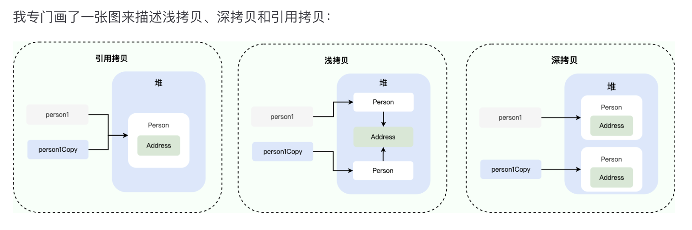

# Java简单
## 0.概念
1. Java SE vs Java EE
    - Java Platform，Standard Edition, 标准版
    - Java Platform, Enterprise Edition, 企业版
        - 包含Servlet, JSP, JDBC等等
2. JVM vs JDK vs JRE
    1. JVM, Java Virtual Machine, 用于运行`Java字节码`的虚拟机
        - Java字节码: 即`.class文件` 
        1. 编译与解释并存
            - `.java文件` -> 通过javac`编译` -> `.class` -> 通过解析器`解释` -> `机器码`
    2. JDK > JRE > JVM > JIT
        - 从 JDK 9 开始，就不需要区分 JDK 和 JRE 的关系了，取而代之的是`模块系统`
## 1. Java数据类型
1. 基本数据类型 8种
    1. 6种数字类型
        1. 4种整数类型 byte, short, int, long
        2. 2种浮点数类型 float, duble
    2. 1种字符型 char
    3. 1种布尔型 boolean
2. 自动拆箱, 自动装箱
    1. 装箱（Boxing）, 基本类型自动变包装类型, Integer i = 10;
    2. 拆箱（Unboxing）, int n = i; 这个过程是自动的
    - 频繁拆装箱的话，也会严重影响系统的性能, 应该尽量避免不必要的拆装箱操作
## 2. Java的内存, static原理
1. JVM运行时数据区
    1. 线程私有区域
        1. 虚拟机栈(`方法栈`)
            - `临时`的, 方法执行完毕后自动释放内存
            1. 方法内的`局部变量`, 因此随方法执行结束二消失
            2. 对象的引用地址
            3. 记录方法的调用和执行过程
        2. 本地方法栈
        3. 程序计数器
    2. 线程共享区域
        1. 堆(`对象堆`)
            1. 所有new出来的`对象`
            2. `字符串常量池`也在堆内存里, 主要目的是为了避免字符串的重复创建
        2. 元空间(`方法区`)
            1. 存储`类`的结构信息(类名, `成员变量`, 方法)
            2. 存储`static`修饰的东西, 被类的所有实例共享
    3. 非核心区域
        - 直接内存
2. `static`静态方法不能调用`非静态成员`
    1. 静态方法是属于`类`的，在`类加载的时候`就会分配内存
    2. 非静态成员属于`实例`的, 在对象实例化之后才存在
## 3. 面向对象 Object-Oriented Programming
0. 面向对象和面向过程
    - 核心是把程序中的事物都抽象成 “对象”，通过`对象之间的交互`完成功能，而非像面向过程那样`按步骤`写指令。
    1. 面向过程编程（POP） Procedural-Oriented Programming
    2. 面向对象编程（OOP） Object-Oriented Programming
1. Java面向对象三大特征
    1. 封装 Encapsulation, 隐藏细节，安全访问
        - 将对象的属性私有化, 只开放少量方法供外部调用, 
        - 优点: 防止外部随意修改数据导致错误
    2. 继承 Inheritance, 复用代码，扩展功能
        - 子类继承父类的属性和方法，子类可以直接用父类的功能，也能扩展自己的特有功能。
        - 优点: 减少重复代码
    3. 多态 Polymorphism (方法名相同, 究竟调用哪个方法)
        - 优点: 代码更灵活、可扩展
        1. `编译时多态` 方法`重载` Overload, 发生在一个类里面
            - 靠`参数列表`区分, 编译阶段就知道要调用哪个方法
        2. `运行时多态` 方法`重写` Override, 发生在父类和子类之间
            - 靠`对象的实际类型`区分, 运行时才确定要调用哪个方法
2. 可变参数与重载
    - 可变参数只能作为函数的最后一个参数, 可变参数编译后实际会被转换成`一个数组`
    - void method2(String arg1, String... args) 
    - 重载 会优先匹配`固定参数`的方法

## 4. 接口与抽象类
1. 对比接口和抽象类
    0. 设计理念
        1. 接口: 强调`能做什么`, Runnable
        2. 抽象类: 强调`是什么`, Animal
    1. 成员变量
        1. 接口: 虽然没明确写, 但都是`public static final`
        2. 抽象类: 可以是`任意修饰符`
    2. 成员方法
        1. 接口 `默认public`
            1. 默认方法: 有方法体，可被实现类重写, 可定义多个
                - default void sleep() {...}
                - 主要是解决接口 “升级兼容” 问题
                1. JDK9给默认方法配了`private方法`, 仅供default方法调用
            2. 静态方法: 有方法体，只能通过接口名调用；
                1. 私有静态方法
            3. 抽象方法: 无方法体，必须被实现类重写
        2. 抽象类`任意修饰符`
            1. 抽象方法: 无方法体, 子类必须重写
            2. 普通方法: 有方法体, 子类可以继承重写
    3. 构造方法
        - 二者都不能创建实例
        1. 接口: 没有构造方法
        2. 抽象类: 有构造方法, 但仅供子类继承
## 5. Object类
### 5.1. hashCode()与equal()
1. 为什么重写 equals() 时必须重写 hashCode() 方法
    - Java规定如果 equals 方法判断两个对象是相等的，那这两个对象的 hashCode 值也要相等。
    - 但反过来, 两个对象有相同的 hashCode 值，他们也不一定是相等的（哈希碰撞）。
    0. 如果不重写, 会影响到Java的集合运算, 散列集合是通过hashCode()来计算存储位置的
    1. hashCode()这个方法会在`hashMap`中用到, 用来判断一个值是否存在
        1. 若hashCode存在, 则需要在调用equals()方法比较二者, 相同时覆盖, 不同则散裂到其他地址
    2. 若x.equals(y)=true
        1. 若没有重写equals()方法, 则xy内存地址一定是同一个, hashCode也相同
        2. 若只重写了equals(), 没有重写hashCode(), 则可能导致二者的hashCode不同, 这就导致这个类`无法和其他散列集合类一起工作`
### 5.2. toString()
### 5.3. clone() 深拷贝与浅拷贝
- 
## 6. String, StringBuffer, StringBuilder
1. String, StringBuffer, StringBuilder对比
    1. String
        1. 不可变, 使用 final 关键字修饰, 更改后,实际上是创建了一个新的String(新地址)
    2. StringBuffer (JDK1.0) `推荐`
        1. 可变, 线程安全, 所有方法都用`synchronized`修饰
    3. StringBuilder (JDK1.5) `仅单线程可用`
        1. 效率高, 但是没有被synchronize修饰, 是线程不安全的
        2. 相同情况下使用 StringBuilder 相比使用 StringBuffer 仅能获得 10%~15% 左右的性能提升，但却要冒多线程不安全的风险。
2. StringBuffer, StringBuilder对比
    1. 可变, 底层是数组, 有一个value[]和一个count
    3. 扩容问题: 
        - 放不下后,会指向一个新的更长的value[]
## 7. 异常
1. Throwable
    1. Error
    2. Exception
        1. CheckedException, 需要try-catch或者throws处理
        2. UncheckedException, 类似于Bug, RuntimeException
## 8. 反射
- Java 反射 (Reflection) 是一种`在程序运行时`，动态地获取类的信息并操作类或对象（方法、属性）的能力。
- `IoC`利用反射实例化对象, 框架通过反射读取`注解`的逻辑, 动态代理实现`AOP`, `ORM框架`通过反射把数据转换成Java对象
1. 通过反射获取类的 Class 对象
    1. 通过字符串获得类(最常用)
        - Class<?> clazz = Class.forName("com.test.User");
    2. 通过对象获取
        - Class<?> clazz = user.getClass();
2. 通过反射创建对象(通过构造器)
    1. 获取`public`构造器
        - clazz.getConstructor(String.class, int.class).newInstance("张三", 20);
    2. 获取`任意访问权限`的构造器
        - clazz.getDeclaredConstructor();
        - constructor.setAccessible(true);
3. 通过反射调用方法
    1. 获取方法
        1. 获取共有方法
            - Method method = clazz.getMethod("sayHello", String.class);
        2. 获取任意访问权限的方法
            - clazz.getDeclaredMethod("showAge");
            - method.setAccessible(true);
    2. 调用方法
        - method.invoke(user, "Java反射");
    3. 只要方法名(用于日志)
        - String methodName = method.getName();
4. 通过反射访问字段
    1. 获得共有字段
    2. 判断字段类型
        - 	Class<?> type = field.getType();
5. 其他常用工具
    1. 获取类的简单名称(不含包名)
        - clazz.getSimpleName();
    2. 获得类的全名
        - clazz.getName();
    3. 判断对象是否是该类的实例
        - boolean isUser = clazz.isInstance(user);
        - 替代instanceof，动态判断类型
## 9.代理模式
- 不修改目标对象的代码，通过代理对象`包裹`目标对象，给目标对象的方法`添加增强逻辑`（如日志、权限、事务）。
### 9.1 静态代理(Static Proxy)
- 代理类在`编译期`就已确定（手动编写代理类代码），`一对一`绑定目标类，增强逻辑`写死`代理类中。
1. 具体代理方法, 通过`实现相同接口`，包裹目标对象
```java
//1. 代理目标, 实现UserService接口
class UserServiceImpl implements UserService {
    @Override
    public void addUser(String username) {
        System.out.println("添加用户：" + username); // 核心业务
    }
}
//2. 手动编写静态代理类, 也要实现UserService接口
class UserServiceStaticProxy implements UserService {
    // 2.1 持有目标对象（接口对象, 到时候传入Impl）
    private UserService target;
    // 2.2 通过构造器传入目标对象
    public UserServiceStaticProxy(UserService target) {
        this.target = target;
    }
    // 2.3 增强目标方法（核心：添加额外逻辑）
    @Override
    public void addUser(String username) {
        // 前置增强：日志
        System.out.println("[静态代理] 调用addUser方法，参数：" + username);
        // 调用目标对象的核心方法
        target.addUser(username);
        // 后置增强：记录结果
        System.out.println("[静态代理] addUser方法执行完成");
    }
}
//3. 创建对象时
//3.1 接口类传实现对象
UserService target = new UserServiceImpl();
//3.2 再把Impl对象传入Proxy构造方法里, 构造代理对象
UserService proxy = new UserServiceStaticProxy(target);
//3.3 真正被调用的是代理实例的增强后的方法
proxy.addUser("张三");
```
2. 缺点
    1. 只能代理`实现了接口的类`
    2. 一一对应, 目标类多的时候也要写很多代理类
### 9.2 动态代理
- 代理类在`运行期动态生成`（无需手动编写代理类代码），通过`反射`动态绑定目标类，增强逻辑可通用化，`一对多`适配任意目标类。
- Java中动态代理的分类
    1. JDK动态代理, 基于接口实现（要求目标类必须实现接口）；
    2. CGLIB 动态代理：基于字节码生成(目标类无需实现接口，继承目标类生成代理类)。
#### 9.2.1 JDK动态代理(官方) (要求目标类需要实现接口)
1. 核心是`实现InvocationHandler接口` + `Proxy.newProxyInstance(...)`
    - 生成一个接口的实现类来作为代理
```java
//1. 代理类(实现InvocationHandler接口即可)
class XXXProxy implements InvocationHandler {
    // 1.1 持有任意类型的目标对象（通用化关键）
    private Object target;
    // 1.2 和上面一样, target传进来
    public XXXProxy(Object target) {
        this.target = target;
    }
    // 1.3 核心方法：所有代理方法的增强逻辑都在这里
    // method在使用时纯如, 这里直接调用 method.invoke(target, args); 即可
    @Override
    public Object invoke(Object proxy, Method method, Object[] args) throws Throwable {        
        // 前置增强：通用日志
        System.out.println("[动态代理] 调用方法：" + method.getName());
        System.out.println("参数：" + (args == null ? "无" : args[0]));
        // 反射调用目标对象的核心方法（动态绑定）
        Object result = method.invoke(target, args);
        // 后置增强：通用结果记录
        System.out.println("[动态代理] " + method.getName() + "方法执行完成");
        return result;
    }
}

// 2. 测试
// 2.1. 创建目标对象（依然需要接口对象传入实现）
UserService target = new UserServiceImpl();
// 2.2 关键工厂方法 Proxy.newProxyInstance()
UserService proxy = (UserService) Proxy.newProxyInstance(
            target.getClass().getClassLoader(), // 目标类的类加载器
            target.getClass().getInterfaces(),  // 目标类实现的接口
            new XXXProxy(target)    // 增强逻辑处理器
        );
```
#### 9.2.2 CGLib动态代理(无接口的场景)
1. 需要导入CGLib依赖
    ```xml
    <dependency>
        <groupId>cglib</groupId>
        <artifactId>cglib</artifactId>
        <version>3.3.0</version>
    </dependency>
    ```
2. 关键
    1. 代理类`实现MethodInterceptor接口`
    2. main()方法中
        1. 创建 new Enhancer()（CGLIB核心类）
        2. 把目标类设为`父类` enhancer.setSuperclass()
            - 原理是继承, 因此不能代理 `final`
        3. 设置增强处理器
            - enhancer.setCallback(new XXXProxy(new UserServiceImpl()));
        4. 生成代理对象
            - ProductService proxy = (ProductService) enhancer.create();
        5. 调用方法
### 9.3 Spring AOP
1. 可以自动根据目标类来选择代理方法
    1. 目标类有继承接口, 自动选择 JDK动态代理 (效率高)
    2. 没有继承接口, 就选择 CGLib代理

# 10. API 与 SPI
- API 是 “拿来用”，SPI 是 “接进来”
1. API Application Programming Interface 应用程序接口
    - 调用方（开发者）依赖实现方（框架 / 厂商） 的接口
    - ArrayList.add()方法, JDK已经帮你实现好了, 你可以直接调用
2. SPI Service Provider Interface服务提供接口
    - 实现方（第三方开发者）依赖调用方（框架） 的接口 
    - JDBC 定义了数据库连接的 SPI 标准(java.sql.Driver接口)
    - MySQL、Oracle 等厂商按这个标准实现各自的Driver类
    - JDBC 框架通过 SPI 机制，在运行时自动加载 MySQL 的 Driver 实现，无需手动注册。

# 11. 序列化, 反序列化
1. 如果考虑把类序列化成文件的话, 不要使用JDK自带的序列化方法
2. 只考虑网络传输的话   
    1. JSON格式
        1. SpringBoot应用
            - SpringBoot 已内置 Jackson，无需额外引入
            1. DTO类`不需要实现`Serializable
            2. 只需要 `@RestController` 就能全自动序列化反序列化
    2. Java 专属 RPC（Dubbo + Kryo，简化版高性能）
        - 引入依赖
        - Dubbo 配置文件中指定序列化方式：serialization: kryo

## 12. 泛型Generic,通配符
1. Java的伪泛型(本质为编译期间的语法糖)
    - 编译器会在编译期间,擦除泛型转换成一般类,`将泛型T擦除为Object`
    1. 这意味着一些方法的重载会报错
    2. 编译期间就会报错, 而且泛型本身可以通过extend和supper来做限定
2. 伪泛型带来的限制
    1. 无法根据泛型类型做判断
        - if (list instanceof List<String>) 编译报错
    2. 无法实例化泛型对象 `new T()`, `new T[]`
        - 因为T擦除成Object之后, 编译器不知道创建什么对象
    3. 泛型类型不能是基本类型
    4. 不能定义泛型静态类
    5. 重载冲突
        1. `void func(List<String> list){}`
        2. `void func(List<Integer> list){}`
        - 擦除后都会变成`List<Object>`, 无法区分, 因此就没有重载了
3. 通配符
    1. `<? extends Person>`, 上边界限定符, 限定为Person的子类
    2. `<? super Manager>`, 下边界限定符, 限定为Manager的父类

