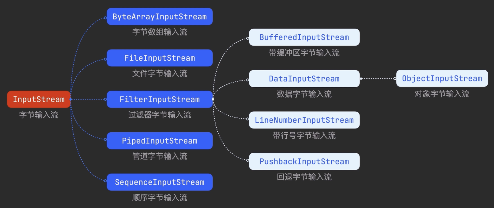

、
# IO流
## 1. BIO
### 1.1 File类 (文件和目录)
- 11个常用方法, 查询,修改,批量
#### 1.1.1 方法一览
1. 查询操作
    - exists(), isDirectory(), isFile()
    - getName(), getPath()
    - file.getParentFile().mkdirs() 
2. 修改操作
    - createNewFile(), mkdir(), mkdirs()
    - delete(), renameTo(File)
3. 批量操作
    - listFiles()
#### 1.1.2 操作示例
1. 创造, 删除, 修改
    1. 创建File对象
        - `File file = new File("");`
    2. 接下来所有操作都要`先判断真的文件是否存在`
        - `if(!file.exists){...}`, 创建的时候文件不能存在
        - 改名, 删除 的时候文件应当存在
    3. 创建真正的文件/目录
        - `boolean result = file.createNewFile()`
        - `boolean result = file.mkdir()`,创建一个文件夹
        - `boolean result = file.mkdirs()`,创建多级目录 
    4. 改名
        - `boolean result = file.renameTo(new File("新路径/名称"))`
    5. 删除
        - `boolean result = file.delete()`
2. 递归删除文件夹
    1. 判断当前路径是不是一个文件夹
        - `file.isDirectory && file.exists()`
        2. 文件夹有一个列出下面所有文件/文件夹的方法
            - `File[] files = file.listFiles()`
        3. 遍历这个数组, 递归该方法 
            - `for(File f : files){func(f)}`
    2. 不是文件夹就删除, 能走到这一步的都是文件
        - file.delete()
### 1.2 字节输入流, 字节输出流
- 
0. InputStream`字节流`
    1. ByteArrayInputStream 字节数组
    2. FileInputStream 文件
    3. FilterInputStream 过滤器
        1. Buffered 带缓冲区
        2. Data 数据
            1. Object 对象
        3. LineNumber 带行号
        4. Pushback 回退
    4. PipedInputStream 管道
    5. SequeceInputStream 顺序
1. 字符如何存储在电脑上?
    1. 一段文本`abcd`->->`97 98 99 100`->转换为字节
    2. 先从ASCII码表找到对应的码值
        - `97 98 99 100`
    3. 转换为对应的字节 (97 = 64+32+1 = 2⁶+2⁵+2⁰)
        - `01100001 01100010 01100011 01100100`
#### 1.2.1 FileInputStream 文件字节输入流
- 每次读取`单个字节`, 或者一个字节数组`byte[]`
- 文件包括: 文本, 图片, 音乐, 视频等等
1. 初始化
    - new FileInputStream("直接文件路径")
    - new FileInputStream(File file)
2. 读取 + 关闭
    - 通过`int read()`方法, 一次读入一个字节`01100001`
    - 当读取结果为`-1`时, 表示文件读完了
    - 
    ```java
    try{
        int b;
        while((b = in.read()) != -1){ //开发时最常用的写法
            sout((char)b);
        }
    } catch (...){...}
    finally{
        if(in != null){ in.close(); } //记得一定要关闭流 close也有异常要处理
    }
    ```
3. 为什么`int read()`读取的是字节, 返回的却是int?
    - 和`-1`有关,防止把文件中的`-1`误认为是文件结束
    1. 在Java中 一个二进制的`最高位是符号位`,0表示正数, 1表示负数
        - 但一个负数并不是修改最高位那么简单
    2. 一个正数1的二进制: `00000001`
        1. 先取得源码的`取反`: `11111110`
        2. 再加1 : `11111111`, 这个才是-1的二进制
    3. 设计者把返回值类型设为`int`, 这样-1的二进制就变成了:
        - `00000000 00000000 00000000 11111111` 255
        - 防止直接读到-1
4. `read(byte[自定长度])`方法可以一次读入多个字节
    - `while((in.read(bytes)) != -1)`
    1. 多余字节问题, 之前的数据没有被刚好覆盖
        - sout(new String(bytes, 0, length))
#### 1.2.2 FileOutputStream 文件字节输出流
- 每次写入`单个字节`, 或者一个字节数组`byte[]`
- 若文件不存在, 输出流可以自动创建文件
1. 初始化
    1. 这一步需要捕捉 FileNotFoundException
        - 若文件没有事先建好, 需要 `exists() + createNewFile()`
    2. 构造方法
        1. `new FileOutputStream("路径"/File, boolean append)`
            - append是可选的, 默认false, 表示覆盖
2. 准备要写入的东西
    1. 字符串`str = "abcd"`
        - 转换成字节数组 `byte[] = str.getBytes()`
3. out.write(bytes), 会自动写入
4. 别忘了关闭流
#### 1.2.3 复制文件
0. 定义输入输出流
1. 首先需要定义一个缓冲区
    - `byte[] bytes = new byte[1024];`
2. 每次读取这么多数据
    - `while((length = in.read(bytes)) != -1)`
    - `out.write(bytes, 0, length)` (精准读取)
        1. 把byte的从下标(offset)为0的开始, 读取length个数据
        2. write()方法默认就`追加`, 与out的定义无关 
3. 关闭输入输出流
### 1.3 字符输入流, 字符输出流
1. 汉字的编码
    - 对应`ASCII字符集`的是`GB(国标)2312字符集`, 有7000+个字符
    1. 字节与字符
        1. 一个字节 8位二进制 最多表示256个字符
        2. 两个字节 能表示65535个字符
            - 因此中文采用两个字节对应一个汉字
    2. GBK字符集: 兼容GB2312, 包含20000+个汉字
2. UTF-8
    - 如果每个国家都用自己的编码集, 不利于交流
    - 因此`使用Unicode字符集`, 汉字: 4E00~9FFF
    - UTF-8是Unicode的实现方式: 英文1字节, 中文3字节
3. 字符流本质: 字节流 + 编码表, 自动完成字节↔字符转换
#### 1.3.1 FileReader 字符输入流
- 专门处理文本文件, 避免字节流读取中文乱码
1. 初始化
    - new FileReader("文件路径"/File file)
    - 底层默认用系统编码, 需指定编码用: `new InputStreamReader(new FileInputStream(file), "UTF-8")`
2. 核心方法
    1. `int read()`: 读取单个字符, 返回字符编码值(-1表示结束)
    2. `int read(char[] cbuf)`: 读取字符到数组, 返回读取的字符数
    3. `close()`: 关闭流
3. 读取示例
    ```java
    try(FileReader fr = new FileReader("test.txt")){
        char[] cbuf = new char[1024];
        int len;
        while((len = fr.read(cbuf)) != -1){
            System.out.println(new String(cbuf, 0, len));
        }
    } catch (IOException e){
        e.printStackTrace();
    }
    ```
#### 1.3.2 FileWriter 字符输出流
- 自动将字符转换为字节写入文件
1. 初始化
    - `new FileWriter("路径"/File, boolean append)`
        - append默认false(覆盖), true为追加
    - 指定编码: `new OutputStreamWriter(new FileOutputStream(file), "UTF-8")`
2. 核心方法
    1. `write(int c)`: 写入单个字符
    2. `write(char[] cbuf)`: 写入字符数组
    3. `write(String str)`: 直接写入字符串(最常用)
    4. `flush()`: 刷新缓冲区, 确保写入文件
    5. `close()`: 关闭流(自动flush)
3. 写入示例
    ```java
    try(FileWriter fw = new FileWriter("test.txt", true)){
        fw.write("你好Java");
        fw.flush();
    } catch (IOException e){
        e.printStackTrace();
    }
    ```
#### 1.3.3 缓冲字符流 (高效读写文本)
1. BufferedReader (字符输入缓冲流)
    - 核心方法: `String readLine()` 按行读取文本(返回null表示结束)
    - 示例:
        ```java
        try(BufferedReader br = new BufferedReader(new FileReader("test.txt"))){
            String line;
            while((line = br.readLine()) != null){
                System.out.println(line);
            }
        }
        ```
2. BufferedWriter (字符输出缓冲流)
    - 核心方法: `newLine()` 跨平台换行, `write(String str)`
    - 示例:
        ```java
        try(BufferedWriter bw = new BufferedWriter(new FileWriter("test.txt"))){
            bw.write("第一行");
            bw.newLine();
            bw.write("第二行");
        }
        ```
## 2. NIO(直接去看NIO2)
### 2.1 NIO核心概念
1. NIO vs BIO
    - BIO: 阻塞IO, 面向流, 单线程处理一个连接
    - NIO: 非阻塞IO, 面向缓冲区, 单线程处理多连接
2. 三大核心组件
    - Channel(通道): 双向读写(替代BIO的流), 可同时读/写
    - Buffer(缓冲区): 数据容器, 所有数据通过缓冲区读写
    - Selector(选择器): 单线程监听多个Channel的事件(连接/读写)
### 2.2 Buffer缓冲区
1. 核心属性
    - capacity: 缓冲区总容量(不可变)
    - position: 当前读写位置(初始0, 最大capacity-1)
    - limit: 读写限制(写模式=capacity, 读模式=position)
    - mark: 标记位置, 可通过reset()回到mark位置
2. 核心方法
    1. 初始化: `ByteBuffer buf = ByteBuffer.allocate(1024)` (堆缓冲区)
        - `ByteBuffer buf = ByteBuffer.allocateDirect(1024)` (直接缓冲区, 效率更高)
    2. 写入数据: `buf.put(byte b)` / `buf.put(byte[] bytes)`
    3. 切换为读模式: `buf.flip()` (limit=position, position=0)
    4. 读取数据: `buf.get()` / `buf.get(byte[] dest)`
    5. 清空缓冲区: `buf.clear()` (重置position=0, limit=capacity, 数据未删除)
    6. 重复读取: `buf.rewind()` (position=0, 不修改limit)
3. 常用Buffer类型
    - ByteBuffer(最常用), CharBuffer, IntBuffer, LongBuffer等
### 2.3 Channel通道
1. 常用Channel实现类
    - FileChannel: 文件通道(处理文件IO)
    - SocketChannel: 客户端TCP通道
    - ServerSocketChannel: 服务端TCP通道
    - DatagramChannel: UDP通道
2. FileChannel核心操作
    1. 获取Channel
        - `FileChannel inChannel = new FileInputStream(file).getChannel()`
        - `FileChannel outChannel = new FileOutputStream(file).getChannel()`
    2. 读取数据到缓冲区
        - `int len = inChannel.read(buf)` (返回读取的字节数, -1结束)
    3. 写入数据到文件
        - `buf.flip()` (切换读模式)
        - `outChannel.write(buf)`
    4. 关闭通道: `channel.close()`
3. 高效文件复制(Channel直接传输)
    ```java
    try(FileChannel in = new FileInputStream("src.txt").getChannel();
        FileChannel out = new FileOutputStream("dest.txt").getChannel()){
        in.transferTo(0, in.size(), out); // 直接通道传输, 无需缓冲区
    }
    ```
### 2.4 Selector选择器 (非阻塞核心)
1. 核心作用: 单线程管理多个Channel, 监听Channel的事件
2. 事件类型
    - SelectionKey.OP_READ: 可读
    - SelectionKey.OP_WRITE: 可写
    - SelectionKey.OP_CONNECT: 连接成功
    - SelectionKey.OP_ACCEPT: 接受连接
3. 核心使用步骤
    1. 创建Selector: `Selector selector = Selector.open()`
    2. 通道设置为非阻塞: `channel.configureBlocking(false)`
    3. 注册通道到Selector: `SelectionKey key = channel.register(selector, SelectionKey.OP_READ)`
    4. 监听事件: `int readyChannels = selector.select()` (阻塞直到有事件)
        - `selector.selectNow()` (非阻塞, 立即返回)
    5. 处理事件:
        ```java
        Set<SelectionKey> keys = selector.selectedKeys();
        Iterator<SelectionKey> it = keys.iterator();
        while(it.hasNext()){
            SelectionKey key = it.next();
            if(key.isReadable()){
                // 处理可读事件
            }
            it.remove(); // 必须移除, 避免重复处理
        }
        ```
### 2.5 NIO.2 (Path/Paths/Files工具类)
1. Path (替代File类)
    - 创建Path: `Path path = Paths.get("文件路径")`
    - 核心方法:
        - `path.toAbsolutePath()`: 绝对路径
        - `path.getParent()`: 父路径
        - `path.getFileName()`: 文件名
2. Files工具类 (简化文件操作)
    1. 文件判断: `Files.exists(path)` / `Files.isDirectory(path)`
    2. 文件操作:
        - `Files.createFile(path)` / `Files.createDirectory(path)`
        - `Files.copy(path, new FileOutputStream("dest.txt"))`
        - `Files.delete(path)` / `Files.move(path, newPath)`
    3. 读取文件:
        - `List<String> lines = Files.readAllLines(path, StandardCharsets.UTF_8)` (按行读取)
        - `byte[] bytes = Files.readAllBytes(path)` (读取所有字节)
    4. 写入文件:
        - `Files.write(path, "内容".getBytes(StandardCharsets.UTF_8))`
        - `Files.write(path, Collections.singletonList("一行内容"), StandardCharsets.UTF_8, StandardOpenOption.APPEND)`
    5. 遍历目录:
        ```java
        Files.walk(path, 5) // 递归深度5
             .filter(Files::isRegularFile)
             .forEach(System.out::println);
        ```

### 总结
1. 字符流核心: 字节流+编码表, 专门处理文本, 优先用缓冲字符流(BufferedReader/BufferedWriter)
2. NIO核心: 通道(双向)+缓冲区+选择器, 非阻塞IO适合高并发, NIO.2(Path/Files)替代传统File类更高效
3. 选型原则: 简单文本操作用BIO字符流, 大文件/高并发用NIO, 日常文件操作优先NIO.2

### Java常见三种IO模型
1. BIO, Blocking IO  `同步阻塞模型`
    - 应用程序发起read调用后, 会一直阻塞, 直到内核把数据拷贝到用户空间
    - `一个IO请求就会需要一个线程`, 高并发的情况下`线程数量过大`
    - `流模型`（数据只能单向(输入流只读、输出流只写)、逐个读取）

2. NIO, Non-blocking IO, `同步非阻塞 IO 模型`或者`多路复用模型`。
    - Netty框架, epoll工作机制
    - 供了 Channel , Selector，Buffer 等抽象。
    - NIO 核心目标是`单线程处理多连接`，通过 “非阻塞 + 事件驱动” `降低资源消耗`。
    - `缓冲区模型`（先把数据批量读入缓冲区，再从缓冲区读取），减少系统调用次数。
    1. Buffer, 缓冲区, 本质是数组
        - 让请求可以一直进入, 这对于`服务端`来说的确是非阻塞的
    2. Channel, 通道, 同时支持读和写操作, 支持双向IO
    3. Selector, 选择器, 封装了操作系统的`IO 多路复用机制`,`epoll()`
        - 让一个线程监听多个 Channel 的 IO 事件（连接、可读、可写），实现 “单线程多通道”

3. AIO, Asynchronous IO, 也称为NIO2, 是异步IO模型
    - 核心目标是`简化NIO的操作`, 同时补充异步IO的能力
    1. 核心:
        1. `Path/Paths` 是对操作系统「文件路径」的抽象, 替代了File类
            - p.toFile(), f.toPath()
        2. `Files工具类`, 将文件操作的通用逻辑（读 / 写 / 复制 / 删除 / 遍历）封装为静态方法
            - 内部实现是复用了NIO的Channel和Buffer操作
        3. 异步IO(AsynchronousFileChannel/AsynchronousSocketChannel)


#### 如何选择
- 日常简单文件操作（读 / 写 / 复制 / 遍历）→ 优先用 NIO.2（代码少、效率高）；
- 低并发文本处理、快速实现功能 → 用 BIO（易上手）；
- 高并发网络编程、大文件非阻塞处理 → 用 NIO（结合 Netty 等框架）。