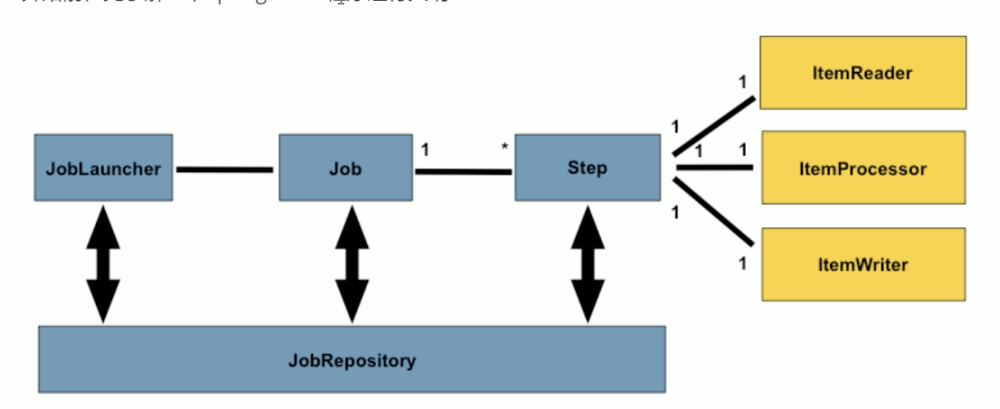

# SpringBatch
1. SpringBatch是一个批处理应用框架,而不是调度框架(schuedling框架),需要结合调度框架来使用
    - Springbatch提供可重用的组件
        - 日志，追踪，事务，任务统计重启跳过重复，资源管理
    - 但是SpringBatch`不提供调度框架`
        - 需要一个调度框架实现定时执行，Quartz，Airflow
    1. 自动执行，提前设置逻辑
    2. 数据量大， 百万到上千万， 但是数量到十亿以上时应该使用大数据工具
    3. 定时执行，每天，每周，每月
2. 批处理的流程:
    1. 系统A`导出数据`到一个`文件`中,不能使用Dubbo接口
        - 一般是有两个系统
    1. 系统B从数据库，文件或队列中读取大量记录
    2. 处理数据
    3. 以修改之后的形式存储数据
3. SpringBatch核心架构
    1. 应用层 Application， 批处理作业，写的代码
    2. 核心层 Batch Core， JobLauncher，Job，Step
    3. 基础架构层 Instrument，提供通用的读写服务处理
4. 程序运行大纲核心4个:
    - 
    1. `JobLaucher`,作业调度器，作业启动的入口
    2. `Job`,任务
        - 在 spring batch 的体系当中只是一个最顶层的一个`抽象概念`
        - 体现在代码当中则它只是一个最上层的接口,一个Job可以包含多个Step
        1. `Step`,步骤，完成所有Step后一个JOB才算做成
            - Tasklet
            1. ItemReader(读取数据)
            2. ItemProcessor(处理数据)
            3. ItemWriter(写回数据)
    3. `JobRepository`
        1. 可以看作是一个数据库的接口,在JOB和Step执行时可以通过这个来持久化一些信息
        2. 因此SpringBatch需要持久化数据

# Demo
1. 导入依赖，除了SpringBatch，还需要一个数据库
    - 数据库配置四要素，账号，密码，URL（库名可以自定义），驱动名称
    - 然后指定数据库初始化脚本 `spring.sql.init.schema-location:xxx.schema.mysql.sql`
        - 这个脚本是SpringBatchCore包自带的
    1. 启动后会自动配置9个表出来
        - 注意重复启动会报错，因此启动一次后，需要把`sql.init.mode`设为`never`

3. 在`启动类`上需要两个注解
    - `@SpringBootApplication`//@Configuration
    - `@EnableBatchProcessing`//有这个注解才会运行SpringBatch
        - 其实这个注解本身就能引入JobLauncher,JobBuilderFactory,StepBuilderFactory,不用手动autowired
    1. 如果是demo的话可以直接@Autowired注入
        1. `JobLauncher`,作业启动器
        2. `JobBuilderFactory`,Job构造工厂
            1. get("JobName")，指定名称
            2. start(step1).next(step2)
            3. build()
        3. `StepBuilderFactory`Step构建工厂
            1. .get("StepName")，指定名称
            2. 两种方式，指定做什么
                1. .tasklet(new Tasklet(){...})
                    - 类似Runnable接口,这种方法适合执行简单的逻辑
                    - `RepeatStatus execute(Stepcontribution, ChunkContext)`
                        - 注意这个返回值是个枚举, RepeatStatus.FINISHED，表示这个Step完成了
                2. .chunk()，块状处理方法
                    1. ItemReader,读取数据
                    2. ItemProcessor,
                    3. ItemWriter
            3. build()

4. RepeatStatus
    1. 一般返回Finish
    2. 
5. Step返回的是`ExitStatus`
    1. COMPLETED, 成功执行完毕
    2. FAIL，执行失败
    3. NOOP， 无效执行

6. 总结数据表（9张）
    1. BATCH_JOB_INSTANCE
        - 作业第一次执行时，会生成一条唯一的记录，用于记录JOB_KEY
    2. BATCH_JOB_EXECUTION，执行对象
        - 每次启动作业，会生成一条记录，有执行ID，执行时间，批处理状态
        - 作业失败重新执行也会生成新的执行对象
    3. BATCH_JOB_EXECUTION_PARAMS
        - 一个参数一条数据
    4. BATCH_JOB_EXECUTION_CONTEXT
        - 里面保存了JobConTEXT的对象数据 
    5. BATCH_STEP_EXECUTION
        - 记录步骤的执行状态
        - 这里面甚至有读入，处理，写出时，抛出异常时而跳过的条数
    6. BATCH_STEP_EXECUTION_CONTEXT
        - 里面保存了JobConTEXT的对象数据 
       