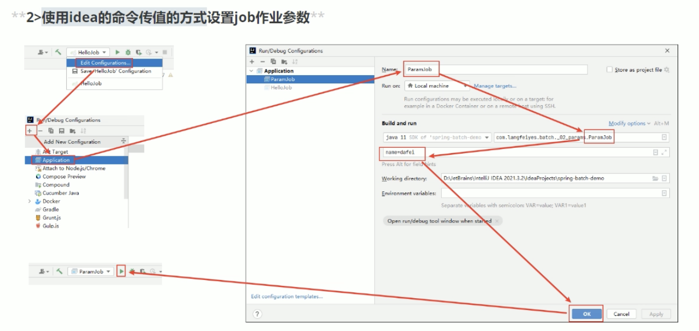

# JOB
0. 汇总
    1. 作业介绍
    2. 作业配置
    3. 作业参数
    4. 作业上下文

1. JOB可以理解为`一段业务逻辑`，可以拆分成多个Step
    - 这个JOB中的逻辑应该是可以`独立的`，不受外部影响的情况下执行
    - 里面的Step是`有固定顺序的`,应该`从头到尾`执行

2. 如何确保JOB的独立？
    - `Job Instance（作业实例对象）`和`Job Execution（作业执行对象）`
    0. 定义好一个JOB
    1. `Job Instance = Job名称 + 标记参数`， 表示`一次运行`
        - 比如一次日终处理，把mysql数据同步到ES里面：
            1. 作业名称： daily-sync-job
            2. 作业标记参数： 当天日期
        - 之后每次启动都生成一个新的Job Instance，因此`一个JOB对应多个JI`
        - 注意： 如果 Job名称 + 标记参数 不变的话，Springbatch`不会重复执行`成功完成的批处理，但是会记录JE的状态为`NOOP（无效）`
    2. `Job Execution`
        - 当作业运行时，还会创建一个`Job Execution`用于记录job的执行情况（开始结束时间，执行结果状态）
        - 一个Job Instance可能出现异常，异常后可以重新执行这个JI， 因此`一个JI对应多个JE`

3. 每次执行后，JI和JE会存储到数据库中
    1. BATCH_JOB_INSTANCE
        1. JOB启动后创建一条JI记录
        2. 包含JobID，JIID等信息
    2.  BATCH_JOB_Execution
        1. 记录JI的执行结果

# JobParameters, 作业参数
1. JobParameters
    1. 里面是一个`Map<String, JobParameter>`
        - JobParameters包含三个属性
            1. object， 参数值
            2. ParameterType， 参数类型
                - 可以是Long，Dubble，Date，String
            3. boolen， 这个用来区分
    2. 设置param
        - JobLauncher.run(Job, JobParameters)
        - 最终实现类是一个`SimpleJobJauncher`
        
2. 使用idea工具传入参数
    - 
    1. 需要使用idea的命令传值
        1. `Edit Configuration`
        2. 设置`Build and Run`
        3. 以KV对的方式设置参数
            - `param1=abc`
    2. 查看数据表
        1. BATCH_JOB_INSTANCE
        2. BATCH_JOB_Execution
        3. BATCH_JOB_Execution_PARAMS
            - 这里可以看到执行参数的记录
        

3. 使用`ChunkContext`获取参数
    - tasklet里面 `RepeatStatus execute(Stepcontribution, ChunkContext)`
    - Map<String, Object> = chunkContext.getStepContext().getJobParameters();
4. 也能用`@Value`获取参数

5. 参数校验器
    1. 自定义参数校验器，`JobParamaterValidator`
        - 这是个接口，需要加一个校验器类来实现
        - 定义了一个 `JobParametersInvailidException`
        1. 加在JobBuilder里使用
            - jobBuilderFactory.get().start()`.validator(xxxValidator)`.build()
    2. 默认参数校验器，`DefaultJobParamaterValidator`
        - 里面维护两个数组集合`requiredKeys`和`optionalKeys`
        1. validator.setReqiuredKeys(new String[]{"name"})
        2. 然后在JobBuilder里使用

# 作业参数增量器 JobParameterIncrementer
- 可以让`标志参数`每次都变动, 提供`run,id`和`时间戳两种`


# 作业监听器 JobExecutionListener
- 一般用于在作业执行前和执行后的时间点嵌入逻辑
- 也是个接口，有点像AOP？可以`实现接口`或者`使用注解`
1. 实现接口
    1. 作业执行前 beforeJob（JobExecetion）
        - 建立各种链接，线程池初始化
    2. 作业执行后 afterJob（JObExecetion）
        - 一般是清理动作，释放资源等
    3. 具体用法，加在JobBuilder里使用
        - jobBuilderFactory.get().start()`.listener(xxxListener)`.build()
2. 使用注解
    - 还是需要建一个新的类，然后在方法上加上`@BefoerJob`注解


# Step也有监听器
1. StepExecutionListener，用法和
    - void beforeStep（）
    - afterStep（）
        - return stepExecution.getExitStatus()
2. Chunk Listener


# JOBの実装,Step的顺序(不写业务)
```java
@Configuration
public class SampleBatchConfig{
    /*
        定义JOB,返回类型为Job,参数为JobRepository和要使用的Step(可变长)
        APP执行时就执行这个方法
    */
    @Bean
    private Job sampleJob(JobRepository jobRepository,
                         Step sampleStep1,
                         Step sampleStep2){
        //1. 完全按顺序执行
        return new JobBuilder("sampleJob", jobRepository)//第一个为ID   
                    .start(sampleStep1)//第一个Step
                    .next(sampleStep2)//其他都是next
                    .build();
        
        //2. 简单判断,A成功则执行B,A执行失败则执行C
        // on() -> if
        // from() -> else,结合上一个on()一起使用
        // end() -> 表示Batch`正常`终了,这时是不会记录进Repository的,不能再执行,要注意
        return new JobBuilder("sampleJob", jobRepository)
                    .start(stepA)
                    .on(*).to(stepB)//アスタリスク（Asterisk星号,默认走B
                    .from(stepA).on("FAILED").to(stepC)//若FAILED,则走C
                    .end()
                    .build()
        //3. 如果想让某一步失败后重新执行,应当使用fail()
        //fail()表示Batch`失败停止`,这时会记录进去,并且可以Restart
        return new JobBuilder("sampleJob", jobRepository)
                    .start(stepA)
                    .next(stepB).on("FAILED").fail()
                    .from(stepB).on("*").to(stepC)//若FAILED,则走C
                    .end()
                    .build()
    }
    /*
        定义Step
        PlatformTransactionManager: SpringBatch已经定义好了
        Tasklet: 具体业务,需要自己实现tasklet接口定义
    */
    @Bean
    Step sampleStep(JobRepository jobRepository,
    PlatformTransactionManager transactionManager,
    Tasklet sampleTasklet){
        return new StepBuilder("sampleStep", jobRepository)
            .tasklet(sampleTasklet, transactionManager)//看你要不要事务处理
            .build();
    }
}
```
