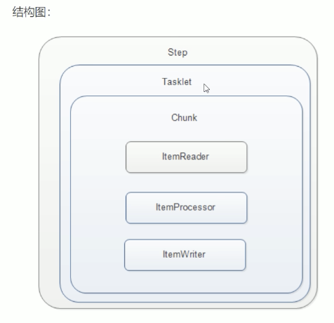

JOB -》 Step-Chunk -〉Reader -》writer
# Chunk Model的实装
- 
- Tasklet里面包含Chunk， 所以最外面还是要execute（）
1. 什么是chunk?
    - 这三个都是接口
    1. `ItemReader<T>`、读入操作
        - T read()，读入item
    2. `ItemProcessor<I, O>`、加工处理操作
        - O process((I)item)， 返回处理后的item
        - 每次读入和操作都是`只处理一个item`
    3. `ItemWriter`、写入操作、File/DBを更新　
        - 所有（块大小）读和操作都完成后，才会汇总成items，`一次性进行`写处理
        - 参数是List<Bean>,write(items)
    - 实装时分别做成这三个类、或者把一个事务做成一套Chunk
    - 在一个chunk里面,一次读入
2. 使用
    1. 首先分别用三个类实现这三个接口，写入逻辑
        1. reader造成的死循环问题，仅当read()`返回值为null时`才会停止
    2. 创建step
        - stepBuilder.get(step1)
            - .chunk(3) // 这个是块的大小, `三次读，三次处理，一次写出三个值`
            - .reader(xxxReader)
            - .processor(xxxProcessor)
            - .writer(xxxwriter)
            - .build()


2. chunk的单位
    1. 如果chunk的单位是2,而csv文件有3个
        1. ItemRead执行一次(读入第一个文件),执行第二次(读入第二个文件)
        2. ItemProcessor执行一次(执行第一个文件),执行第二次(执行第二个文件)
        3. ItemWrite仅执行一次(写入DB)
        4. 因为还有一个csv,所以上面的再进行一次
    2. chunk的使用
        1. 
        ```java
        @Configuration
        public class SampleBatchConfig{
            //sampleJob
            //...
            @Bean
            Step sampleStep(JobRepository jobRepository, PlatformTransActionManager transactionManager){
                return new StepBuilder("sampleStep", jobRepository)
                    .<ReceiveFileInfo, ProcessedFiledInfo> chunk(1000, tM)
                    .reader(iReader)
                    .processor(iProcessor)
                    .writer(iWriter)//为了防止空指针,这些对象应该注入进来
                    .build();
            }
        }
        ```
        2. `.<I, O> chunk(1000, tM)` ジェネリクス
            - I:入力情报的保管Bean
            - O:出力情报的保管Bean
            - 1000:commit单位,也就是Chunk单位
            - tM: transactionManager
    3. ItemReader的使用
        ```java
        //本身是个接口,返回T类型对象
        public interface itemReader<T>{
            @Nullable//如果返回null,则认为是读取完毕
            T read() throws Exceptions;
        }
        ```
        1. DB的读入
            1. JDBC
                - JdbcCursorItemReader,カーソル、一件ずつ、直列
                - JdbcPagingItemReader、指定件数ずつ、並列（へいれつ）
            2. MyBatis
                - MyBatisCursorItemReader
                - MyBatisPagingItemReader
            3. JPA
                - JpaCursorItemReader
                - JpaPagingItemReader
        2. 文件读入
            1. 单一,FlatFileItemReader
            2. 复数,MuiltResourceItemReader
    