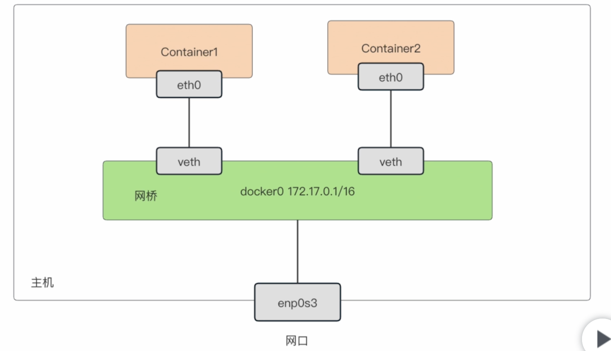

# 容器之间的通讯
## 单机模式下
1. 四种通讯模式
    - 使用`docker network ls`查看
    1. bridge 桥接模式
    2. host 和宿主机共享网络
    3. portMap 端口映射
    4. none 完全隔离
## bridge 桥接模式

- 桥接模式是docker默认的, docker会提供一个网桥用于通讯
    - 容器1 -> 网桥 -> 容器2
    - 网桥 -> 网口(以宿主机的名义链接互联网)
1. 容器间相互访问
```bash
docker run --name web1 -d nginx:1.19
docker run --name web2 -d hello_docker:v2
docker exec -it web1 bash

# 需要看一下web2的ip, 桥接默认不支持容器名解析
docker inspect web2 | grep IPAddress

# 在web1 中 使用curl测试web2是否正常
curl web2的ip

# 测试访问互联网
curl www.baidu.com
```
# host 和宿主机共享网络
1. Host无法直接访问容器
```bash
# 在host直接curl
curl web2的ip/web2 #都不能访问
# 和宿主机共享网络
docker run --name web3 --net host -d nginx:1.19
# 占用宿主机的80端口
docker curl localhost
```

# portMap 端口映射
- 把容器的端口映射到宿主机的端口, 这样就能通过宿主机的port访问到容器了
```bash
# 就是之前测试时的方法 -p
docker run -d --name web5 -p8080:80 nginx:1.19
# 这样外部访问宿主机的8080端口时, 流量会被转发到容器的80端口上
curl localhost:8080
```

# none 完全隔离
- 不对外暴露网络, 很安全
```bash
docker run -d --net none --name web6 nginx:1.9

# 这样创建的容器无法与外部联系
docker exec -it web6 bash
curl www.baidu.com
```


