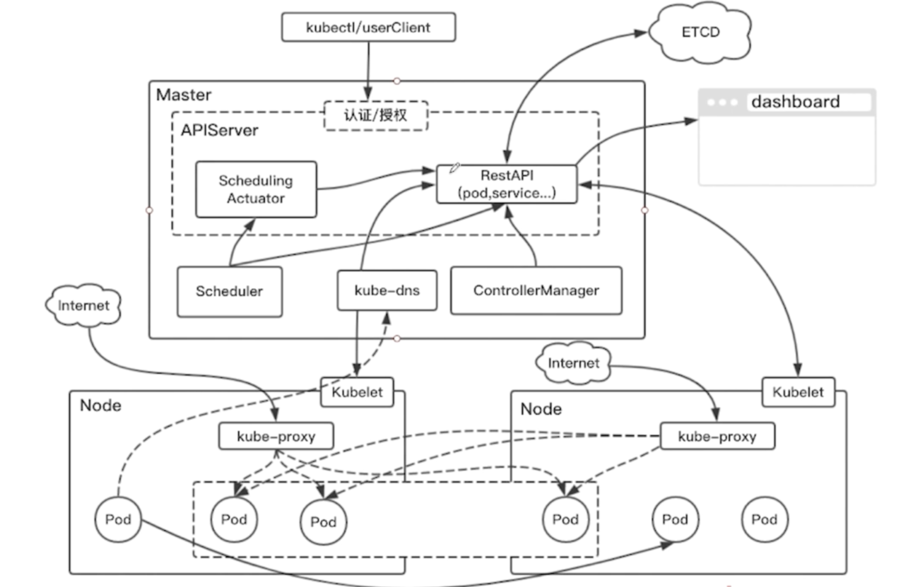
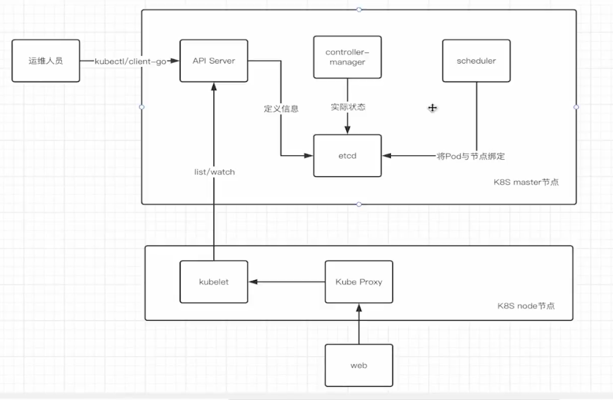
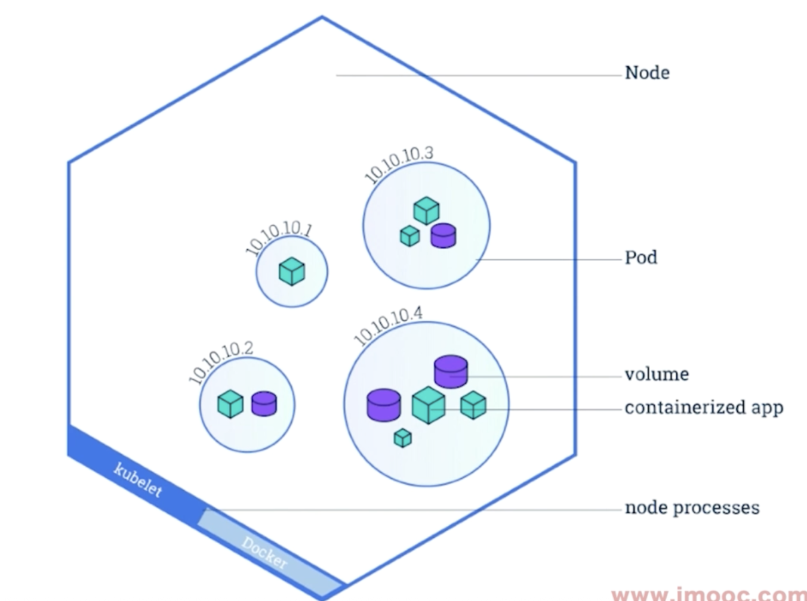
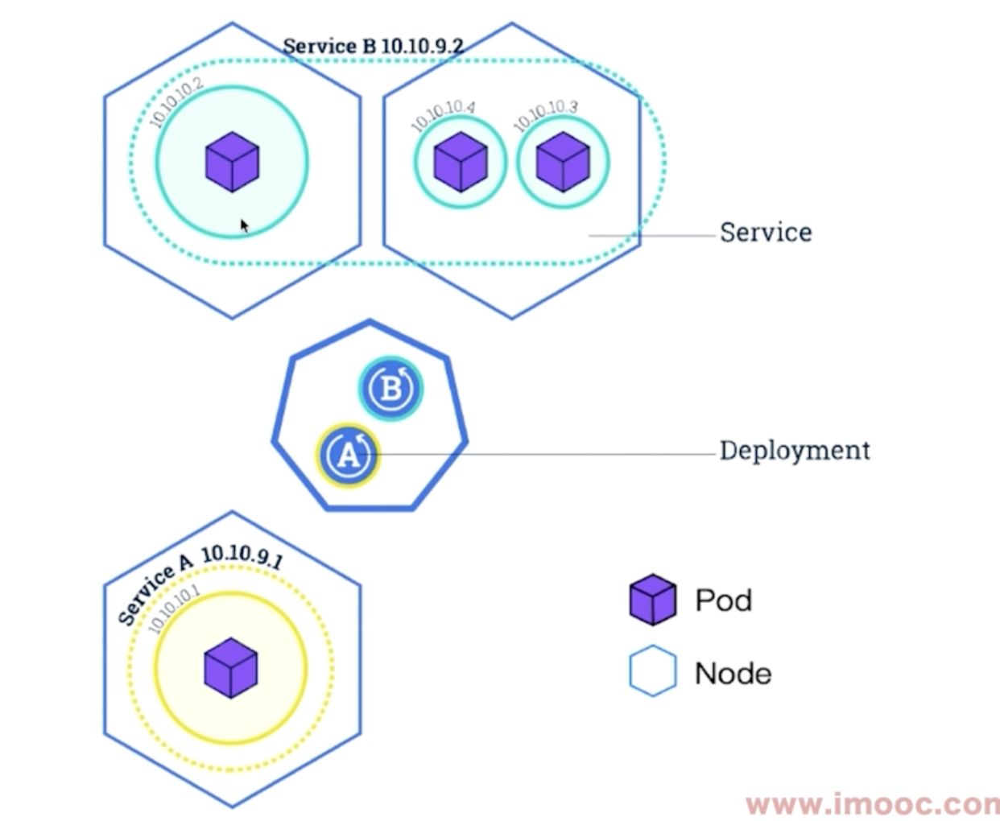
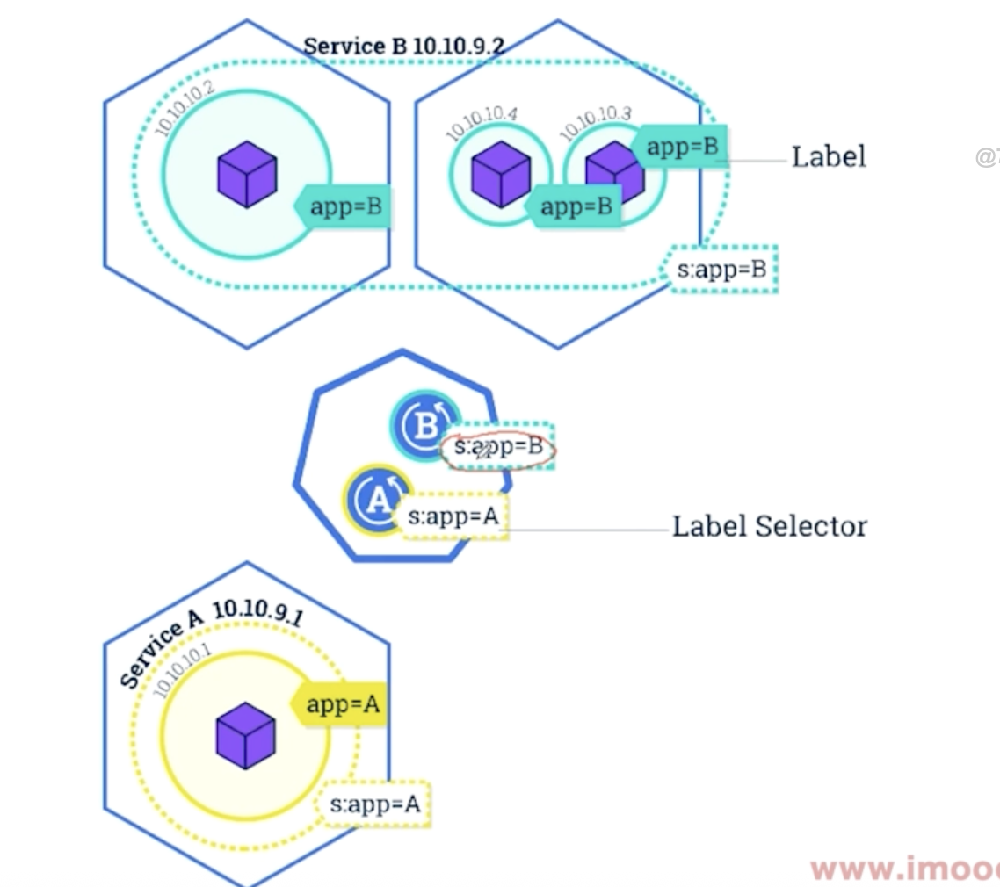
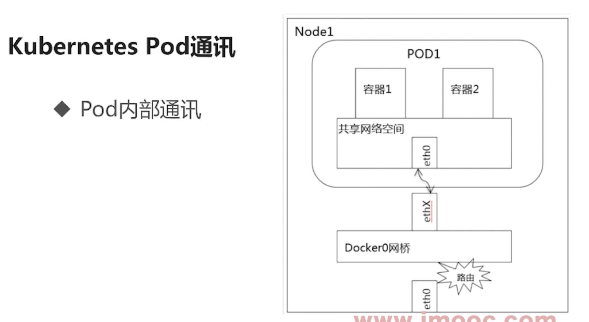
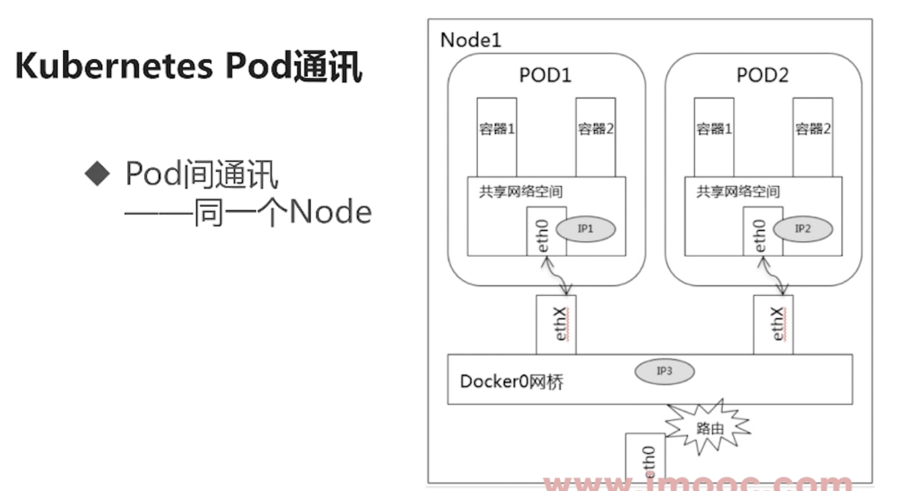
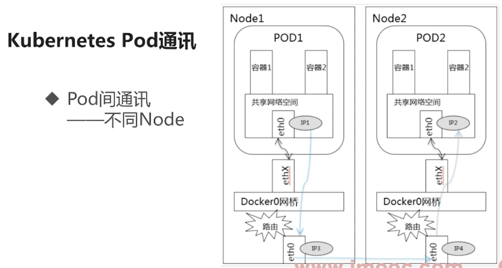

# Kubernetes VS DockerSwarm
# 核心组件
1. K8S master节点, 云端的四大模块
    0. 在master上`发起`部署(Deployment)
        - 比如改端口, 回滚更新服务都是一次部署
    1. API Server
        - 运维人员通过这个server来操作K8s,这是唯一入口
            - 提供整个集群的认证和授权
        - 具体调用API的工具: kubectl/ client-go
    2. etcd
        - 一次性存储, 持久化
        - 调用API传递的信息会存储到这个里面
        - 用户定义期望的状态信息会存在这个里面
    3. controller-manager
        - 扩缩容, 故障检测, 滚动更新
        - 通过读取etcd的期望信息, 努力实现期望的状态
        - 创建实际的pod等等
            - 但目前pod还没有被调度到指定的节点上
    4. scheduler
        - 负责资源的调度, 把Pod调度到相应的节点上
    5. kube-dns(可选)
        - 负责整个集群的dns服务, 尤其是通过名字访问的功能
    - 
2. K8S Node节点/work节点
    - 每个node上运行一个kebelet服务和一个docker服务工具
    1. kubelet 
        - 维护当前Node上容器的生命周期, Node的网络等等
        - 通过一套监听机制访问API Server
        - 用于管理容器运行
    2. Kube Proxy
        - 为Service服务, 提供对外发现和负载均衡, 相当于Service的具体实现方法
        - 外面的app需要通过proxy来访问集群内部

3. Pod
    - 在Node节点上运行的一组容器app可以称为一个pod
    - 里面可能有复数个容器, 磁盘等等
        - 一个Node中的多个pod通常表示同一个应用的扩容副本, 或者新旧版本
    - Pod有独立的ip地址, 这些容器可以共享ip,共享存储磁盘
    - 
4. Service
    - 可以将多个Pod组合成一个Service
    - Service可以提供一个ip
    - Pod重启后ip可能会变, 但Service是不变的, 可以定位到pod的ip地址
        - 这意味着Service可以对多个Pod进行负载均衡, 进行轮询等等
    - 
5. Lable Selecter
    - 这是用来定义Service的方法, 给Pod打标签
    - 所有带同一组标签的Pod视为同一个Service(松耦合)
    - 因此Service只是一个概念, 没有实体
    - 

# 核心概念
1. Namespace
    - 将集群的资源进行隔离(分组)
2. Pod
    - 最小可调度单元, 可能包含一个或多个容器
    - 一组容器应用的抽象层
3. Deployment
    - 用于管理一组Pod, 提供副本控制,滚动升级等功能
    - 一般通过Deployment来部署Pod
4. Service
    - 提供访问容器组的接口

# 用户Deploy的全过程
1. 用户通过kubectl向APIServer发起命令
2. 请求通过认证后, 由scheduler的策略, 得到一个目标Node, 告诉APIServer
3. APIServer请求该目标Node的kubelet, kubelet运行相关Pod
    - 与此同时, APIServer将Pod的信息存储到ETCD
4. Pod运行起来之后, 由ControllerManager进行管理Pod的状态
5. 单独的Pod需要通过Pod的ip访问
6. Kube-proxy将一些Pod组成Service, 提供Service的ip
    - 在任何一个Node上访问Service的ip, 都可以跨Node访问相应的Pod
    - 外部请求通过访问Node的某个端口, 来访问Service的ip
7. kube-dns提供通过名字来访问Pod的功能

# K8S的设计理念
1. API设计
    1. 都是声明式API
        - 现在需要把Pod扩容到两个
        1. 方法1: 将Pod数量加1,命名式
        2. 方法2: 将Pod数量指定为2,声明式, 对于重复的操作是稳定的, 操作都是名词而不是动词
    2. 以操作意图作为基础设计API
2. 控制机设计原则
    1. 考虑到任何错误, 容错处理
    2. 任何一个模块都有自我修复功能, 优雅降级(清晰划分低级功能和高级功能, 低级不依赖高级)

# K8s的业务
1. Long-Running, 长期伺服
    - 我们开发的微服务
2. Batch, 批处理
3. Node-daemon, 节点后台支撑型
4. 有状态的应用

# K8S的网络方案
1. 只要实现了CNI(container network interface)的接口的网络都行, 容器网络接口
    - 比如 Flannel, Calico, Weave
2. Docker网络本身只能访问当前Node的容器, 无法跨主机访问其他Node
    - K8S能实现所有Pod之间互联互通

# Kubelete Schedular
- 决定每个Pod应该调度到哪个Node上面
1. 调度策略
    1. preselect, 预选规则
        1. NodiskConflict, 不要发生挂载冲突
        2. CheckNodeMemoryPressure, 检测Node的内存压力,也可以检测磁盘容量
        3. NodeSelector, 选择有指定标签的Node
        4. FitResource, Node要满足指定的CPU,GPU等要求
        5. Affinity, 亲和性, 比如一个Pod最好和另一个Pod运行在一起, 一个Pod最好不要和另一个Pod运行在一起
    2. optimize-select, 优选规则
        - k8s有一套打分函数, 最终选择得分最高的主机部署Pod
        1. SelectorSpreadPriority, 尽量把Pod分到不同主机上
        2. LeastRequestPriority, 若需要一个新Pod, 则根据Node空闲的那部分容量来决定分配对象
        3. AffinityPriority, IN,NOTIN,等等匹配条件

# Pod的通讯
1. 同一个Pod中,不同容器
    - ip相同, 因此直接通过localhost+端口进行相互访问
    - 
2. 同一个Node, 不同Pod
    - 同一个Node的Pod, 默认路由都是Docker0网桥, 通过这个网桥进行通讯
    - 可以通过Pod的ip访问
    - 
3. 不同Node的Pod
    1. 需要满足一些条件
        1. 这些pod的ip不能相同
        2. pod的ip要与他的Node的ip关联起来
    - 

# 服务发现
- KubeProxy和KubeDNS
1. KubeProxy分两种类型
    1. Cluster-IP, 
        - 对每个Service安装一个IP Table Schedular, 
        - 对所有相关的Pod做一个虚拟ip, 
    2. NodePort
        - 在每一个Node上都起一个监听端口, 相当于把Service暴露在Node节点上
        - 外部通过Node的ip和port来访问Service
2. KubeDNS
    - 让Cluster内部的Pod通过名字相互访问

# Kubernetes
1. Kubenetes cluster 包括以下内容
    1. 一组Master Node
        - 与kubuctl交互,分配对象,调度资源
    2. 一系列Worker Node
2. Master Node,也叫做Control Plane
    1. kube-apiserver
        - 行政部门,上传下达
        - 所有服务访问的唯一入口,提供认证,授权,访问控制,API注册发现
        - 处理内部和外部用户请求,提供RESTful接口
    2. kube-scheduler
        - 分管副总,负责执行和调度
        - 调度,将Pod调度到对应的机器上,运行到哪个节点
        - 监测节点壮态
    3. kube-controlelr-manager
        - 公司的CEO,管理公司,指定决策
        - 实际控制node运行等等,维护cluster状态
        - 副本期望数量,故障检测,自动拓展,滚动更新
        1. 包含以下控制器
            1. Node Controller
            2. Job Controller
            3. Endpoint Controller
            4. Service Account & Token Controller
    4. etcd
        - 秘书,报关资料
        - 用于保存k8s的集群数据库
        - 键值对数据库
        - 可以用redis代替
    5. 可选组件,cloud-controller-manager
        - 顾问,与云供应商对接
        - 将你的集群连接到云供应商的API上
        - 本地环境自然不需要这个
3. Worker Node,也称为Node组件
    - 运行于各个节点
    1. kubelet
        - 分公司负责人,执行来自总部的命令
        - 在每个节点上运行,确保容器运行于pod中,但本身不在容器里
        - 工作节点执行的agent,管理具体容器的生命周期,管理容器,上报Pod运行状态
        - 也负责Volume和网络管理
    2. kube-proxy
        - 联络人,接口人,具体对接什么项目,就来联系他
        1. 网络访问代理,也是一个Load Balancer
            - 是实现Service功能的一部分
        2. 将请求分配给node上同一类标签的Pod
        3. 使用防火墙规则(iptable,ipvs)来实现Pod映射
    3. Container Runtime
        - 管理镜像,以及Pod和容器的创建
        - 比如Docker Engine
        - 但kubenetes在1.25之后不再支持Docker,而是使用containerd
4. DNS 
    - 一个可选的DNS,为每个Service对象创建DNS,这样让Pod通过DNS访问
# 云原生
1. 用Java,Go,Python开发的应用称为原生应用
2. 在设计开发是,让他们能运行在云基础设施或者K8s上,从而具备弹性拓展能力,这个就被称为云原生应用
    1. 技术包括容器,服务网格,微服务,声明式API
3. SpringCloud与K8s很多功能都是重复的,而切SpringCloud只能用于Java开发,而K8S与语言无关,可以应用于各种应用
