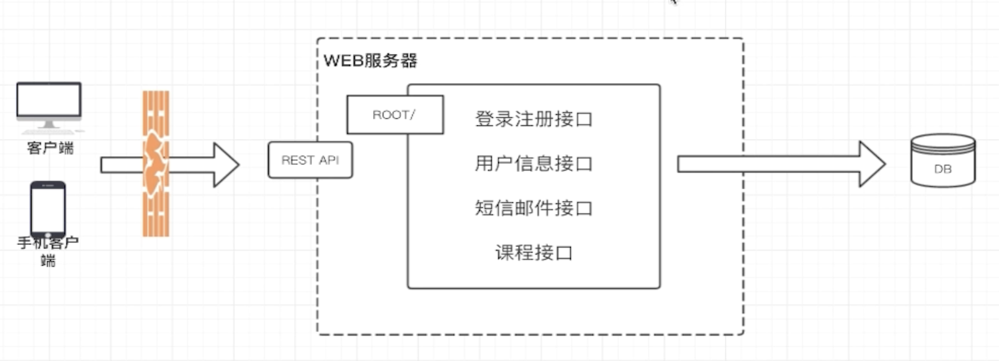
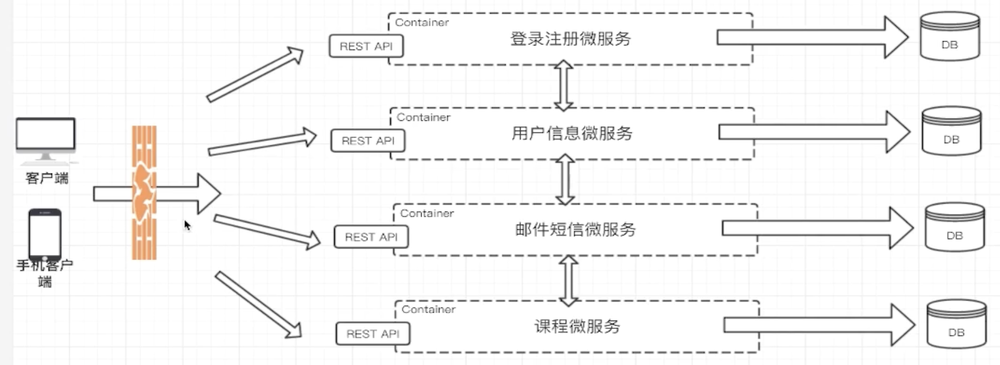

# 一个在线教育网站的部分内容
1. 用户可以登录注册, 获取用户信息
2. 发邮件发短信确认
3. 查看课程, 相关的CRUD
# 单提架构的情况

# 微服务示意图

1. 但这样还是有一些问题
    1. 微服务特别多的时候, 客户端代码会很复杂
    2. 并不是所有服务都能提供RESTfulAPI(即基于HTTP的)
        - dubbo, swift, 消息队列
    3. 难以重构
        - 任何重构都要兼容移动端
2. 更好的方式是使用 `API GateWay`统一API的入口

# 微服务的优势与不足
1. 优势
    1. 独立性
        - 每个服务之间相互独立
        - 数据库相互独立, 避免修改字段时小心翼翼
        - 一个服务宕机, 不影响其他服务
    2. 敏捷性
        - 各个功能简单, 理解也简单
        - 出问题可以迅速定位
    3. 技术栈灵活
    4. 高效团队
        - 不需要很多人
2. 不足
    1. 额外的工作
        - 如何拆分? DDD领域驱动设计
    2. 数据一致性
        - 单体架构只需要用事务即可
        - 微服务只能尽量让JOIN操作发生在一个微服务里, 但难免业务变动
    3. 沟通成本
        - 想改接口的话, 可能不是你们组负责
