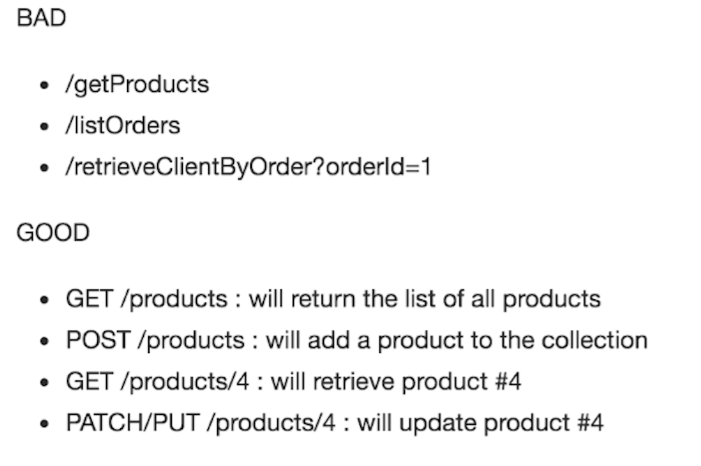
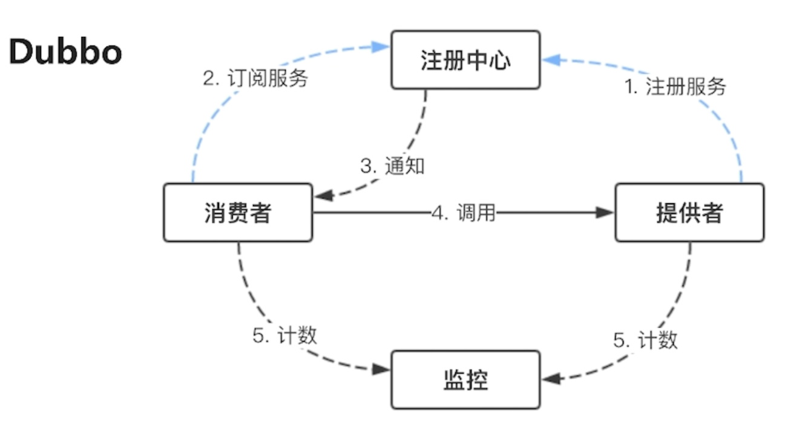
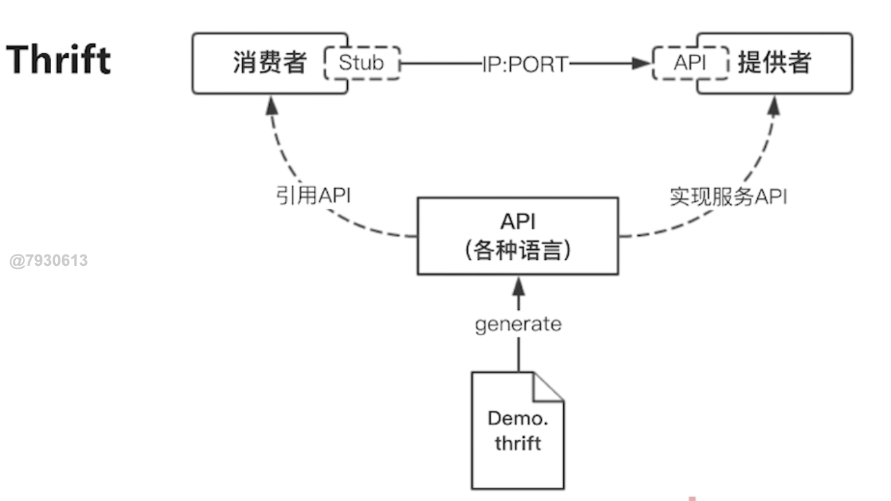
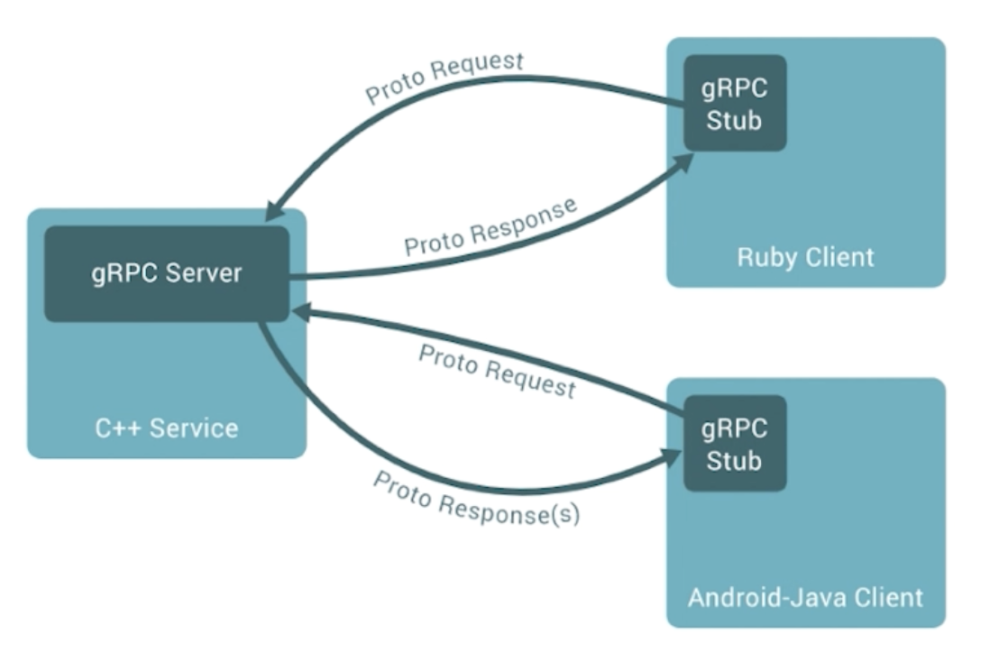
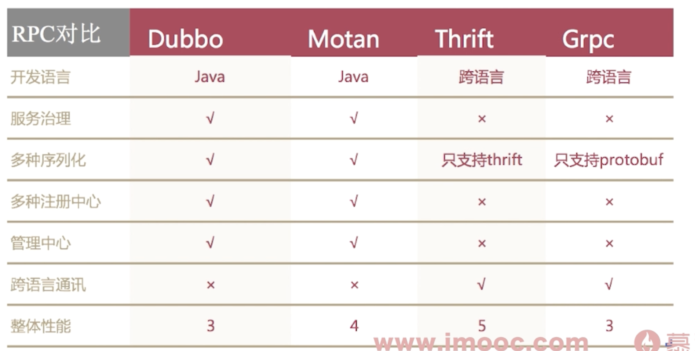
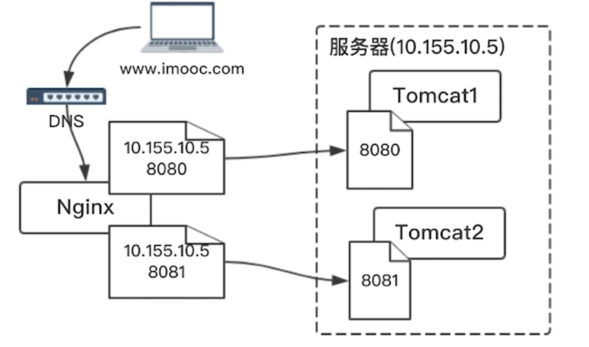
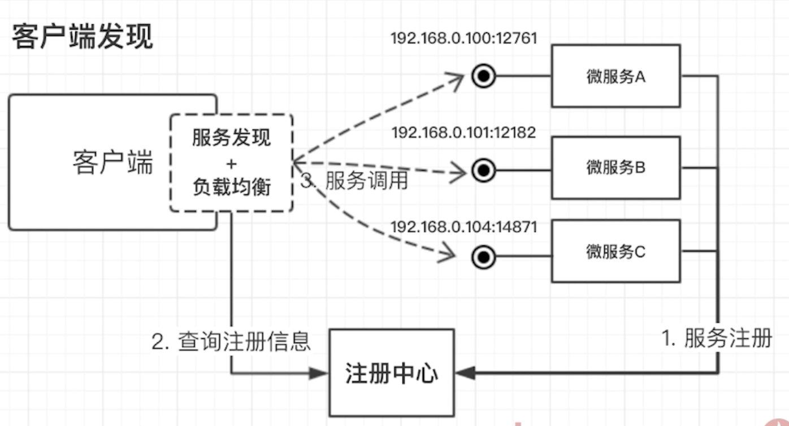
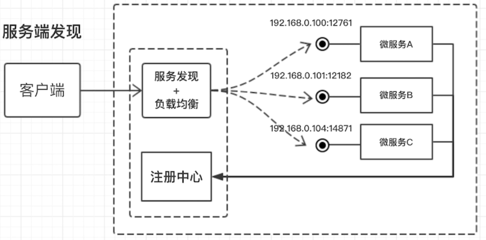

# 微服务引入的问题: 
1. 如何相互通讯?
    1. 单体架构
        1. 直接把另一个系统的连接拿来, 内容嵌入到自己的页面
        2. 用HTTPClient, 直接调用对方的接口, 从而拿到返回的数据
2. 微服务如何`发现彼此`?
    1. dubbo 有一种中间人机制,服务的消费者可以拿到服务提供者的地址
3. 如何部署, 更新, 扩容
    1. 单体架构
        1. git工具把本地代码传到生产环境,然后重启服务器
        2. JINX? 自动部署发布
    2. 微服务
        1. 比较少的时候可以用上面的方法(往往很多)
# 微服务之间的通讯
1. 从通讯方式
    1. 一对一还是一对多?
    2. `同步还是异步`?
        1. 同步一对一: 请求响应模式
        2. 异步一对一: 发布通知, 无需等待响应
            - 用回调取得对方响应
        3. 异步一对多: 发布订阅
2. 从通讯协议
    1. REST API, 主要用于CS系统
        - 用HTTP接口设计实现REST风格的API
        - 
        - 有不同的请求方式
    2. RPC(Remote Procedure Call，远程过程调用)
        - dubbo, grpc, thrift
    3. MQ, 消息队列, 主要用于发布订阅的模式
# RPC
- RPC是微服务通讯用的最多的框架
- 允许程序调用远程计算机上函数或过程的协议，开发者能像调用本地函数一样调用远程服务，无需关心底层网络通信细节，常用于构建分布式系统和微服务，实现客户端与服务器之间的通信
1. 如何选择RPC
    1. IO,线程调度模型
        - 是同步的IO还是非阻塞的异步IO
        - 长连接还是短链接(连接后是否长时间保持连接状态)
            - HTTP基本都是短链接
    2. 序列化的方式(正反序列化的时间, 序列的大小)
        1. 可读的: XML, JSON
            - FASTJSON
        2. 二进制: JDK自带的序列化
    3. 是否需要多语言支持
    4. 服务治理?
        - 有没有服务发现, 服务监控
2. 常用介绍
    1. Dubbo/Dubbox 阿里开源的框架
        - 
        - 消费者从注册中心获取提供者的地址, 然后再调用提供者
            - 实线是同步调用, 虚线是异步调用
        1. Dubbo只支持Java
    2. Motan 新浪微博的开源框架
    3. Thrift, Apache
        - 
        - 跨语言的, 先写API定义文件, 再生成各个语言的接口
    4. GRPC, Google
        - 
    5. 总结
        - 

# 服务如何发现?更新,部署,扩容
1. 服务的发现
    1. 传统服务
        - ip+端口(localhost:8080)
        - dubbo也是 (20880)
        - Nginx通过轮循找到, 本质上是程序猿配置出来的
        - 
    2. 微服务
        1. 客户端发现
            - 让客户端去注册中心查询服务的注册信息
            - 
        2. 服务端发现
            - 再建一个同时具有服务发现和负载均衡的服务, 该服务将客户端的请求转发给注册中心
            - 
2. 如何部署服务
    1. 传统服务
        1. 代码写好, 准备上线
        2. 和运维交涉, 要一台空闲的服务器
        3. 运维通过Jinks或者其他脚本自动化方式将文件上传到服务器
        4. web服务需要额外copy一个tomcat, 查询端口列表, 分配一个端口号
        5. 给域名做DNS解析, 解析到Nginx, 配置反向代理, 指向配置好的tomcat
    2. 微服务
        - 微服务数量大, 无法使用传统方式一个个部署
        1. `服务编排`
            1. 服务发现, 部署, 更新, 扩容等等
            2. 用于简化上述操作
        2. Apache的Mesos
        3. Docker的Deocker swarm
        4. `Google的Kubernetes`
