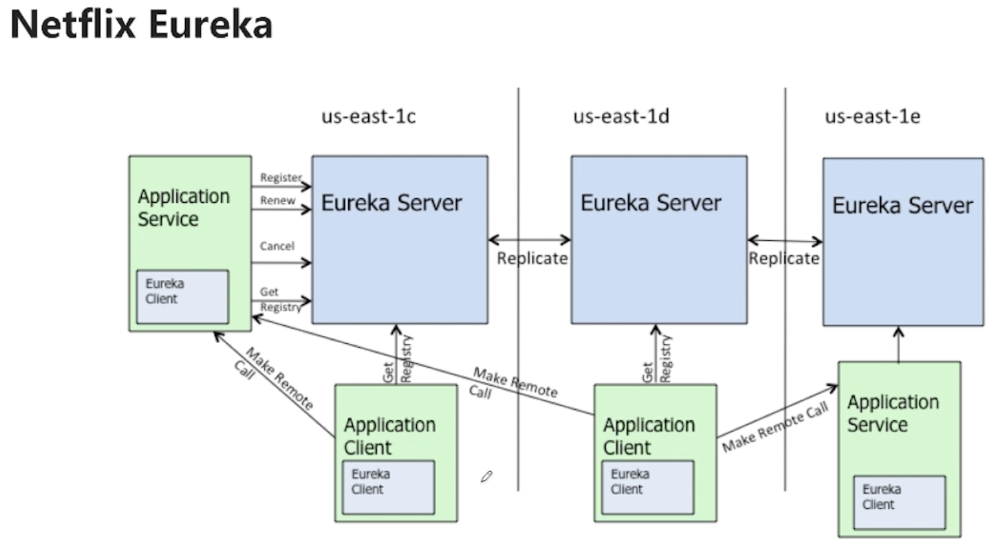
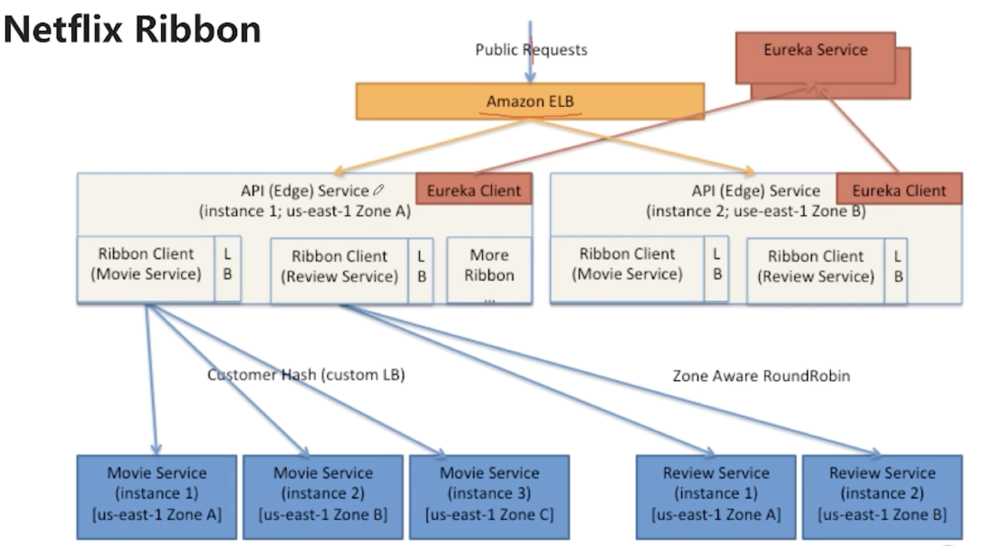
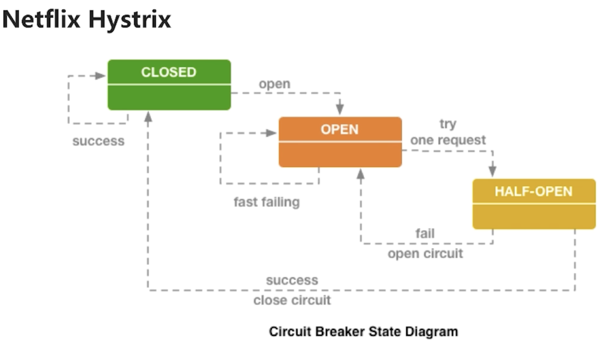
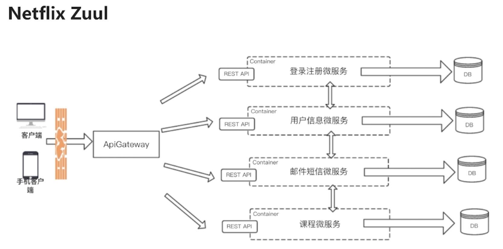
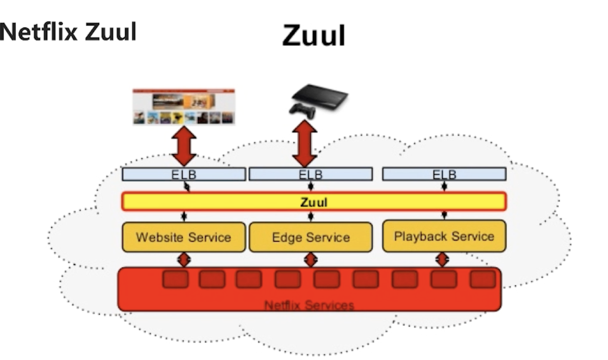
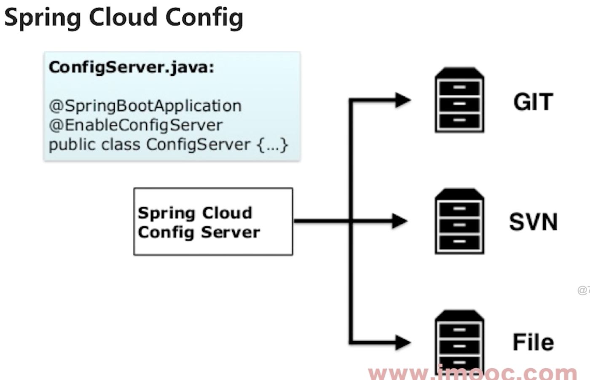

# SpringCloud
- 简化Java分布式系统
1. 传统分布式系统可能会遇到的问题
    1. web服务的上传共享, 需要在每个tomcat上面配置
    2. 多个服务之间的负载均衡, Nginx上配置rogroob?轮循访问每一个tomcat
    3. 服务之间的调用
        - 比如一个文件代理服务
    4. 分布式情况下的事务管理
2. SpringCloud提供快速开发具有分布式能力的服务
    1. 统一的配置管理
    2. 服务的注册, 发现, 调用
    3. 负载均衡
    4. 全局锁, 调度器等等
3. SpringCloud是功能的集合,实现了风格的统一

# SpringCloud与微服务
- SpringCloud是Java微服务的解决方案
1. SpringCloud侧重微服务的`功能和开发`, 但是`没有提供资源管理和自动化部署`功能
2. 在DevOps里, SpringCloud只提供了前面的Dev, 没有后面的Ops
3. SpringCloud最终产出: `Image镜像`

# SpringCloud核心组件
1. Netflix Eureka, 服务发现组件
    - 运行多个实例来避免单主机问题, 分布在多个机房提高可用性
    - 每个服务的注册信息与Eureka实时同步
    - Eureka属于客户端发现
    - 
2. NetFlix Ribbon, 负载均衡组件
    - 
    - Edge Service? 用于给外部看数据的统一页面, 这样的服务称为Edge Servcie
    - 使用某些算法, 对Service1进行轮循
    - 也提供连接超时, 重试的算法
3. NetFlix Hystrix, 断触器
    - 
    - 假如说DB突然出了问题, 前面的页面一直转转转
    - 此时用户可能会频繁重试, 即使DB很快恢复, 也会导致请求大量堆积
    - 断触器可以在服务宕机时, 后续的请求不再有效
    - 也可以在服务宕机时, 给用户更好的提醒, 或者从缓存取得数据返回
4. NetFlix Zuul, 服务网关
    - 
    - 
    - 如果没有APIGateWay的话,...
    - 因此使用APIGateWay来实现统一提供RestAPI
    - Zuul就是API Gateway, 还提供陆游服务, 负载均衡等等
5. Spring Cloud Config, 分布式配置
    - 每个环境配置不同
    - 
6. 需要特别注意的是，Spring Cloud 生态在不断演进。以你之前使用过的 Zuul 为例，它及其同系的 Netflix Hystrix、Ribbon 等早期组件在 Spring Cloud 2020.0.0 及以后的版本中已进入维护模式并被替代。

网关：官方主推的现代化替代方案是 Spring Cloud Gateway，它基于非阻塞式模型，性能更高。你的学习路径已经从 Zuul 转向 Gateway，这是正确的。

容错与负载均衡：Hystrix 的现代替代者是 Resilience4j 和 Spring Cloud Circuit Breaker。Ribbon 则被 Spring Cloud LoadBalancer 所取代。

因此，对于新项目，建议直接采用新一代组件（如 Gateway、LoadBalancer、Circuit Breaker）。