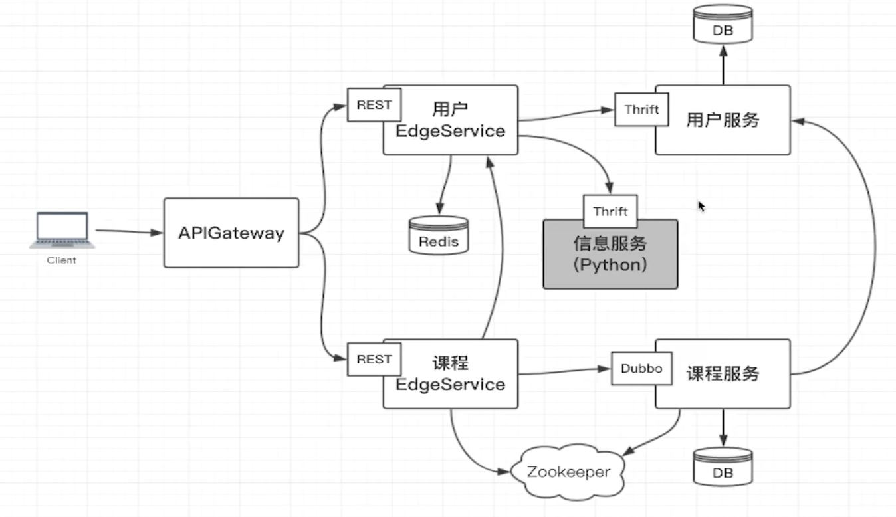

# 登录系统
1. 用户可以注册和登录
    - 现在基本都是单点登录, 支持跨域
    - `最好不要使用Session, 微服务最好是无状态的`
2. 登录后的用户可以对课程进行CURD
    - 
# 
- 

# 考虑从依赖最少的信息系统着手
- cd /Users/peihanggu/GithubLocal/PracticeProject/IdeaProjects/DockerApp

# 汇总
1. Python信息服务
    1. 提供thrift
        - 9090
2. 用户服务
    1. DB
        - mysql 8.4
        - 3307:3306
    2. 提供thrift
        - 7911
3. 用户EdgeService
    1. redis
        - 6380:6379
    2. 提供HTTP
        - 8082
4. 课程服务
    1. DB
        - 和用户服务共用一个DB
    2. 提供Dubbo接口
        - 20880
    3. zookeeper
        - 2181:2181
5. 课程EdgeService
    1. 提供HTTP
        - 8081