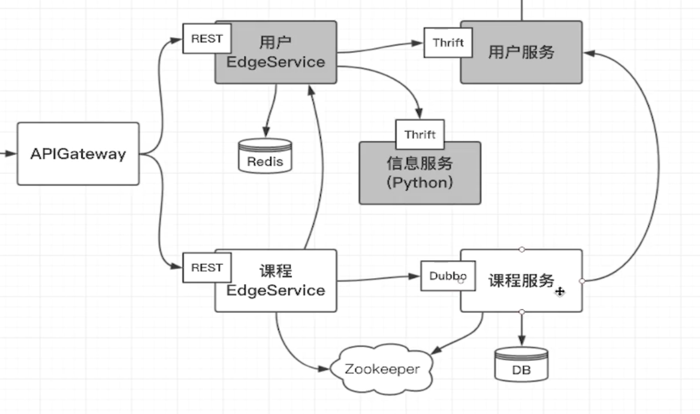

# 课程服务

1. 对外提供Dubbo接口
2. 访问后端数据库
3. 注册服务到zookeeper

# zookeeper
1. 
2. 执行脚本
    ```docker
    docker rm -f imooc-zookeeper
    docker run --name imooc-zookeeper -p 2181:2181 --restart always -d zookeeper:3.5
    ```
    - --restart always , 当容器出现异常时, 总是会重启
# api模块
- 与thrift不同, dobbo需要手动写api