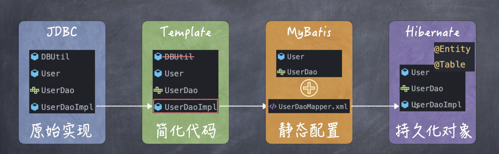

# 使用jdbc模版之前
1. 连接数据库流程
    1. 创建Connection, 获得连接
    2. 创建Statement, 准备SQL语句
        1. 给每个值setString()
    3. ResultSet = exec(), 执行
    4. while(result.next()){},处理结果集
    5. return,返回结果
2. 测试时
    ```java
    @SpringBootTest//需要Spring环境因此用这个注解
    public class Test{
        @Test
        public void test01(){
            UserDao userDao = new UserDaoImpl();
            userDao.findUser("1");
        }
    }
    ```
# 使用模版
1. JDBCTemplate就是上述5步的综合起来简化成的模版
2. JDBCTemplate本身是Spring提供的,因此也可以使用SpringIoC来管理数据源
    - 就不需要单独写一个jdbcUtil了
# 用法
1. 导入Spring-boot-starter-data-jdbc
2. 首先准备数据源application.properties并确保能跑通
3. 修改Dao
    ```java
    @Repository("jdbcUserDao")//注意与测试时的实例名称保持一致
    Class UserDaoImpl{
        @Autowired
        private JDBCTemplate;

        @Override
        public User findUser(String id){
            //JDBCTemplate提供了一系列方法
            //但用法比较特殊
            //return  JDBCTemplate.queryForObject("SELECT XXXX", User.class, id);只能查出来一个值,需要一个映射关系
            return  JDBCTemplate.queryForObject("SELECT XXXX",
                        //new BeanPropertyRowMapper<User>(User.class),默认的
                        new UserRowMappers(),
                        id);
        }
    }
    ```
4. 按需新建映射器
    - 当table和javaproperty名称不一致时
    ```java
    public class UserRowMapper implements RowMapper<User>{
        @Override
        User mapRow(....){
            User user = new User();
            //默认的也要写一下
            user.setId(rs.getInt("id"));
            //特殊的,java这边是boolean类型
            user.setAdmin(rs.getInt("is_admin") == 0? true : false);
        }
    }
    ```
4. 测试时
    ```java
    @SpringBootTest
    public class Test{
        @Autowired
        private UserDao jdbcUserDao;

        @Test
        public void test01(){
            //UserDao userDao = new UserDaoImpl();
            jdbcUserDao.findUser("1");
        }
    }
    ```
# jdbcTample具体用法
1. 提供的方法
    1. 增删改,update()
        ```java
        int result = update("INSERT...", 
                user.getUserName(),user.getPassword());
        ```
    2. 查询,query()
        1. queryForObject("SQL",Mapper,id)
2. 容易出错的地方
    1. 上面的BeanPropertyRowMapper
    2. BeanPropertyRowMapper
        - 要求table和java数据必须完全一致
        - 数据类型也要求一致
    3. 如果有字段和类型不一样的话,就需要新建一个RowMapper了



