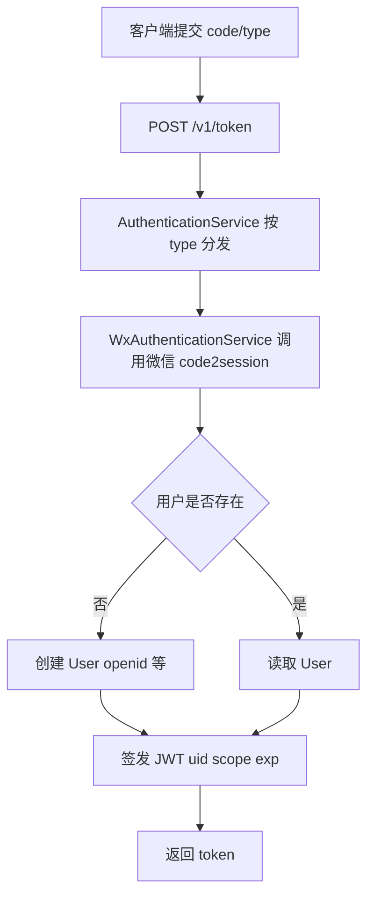
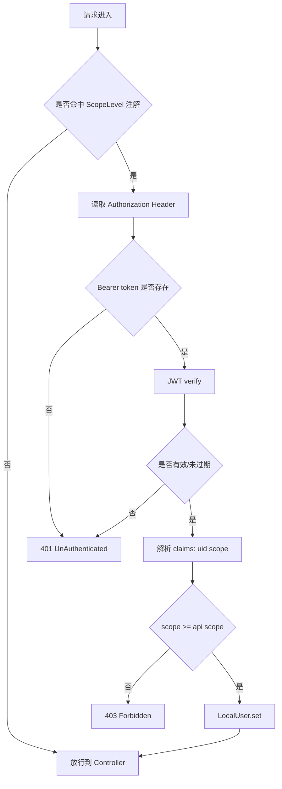
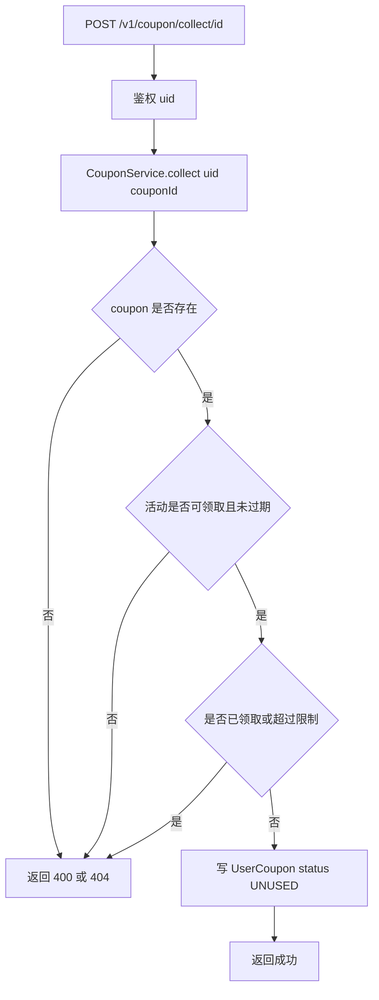
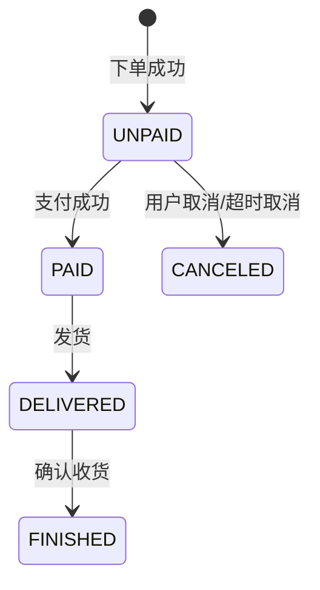
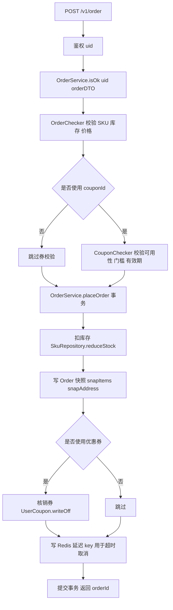
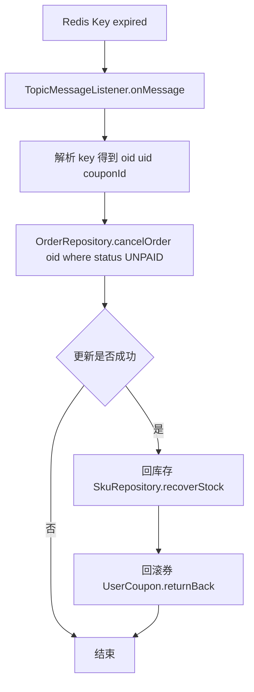
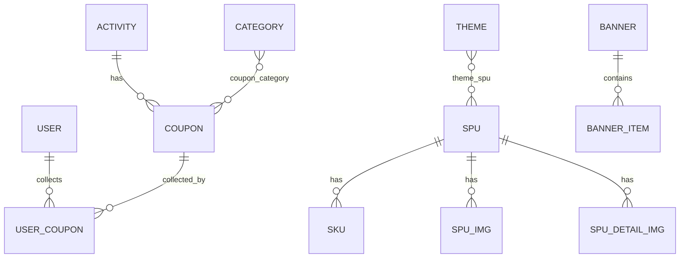

# Missyou 应用模块化设计书（反向生成）
- 生成方式：根据你提供的源码（`missyou.zip`）自动抽取结构 + 人工整理
- 版本日期：2026-01-14
- 技术栈：Spring Boot / Spring Data JPA / JWT / Redis / Jackson
---
## 1. 目标与范围
本设计书覆盖：
- 统一异常与返回体
- 参数校验（Lombok + Bean Validation）
- JPA/ORM 实体关系与查询
- 分页模型与 VO 映射
- 泛型与 JSON 序列化/反序列化
- 端到端业务流程（登录、领券、下单、超时取消）
- 数据库实体关系（ER）与建议索引
不覆盖：前端、小程序支付回调、真实支付对接等（代码中仅保留占位/示例）。
---
## 2. 总体架构
### 2.1 模块划分（逻辑域）
- **Core 基础设施**：统一异常、统一返回、URL 自动前缀、权限拦截、线程上下文
- **Auth 鉴权**：微信登录、Token 颁发与校验、ScopeLevel 权限等级
- **Catalog 商品域**：Banner / Theme / Category / Spu / Sku
- **Marketing 营销域**：Activity / Coupon / UserCoupon
- **Trade 交易域**：Order 下单、库存扣减、优惠券核销、超时取消
- **Middleware**：Redis 过期事件监听（用于订单超时取消）
### 2.2 分层（按代码包）
- `api.v1`：对外 REST API（Controller）
- `service`：业务编排与事务
- `logic`：可复用校验/计算（OrderChecker / CouponChecker）
- `repository`：JPA Repository
- `model`：JPA Entity
- `dto/vo/bo`：入参与出参模型
- `manager.redis`：Redis Listener
### 2.3 API 前缀机制
配置 `missyou.api-package: com.lin.missyou.api`，并通过自动前缀映射为 `/v1` 路由前缀。

> 结论：本书中所有接口路径都按 `/v1/...` 表示。
---
## 3. Cross-cutting 设计
### 3.1 统一返回体
- `UnifyResponse(code, message, request)` 作为统一响应结构。
- 成功场景部分通过抛出 `CreateSuccess / UpdateSuccess / DeleteSuccess` 快速返回（“成功也走异常”）。

**评审建议（工程化）**
- 长期建议改为 `Result<T>`（成功/失败都返回对象；异常只用于错误），以减少：
  - 监控告警误报（异常计数被放大）
  - 调试复杂度（堆栈干扰）
  - 语义混淆（异常并非异常）
### 3.2 统一异常体系
- `HttpException`（含 `code` 与 `httpStatusCode`）作为业务异常基类。
- `GlobalExceptionAdvice` 捕获 `HttpException`，输出 `UnifyResponse`。
- 错误码与文案通过 `exception-code.properties` 配置映射。

**建议补齐**
- 加入兜底 `@ExceptionHandler(Exception.class)`：未知异常也按统一结构返回（生产环境隐藏堆栈）。
- 全面替换 `System.out.println / printStackTrace` 为 SLF4J 日志，并区分 `info/warn/error`。
### 3.3 参数校验（Lombok + Bean Validation）
- DTO 使用 Lombok（如 `@Data/@Getter/@Setter`）。
- Controller 方法使用 `@Validated` 触发校验。
- 已存在自定义校验示例：`@TokenPassword`。

**工程化建议**
- 对交易域 DTO（下单、地址、SKU明细）补齐 `@NotNull/@Positive/@Size`，并对嵌套对象加 `@Valid`，将非法请求尽量拦截在 Controller 层。
### 3.4 序列化/反序列化（Jackson）
配置（来自 `application.yml`）：
- `property-naming-strategy: SNAKE_CASE`
- `WRITE_DATES_AS_TIMESTAMPS: true`

设计要点：
- 订单快照（`snapItems/snapAddress`）与 SKU 规格（`specs`）采用 JSON 字符串落库。
- `GenericAndJson` 使用 `TypeReference<T>` 解决泛型反序列化类型擦除。

**风险点**
- JSON 结构变更需兼容旧快照；建议在快照 JSON 中加入 `schema_version` 便于演进。
---
## 4. 模块设计：Auth（登录/颁发/校验/权限）
### 4.1 关键类清单
- `TokenController`：颁发 token、校验 token
- `AuthenticationService`：按登录类型分发
- `WxAuthenticationService`：微信 code2session、创建/读取用户
- `JwtToken`：JWT 生成与校验
- `PermissionInterceptor`：ScopeLevel 权限校验
- `LocalUser`：ThreadLocal 保存 uid/scope
- `@ScopeLevel`：API 权限等级注解
### 4.2 核心数据结构（Claims）
建议（与当前实现保持一致）：
- `uid`：用户 id
- `scope`：权限等级（int）
- `exp`：过期时间

> 推荐在后续加入：`iat`、`jti`、`device_id`（用于风控与登出/踢出）。
### 4.3 登录与发放令牌流程

### 4.4 请求鉴权与权限校验流程

### 4.5 评审关注点（安全/可维护）
- `TopicMessageListener` 等类使用 `new` 方式注册时，`@Autowired` 可能失效；权限拦截器也需避免此类问题。
- 建议在 `afterCompletion` 中确保 `LocalUser.clear()`（ThreadLocal.remove），避免线程池复用导致数据串扰。
---
## 5. 模块设计：Catalog（商品展示）
### 5.1 关键类清单
- Controllers：`BannerController / ThemeController / CategoryController / SpuController / SkuController`
- Services：`BannerService / ThemeService / CategoryService / GridCategoryService / SpuService / SkuService`
- Repositories：对应实体的 Repository
### 5.2 核心实体与关系
- `Theme` ↔ `Spu`：多对多（`theme_spu`）
- `Spu` → `Sku`：一对多
- `Spu` → `SpuImg/SpuDetailImg`：一对多
- `Banner` → `BannerItem`：一对多

> 软删除：多实体使用 `@Where(delete_time is null)`。
### 5.3 API（按代码抽取）
| Controller | Method | Path |
|---|---:|---|
| BannerController | GET | `/v1/v1/banner/name/{name}` |
| BannerController | GET | `/v1/v1/banner/test` |
| BannerController | POST | `/v1/v1/banner/test2/{id}` |
| CategoryController | GET | `/v1/category/all` |
| CategoryController | GET | `/v1/category/grid/all` |
| SpuController | GET | `/v1/spu/by/category/{id}` |
| SpuController | GET | `/v1/spu/id/{id}/detail` |
| SpuController | GET | `/v1/spu/latest` |
| SpuController | GET | `/v1/spu/latest?start= & count=` |
| ThemeController | GET | `/v1/theme/by/names` |
| ThemeController | GET | `/v1/theme/name/{name}/with_spu` |

### 5.4 ORM 与性能建议
- 列表接口建议避免 N+1：对 `Spu -> skuList/imgList` 这类关系，推荐：
  - DTO 投影（select new VO）
  - 或 fetch join（仅在明确需要时）
- 对高频查询字段建议建索引：`spu.categoryId`、`sku.spuId`、`banner.name`、`theme.name`。
---
## 6. 模块设计：Marketing（活动/优惠券/领券）
### 6.1 关键类清单
- Controllers：`ActivityController / CouponController`
- Services：`ActivityService / CouponService`
- Logic：`CouponChecker`
- Repositories：`ActivityRepository / CouponRepository / UserCouponRepository`
### 6.2 数据模型
- `Activity` → `Coupon`：一对多（`Coupon.activityId`）
- `Coupon` ↔ `Category`：多对多（`coupon_category`）
- `UserCoupon`：显式关系表（记录：uid、couponId、status、orderId、createTime）

**状态机（CouponStatus）**
- UNUSED（未使用）→ USED（已使用）
- UNUSED → EXPIRED（过期）
- USED → UNUSED（订单取消回滚）
### 6.3 领券流程

### 6.4 API（按代码抽取）
| Controller | Method | Path |
|---|---:|---|
| ActivityController | GET | `/v1/activity/name/{name}` |
| ActivityController | GET | `/v1/activity/name/{name}/with_coupon` |
| CouponController | GET | `/v1/coupon/by/category/{cid}` |
| CouponController | GET | `/v1/coupon/myself/available/with_category` |
| CouponController | GET | `/v1/coupon/myself/by/status/{status}` |
| CouponController | GET | `/v1/coupon/whole_store` |
| CouponController | POST | `/v1/coupon/collect/{id}` |

### 6.5 并发与一致性（评审要点）
- `UserCouponRepository.writeOff`：带条件更新（`status=1` 且 `orderId is null`）属于**乐观并发控制**，可避免重复核销。
- `returnBack`：要求 `status=2` 且 `orderId is not null`，用于取消订单后回滚。
- 过期策略：建议“状态字段 + 时间判断”双保险；不要只依赖状态枚举。
---
## 7. 模块设计：Trade（订单/库存/超时取消）
### 7.1 关键类清单
- Controller：`OrderController`
- Services：`OrderService / OrderCancelService / CouponBackService`
- Logic：`OrderChecker`
- Repositories：`OrderRepository / SkuRepository / UserCouponRepository`
- Middleware：`TopicMessageListener`（Redis 过期事件）
### 7.2 订单状态机（来自 OrderStatus）

### 7.3 下单主流程

### 7.4 超时取消流程（Redis 过期事件）

### 7.5 事务边界与并发语义（评审重点）
- `reduceStock`：条件更新（`stock >= quantity`）避免扣成负数，是典型“数据库层乐观并发”。
- `cancelOrder`：`where status=UNPAID` 防止重复取消。
- 推荐：`placeOrder()` 与 `writeOff()` 保持同一事务；若写 Redis key 放在事务后执行，可避免“事务回滚但延迟任务已写入”的不一致。
### 7.6 API（按代码抽取）
| Controller | Method | Path |
|---|---:|---|
| OrderController | GET | `/v1/order/by/status/{status}` |
| OrderController | GET | `/v1/order/detail/{oid}` |
| OrderController | GET | `/v1/order/status/unpaid` |
| OrderController | POST | `/v1/order` |

---
## 8. ORM 与分页（工程化说明）
### 8.1 ORM 策略
- `BaseEntity` 提供 `createTime/updateTime/deleteTime`，配合 `@Where(delete_time is null)` 实现软删除。
- 建议：对软删除字段加索引（`delete_time`），并在重要表上考虑联合索引（例如 `(user_id, status, expired_time)`）。
### 8.2 分页模型
- Controller 侧以 `start/count` 入参
- 内部转换为 `PageRequest(page, size)`
- Repository 返回 `Page<T>`
- 输出通过 `Paging<T>` + `PagingDozer<T, VO>` 统一封装

**性能建议**
- Dozer Mapper 建议作为单例 Bean 注入，避免每次构建。
- 预留游标分页接口（基于 `id/createTime`），用于深分页场景。
---
## 9. 数据库设计（数据字典 + 索引建议）
### 9.1 通用字段
- `id`：主键
- `create_time/update_time/delete_time`：审计字段（软删除）

> `create_time/update_time` 当前设置为 `insertable=false, updatable=false`，通常由数据库默认值/触发器维护。
### 9.2 表级数据字典（摘要）
以下字段来自实体类，建议你按实际 DDL 对齐：

#### 9.2.1 `user`
- 关键字段：`id, openid, nickname, ...`
- 建议索引：`uk_openid(openid)`（唯一）

#### 9.2.2 `coupon`
- 关键字段：`id, activity_id, start_time, end_time, type, ...`
- 建议索引：`idx_activity(activity_id)`、`idx_time(start_time,end_time)`

#### 9.2.3 `user_coupon`
- 关键字段：`id, user_id, coupon_id, status, order_id, create_time`
- 建议索引：
  - `idx_user_status(user_id, status)`（查“我的券”）
  - `idx_coupon_user(coupon_id, user_id)`
  - 唯一约束（按业务）：若“一人一券”则 `uk_user_coupon(user_id, coupon_id)`；若允许多张则不加唯一

#### 9.2.4 `order`
- 关键字段：`id, order_no, user_id, status, expired_time, total_price, final_total_price, snap_items, snap_address`
- 建议索引：`idx_user_status(user_id, status)`、`idx_expired(status, expired_time)`、`uk_order_no(order_no)`

#### 9.2.5 `sku`
- 关键字段：`id, spu_id, stock, price, specs`
- 建议索引：`idx_spu(spu_id)`

#### 9.2.6 `spu`
- 关键字段：`id, category_id, title, price, ...`
- 建议索引：`idx_category(category_id)`、`idx_create(create_time)`

#### 9.2.7 关系表
- `theme_spu(theme_id, spu_id)`：建议联合主键或唯一约束 `(theme_id, spu_id)`
- `coupon_category(coupon_id, category_id)`：建议联合主键或唯一约束 `(coupon_id, category_id)`
### 9.3 ER 图

---
## 10. 错误码与异常（评审表）
### 10.1 错误码来源
- 代码：`HttpException` 子类
- 文案：`src/main/resources/config/exception-code.properties`

> 建议在评审稿中列出“Top 15 错误码”，并对外部接口做映射文档。
### 10.2 推荐输出格式（示例）
- HTTP 401：未登录/Token无效
- HTTP 403：权限不足
- HTTP 404：资源不存在
- HTTP 400：参数错误
- HTTP 500：服务端异常
---
## 11. 测试与质量保障（工程化补充）
- 单元测试：
  - `OrderChecker`（库存不足、价格异常、优惠券门槛）
  - `CouponChecker`（时间窗、门槛、状态）
- 集成测试（SpringBootTest + H2/MySQL TestContainer）：
  - 下单事务一致性（扣库存 + 核销券）
  - 超时取消（模拟 Redis 过期事件或直接调用 cancel service）
- 回归用例：
  - 幂等：重复下单/重复取消/重复核销
  - 并发：并发扣库存、并发核销
---
## 12. 部署与配置（工程化补充）
- Profile：`dev/prod`（`application.yml` 指定 active=dev）
- 配置建议：
  - 将 `wx.appsecret` 等敏感信息迁移到环境变量/密钥管理，不入库/不入Git
  - Redis：开启 Keyspace Notifications（用于 expired 事件）
- 日志：建议按环境区分 level，并输出 traceId（便于链路排查）
---
## 13. 风险清单与演进路线（前瞻性）
### 13.1 风险清单
- 监听器 `new TopicMessageListener()` 导致依赖注入失效 → 超时取消链路可能不可用
- 成功使用异常实现 → 监控与可维护性风险
- 快照 JSON 演进 → 需要版本化与兼容策略
- JPA N+1 → 列表页潜在性能问题

### 13.2 演进路线（建议）
1) Listener Bean 化 + 完整链路压测（下单→过期→取消→回滚）
2) 统一 Result<T> 返回模型，成功不抛异常
3) VO/DTO 映射替换 Dozer（可迁移 MapStruct，编译期生成更可控）
4) 游标分页与关键索引落地
5) 增加支付回调与订单状态幂等机（PAID 相关）

---
## 附录 A：接口清单（严格贴合代码：参数 / 鉴权 / 返回字段）
> 说明：本表基于源码 Controller 方法签名、DTO/VO 字段与注解整理。
> 注意：你原始抽取结果中 `BannerController` 出现 `/v1/v1/...`，这通常是自动前缀与手写前缀叠加导致；此处以代码语义的 `/v1/banner/...` 口径书写。

| Controller | Method | Path | 是否鉴权 | 请求参数（DTO/Path/Query） | 返回字段（VO/Entity） |
|---|---:|---|---|---|---|
| ActivityController | GET | `/v1/activity/name/{name}` | 否 | Path: name:String | Activity: id,title,startTime,endTime,online,entranceImg,remark |
| ActivityController | GET | `/v1/activity/name/{name}/with_coupon` | 否 | Path: name:String | Activity + coupon(List<CouponPureVO>); CouponPureVO: id,title,startTime,endTime,description,fullMoney,minus,rate,remark,wholeStore,type |
| BannerController | GET | `/v1/banner/name/{name}` | 是（类上@ScopeLevel） | Path: name:String | Banner(Entity): id,name,description,title,img,items(List<BannerItem>) |
| BannerController | GET | `/v1/banner/test` | 是（类上@ScopeLevel） | 无（测试接口；当前实现抛 ForbiddenException） | String（但当前实现不返回） |
| BannerController | POST | `/v1/banner/test2/{id}` | 是（类上@ScopeLevel） | Path: id:Integer @Range(10..20); Query: name:String @Length(min=10); Body: PersonDTO @Validated(name,age,schoolDTO,password1,password2; schoolDTO @Valid) | PersonDTO（同入参字段） |
| CategoryController | GET | `/v1/category/all` | 否 | 无 | AllCategoryVO: roots(List<CategoryPureVO>), subs(List<CategoryPureVO>); CategoryPureVO: id,name,isRoot,img,parentId,index |
| CategoryController | GET | `/v1/category/grid/all` | 否 | 无 | GridCategory(Entity): id,title,img,name,categoryId,rootCategoryId |
| CouponController | GET | `/v1/coupon/by/category/{cid}` | 否 | Path: cid:Long | List<CouponPureVO>（字段同上） |
| CouponController | GET | `/v1/coupon/myself/available/with_category` | 是（方法@ScopeLevel） | 无 | List<CouponCategoryVO>: categories(List<CategoryPureVO>) |
| CouponController | GET | `/v1/coupon/myself/by/status/{status}` | 是（方法@ScopeLevel） | Path: status:int | List<CouponPureVO>（字段同上） |
| CouponController | GET | `/v1/coupon/whole_store` | 否 | 无 | List<CouponPureVO>（字段同上） |
| CouponController | POST | `/v1/coupon/collect/{id}` | 应为是（方法内部依赖LocalUser，建议补@ScopeLevel） | Path: id:Long | 无业务数据（成功时统一成功响应 CreateSuccess） |
| OrderController | GET | `/v1/order/by/status/{status}` | 是（方法@ScopeLevel） | Path: status:int; Query: start:int=0, count:int=10 | Paging<OrderSimplifyVO>; OrderSimplifyVO: id,orderNo,totalPrice,totalCount,snapImg,snapTitle,finalTotalPrice,status,expiredTime,placedTime,period |
| OrderController | GET | `/v1/order/detail/{oid}` | 是（方法@ScopeLevel） | Path: oid:Long | Order(Entity): id,orderNo,userId,totalPrice,totalCount,snapImg,snapTitle,expiredTime,placedTime,snapItems,snapAddress,prepayId,finalTotalPrice,status,period,createTime |
| OrderController | GET | `/v1/order/status/unpaid` | 是（方法@ScopeLevel） | Query: start:int=0, count:int=10 | Paging<OrderSimplifyVO>（字段同上） |
| OrderController | POST | `/v1/order` | 是（方法@ScopeLevel） | Body: OrderDTO(totalPrice,finalTotalPrice,couponId,skuInfoList,address); skuInfoList: List<SkuInfoDTO>(id,count); address: OrderAddressDTO(userName,province,city,country,mobile,nationalCode,postalCode,detail) | OrderIdVO: id |
| SpuController | GET | `/v1/spu/by/category/{id}` | 否 | Path: id:Long @Positive; Query: is_root:boolean=false; start:int=0, count:int=10 | Paging<SpuSimplifyVO>; SpuSimplifyVO: id,title,subTitle,img,forThemeImg,price,discountPrice,description,tags,sketchSpecId |
| SpuController | GET | `/v1/spu/id/{id}/detail` | 否 | Path: id:Long @Positive | Spu(Entity):（含关联 skuList / imgList / detailImgList 等） |
| SpuController | GET | `/v1/spu/latest` | 否 | Query: start:int=0, count:int=10 | Paging<SpuSimplifyVO>（字段同上） |
| TestController | GET | `/v1/test/push` | 否 | 无 | void（测试接口） |
| ThemeController | GET | `/v1/theme/by/names` | 否 | Query: names:String（逗号分隔） | List<ThemePureVO>: id,title,description,name,extend,entranceImg,internalTopImg,online,titleImg,tplName |
| ThemeController | GET | `/v1/theme/name/{name}/with_spu` | 否 | Path: name:String | Theme(Entity): id,title,description,name,extend,entranceImg,internalTopImg,online,titleImg,tplName,spuList(List<Spu>) |
| TokenController | POST | `/v1/token` | 否 | Body: TokenGetDto(account@NotBlank,password@TokenPassword,type:LoginType) | Map: token |
| TokenController | POST | `/v1/token/verify` | 否 | Body: TokenDTO(token:String) | Map: is_valid:boolean |

