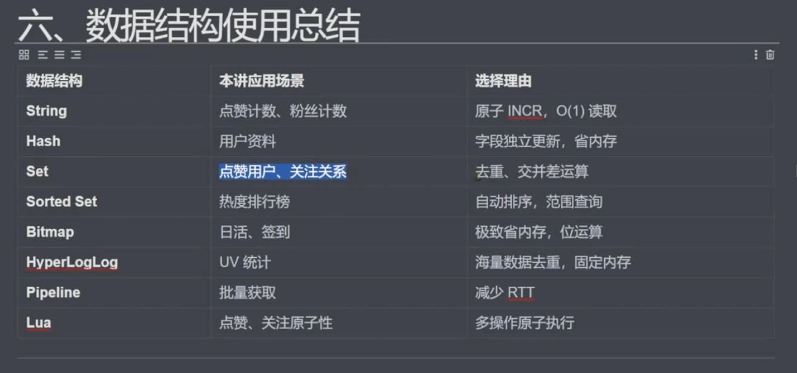

# 项目需求分析
- 
1. 点赞系统
    1. 点赞/取消, 统计数量
        - String,Set
2. 关注系统
    1. 关注/取消关注, 双向关系
        - Set
3. 热度排行榜
    1. 实时热度排行
        - Sorted Set
4. 活跃用户统计
    1. 日活/周活统计 BitMap, HyperLogLog
# 业务场景
1. 用户A 关注 用户B
2. 用户B 发表新文章
3. 用户A 收到动态
4. 用户C给用户B点赞
5. 文章热度上升, 进入排行榜

# 数据模型建模
1. Key的规范
    - 业务:对象:标识:属性
2. 用户资料 Hash
    - user:{id}:profile
    - Hash存储用户对象的各个信息
3. 文章信息 Hash
    - article:{id}:meta
4. 文章点赞 `Set + String`
    1. like:article:{id}
        - 存储点赞用户ID, 用于去重和判断存在
    2. article:{id}:count 
        - 存储点赞数, 用INCR实现原子增减
5. 关注系统
    1. 用户关注 `Set + 关系运算`
        - follow:{id}:following
    2. 用户粉丝 `Set + 关系运算`
        - follow:{id}:followers
        1. 关系运算
            1. 共同关注 SINTER
            2. 可能认识 SDIFF
            3. 是否互关 SISMERBER
7. 热度排行 `Sorted Set`
    - rank:article:daily
    1. Score的计算
        - 点赞*1 + 评论*2 + 分享*3 + 时间衰减因子
8. 日活统计 `Bitmap/HyperLogLog`
    1. dau:{yyyyMMdd} -> Bitmap, 第 userID 位为1表示活跃
        - BitMap优势: 1亿用户只要12MB内存
    2. 去重统计HyperLogLog
        - uv:article:456 -> HyperLogLog, 统计浏览去重人数
        - 优势: 一亿数据只要12KB,误差只有0.81%
9. 用户签到 `Bitmap`
    - sign:{id}:{yyyyMM}
