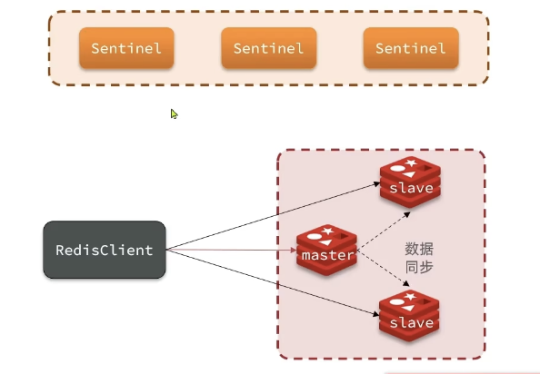

# 哨兵
1. 从节点即使宕机了, 也能根据数据同步机制快速恢复
2. 主节点宕机则需要哨兵机制
    - 立即选一个slave升级为master

## 哨兵作用 Sentinel
- 哨兵也要保证高可用性, 因此也必须是个集群
- 
1. 监控
    - 监控集群中每个节点的健康状态
2. 自动故障恢复
    - 如果master故障, 将一个slave提升为master
    - 如果slave故障, 重启slave
3. 通知
    1. 通知client(java的redisTemplate)
        - Java通过Sentinel取得Redis的地址, 相当于Sentinel提供`服务发现`
### 监控
1. 心跳机制
    - Sentinel每隔一秒给集群每个实例发送ping
        1. 某实例没有及时回复, 则认定该节点`主观下线`
        2. 若超过指定数量(quorum)的哨兵节点都认为某个实例`主管下线`, 则该实例`客观下线`
            - quorum最好超过Sentinel实例的一半
### 选举Master
1. 选举新master的依据
    1. 首先判断slave与master断开时间的长短, 若超过指定值`down-after-millseconds * 10`, 则排出该slave
    2. 根据slave节点的`slave-priority`值, 越小优先级越高, 为0则不参与选举
    3. 优先级一样的, 会判断slave的offset值, 越大说明数据越新
2. 选中一个salve后
    1. 向该slave发送`slaveof no one`, 使其称为master
    2. 向其他slave发送`slaveof ip port`, 指向新的master, 开始同步数据
    3. 将故障master节点标记为slave, 重启后成为slave节点
3. 通知java客户端

## 搭建哨兵集群
- Redis Sentinel（哨兵）不需要单独的 Docker 镜像 ——直接使用官方的 Redis 镜像即可！因为 Sentinel 本身就是 Redis 内置的一个进程（redis-sentinel），不是独立的服务，所以无需额外下载专门的 sentinel 镜像。
1. redis镜像, 核心启动命令不同
    1. redis-server, 主从节点
        - redis-server /etc/redis/redis.conf  # 核心：启动Redis服务进程
    2. redis-sentinel, 哨兵进程
        - redis-sentinel /etc/redis/sentinel.conf  # 核心：启动哨兵进程

## RedisTemplate连接哨兵
1. 不再配置Redis集群地址
2. 配置Sentinel集群地址就好
3. 读写分离配置
    - 配置LettuceClientConfigurationBuilderCustomizer
    - 对Lettuce进行自定义配置