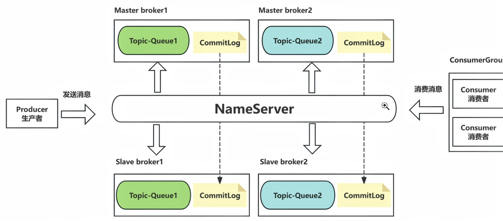

# Rocket基本组件
- 与Kafka类似
1. Topic主题, 消息归类的基本单元
    - 消息的发送和订阅必须要首先创建一个Topic
2. Queue队列, 消息的最小存储单元
3. Producer生产者
4. Consumer消费者
5. ConsumerGroup 消费者组, 逻辑概念, 描述多个消费行为一致的消费者
    - 也有把消息的消费压力分散到多个Consumer中的功能
6. Broke集群, 每个Broke都是一个Kafka实例
    - 消息存储与投递的核心, 负责写入、持久化、索引、拉取、过滤、重试等

# 基本构造
1. 客户端（Producer/Consumer）
2. 路由（NameServer）
3. 存储与转发（Broker）

# RocketMQ基本架构
- 消息的发送和订阅必须要首先创建一个Topic
1. 生产者根据Topic将消息发到队列, 消费者订阅Topic来获取并消费消息
2. 一个`Topic`中可以有多个`RocketMQ实例(也可以叫Broke)`
    - 一个RocketMQ实例包含
        - 一个`队列`, 只存储消息的偏移量 offset
        - 一个`CommitLog`, 存储真正的消息体
    - 这也是RocketMQ实现高吞吐量和并发消费的关键
    - 这两个`RocketMQ实例`就组成了一个`Broke集群`
3. `Slave Broke(从Broke)`
    - 实现高可用性的关键
    - 从Broke只是同步主Broke的消息, 不参与消费
    - 如果它的主Broke宕机了, 则从Broke会顶替主Broke继续工作
4. `NameServer`(注册中心)
    - 协调多个Broke, 负责Broke的注册与管理
    - Topic路由管理与发现
    - 
5. `ConsumerGroup`
    - 一个消费者挂了后, 另一个可以顶替他继续消费