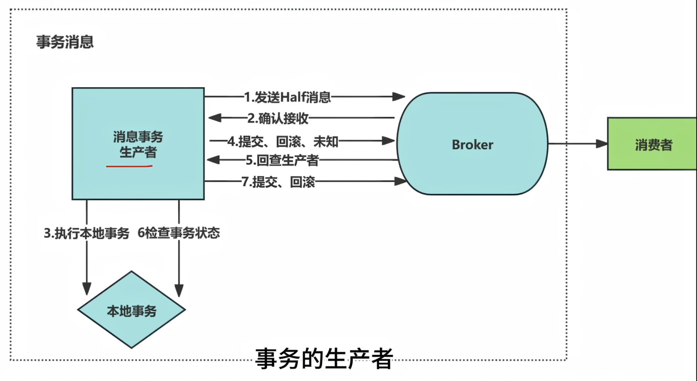

# Java
## 生产者发送消息(3种方式)
- RocketTemplate, 创建这个实例来操作
1. `同步发送`, 等待消息返回后再继续执行后续操作
    - rocketTemplate.syncSend(String, json)
    - syncSendOrderly(), 可以指定发送到哪个队列
2. `异步发送`, 不等待返回值直接进入后续流程, Broke将结果返回后用回调函数取得结果
    - rocketTemplate.asyncSend(String, new SendCallBack(){@Override})
        - 成功的回调 onSuccess(){}
        - 失败的回调 onException(){}
3. 单向发送, 只负责发送, 不管消息是否成功, 没有返回值
    - rocketTemplate.sendOneWay(){}

## 消费者消费消息
1. 实现
    1. 注解: @RocketMQMessageListener(...)
        1. topic="...", 必须
        2. consumerGroup="...", 必须
        3. messageModel= ConsumeMode.ORDERLY
    2. implements RocketMQListener<String> 
2. 顺序消息
    - 一个队列的消息会按顺序存储和消费消息, 但是通常消息会被发送到不同的队列中以实现负载均衡
    - 只要让生产者和消费者只对一个队列进行发送和消费就能实现顺序消息
        1. 生产者syncSendOrderly(), 可以指定发送到哪个队列
        2. 消费者ConsumeMode.ORDERLY, 然后
2. 两种消费消息的方式
    1. pull(默认方式)
    2. push, broke主动把消息推给消费者

# 消息模型 MessageModel
1. 集群消费模式 CLUSTERING (默认)
    - 同一个消费者组的消费者们共同消费Topic的消息
    - 且他们不会消费同一个队列的消息(无法确保顺序,且容易重复消费)
2. 广播消费模式 BROADCASTING
    - 同一个消费者组的消费者们 都会收到Topic的所有消息
    - 可以消费同一个队列的消息

# 延迟消息
1. new Message()
2. msg.setDelayTimeLevel()
    - 设置的是延迟的等级

# 批量发送消息
- 生产者一次性发送多条, 减少IO次数
    - 这种情况不是是延迟消息
- 消费者不变

# 过滤消息
- 用Message的Tag属性来过滤消息
- 生产者定义一个Tag
- 消费者在注解中定义过滤表达式即可
    - selectorExpression=""

# 事务消息(优点)
- 可以保证`本地事务执行`和`消息发送`这两个操作的原子性
    - 会先发送一个Half消息
    1. 成功后提交, 给消费者消费
    2. 失败后会滚, broke会丢弃这条消息
- 但`不确保消费者`的行为
- 
1. 具体实现
    1. 创建一个本地事务的监听器
        - implments RocketMQLocalTransactionListener
        - 提供方法 监听本地事务是否执行成功
    2. 本地事务也需要 @Transactional注解
    3. 生产者 
        - template.sendMessageInTransaction()

