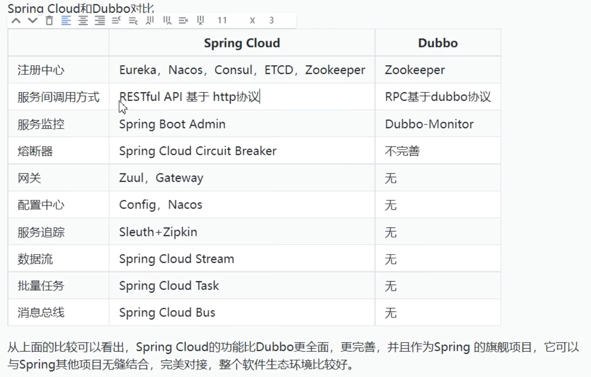
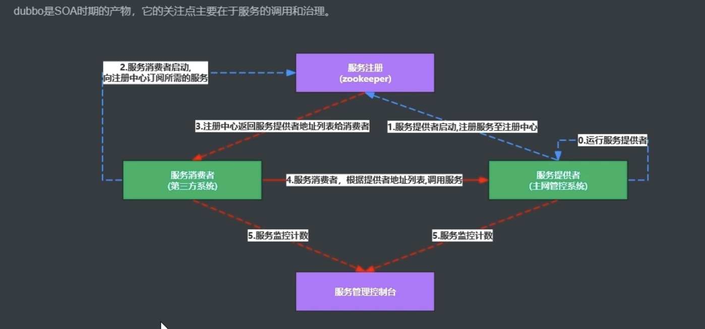

1. Dubbo与SpringBoot对比

zookeeper可能会被etcd淘汰
Dubbo普及度不如gRPC
jenkins 资源占用高的旧CI/CD工具, githubActions, Gitlab CI
swagger 接口文档自动化工具, 通过注解自动生成接口文档, 用于前后端协作, postman和AI也能做到

前端 VUE(国内)/React(国际)
Next.js 是React全栈框架
VitePress, 针对md格式, 对技术网站友好

# Dubbo

- Dubbo是SOA时期的产物, 主要用于服务的调用(RPC框架)和治理
    - 现在也添加了负载均衡熔断等等功能
    - 如果只是做远程调用的话, Dubbo(dubbo协议)性能比openfeign(http协议)的
- SpringCloud是微服务

# 架构
1. 服务提供者
2. 服务架构者
3. 服务注册(zookeeper或者nacos甚至Redis)
## 运行流程
1. 提供者启动, 将服务注册到注册中心
2. 消费者启动, 向注册中心订阅所需要的服务
3. 注册中心把服务提供者列表给消费者, 消费者把服务注册信息拉取到`本地`
4. 消费者根据该信息去调用提供者的服务 

# 使用
0. 可能需要先定义API模块
    0. 打成jar包, 这样需求变动时,只要改这一个模块就行
    1. 让提供者和消费者依赖API模块
    - 实体类需要实现序列化接口
1. 服务提供者
    1. 引入依赖
    2. 启动类添加注解`@EnableDubbo`
    3. 服务类添加注解`@DubboService`, 实现API接口
    4. 配置文件引入Dubbo和ZooKeeper的信息
2. 消费者
    1. 引入依赖
    2. 启动类添加注解@EnableDubbo
    2. 通过`@DubboReference`将远程服务注入
    3. 配置文件引入Dubbo和ZooKeeper的信息

## 面试
1. 你怎么理解Dubbo
    1. 这是一个高性能,轻量级的开源RPC框架
    2. 可以理解为三层模型
        1. Business业务逻辑层
            - 需要我们提供配置和实现信息
        2. RPC调用的核心层
            - 里面封装了RPC的调用过程,负责均衡,集群容错,代理等功能
        3. Romoting
            - 对网络传输协议和数据转化的封装
    3. 提供6种核心能力
        1. 面向接口代理的高性能RPC调用
        2. 智能容错和负载均衡
        3. 服务的自动注册和发现
        4. 高度可拓展能力
        5. 运行期间流量调度
        6. 可视化服务治理和运维
2. Dubbo的负载均衡策略(5种)
    1. 加权随机
        - 通过区间的随机算法获取一个目标服务器, 可以对某个服务器增加权重
    2. 最小活跃数
        - 计算服务提供者的被调用次数, 收到请求active+1, 结束请求后active-1
        - active数低的服务提供者优先获取请求s
    3. 一致性hash算法
        - 同一个客户端的请求,通过该算法,只要请求信息没变, 就总是会落到同一台服务器上
    4. 加权轮询
        - 在轮询时,可以对某个服务器增加权重,使其更多次被调用
    5. 最短响应时间的权重随机
        - 计算服务收到请求后的响应时间, 给响应时间短的服务配置更高的权重
3. Dubbo工作原理
    1. 提供者和消费者根据配置信息连接到注册中心, 分别注册和订阅服务
    2. 注册中心根据订阅关系, 给消费者返回服务提供者的信息, 同时,消费者将该信息缓存到本地
        - 如果信息变更, 消费者会收到注册中心的推送, 更新本地的信息
    3. 服务消费者产生`代理对象`, 根据负载均衡策略去选择一台目标服务提供者, 并且定时向monitor记录接口的调用次数和时间
    4. 拿到代理对象之后, 消费者通过代理对象发起接口的调用
    5. 服务提供者收到请求后, 将数据反序列化, 再通过代理, 
4. Dubbo与SpringCloud
    - 
    1. Dubbo是SOA时期的产物, 主要关注服务远程调用和流量控制等等方面
        - 底层是Netty(一个NIO框架), 基于TCP协议传输
    2. SpringCloud诞生于微服务架构时代, 关注微服务项目整个解决方案
        - 基于HTTP协议+RESTfulAPI实现通讯
