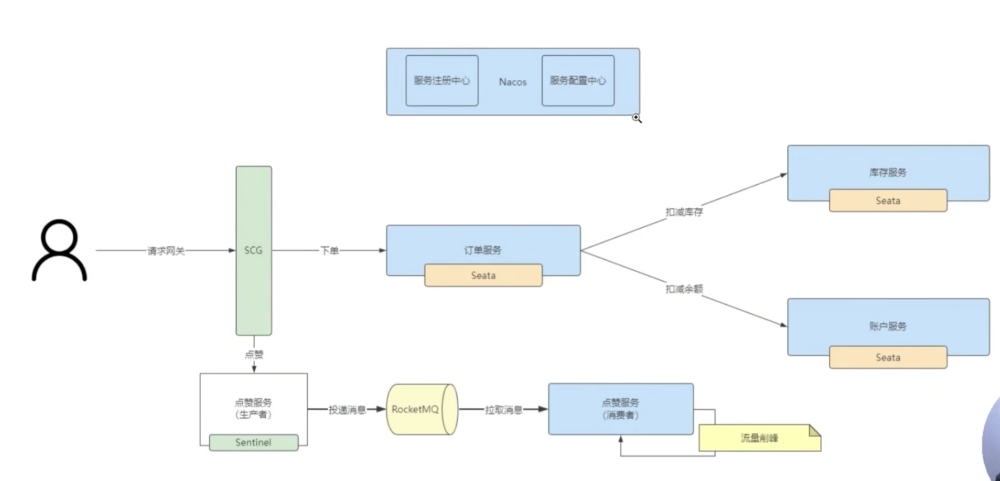
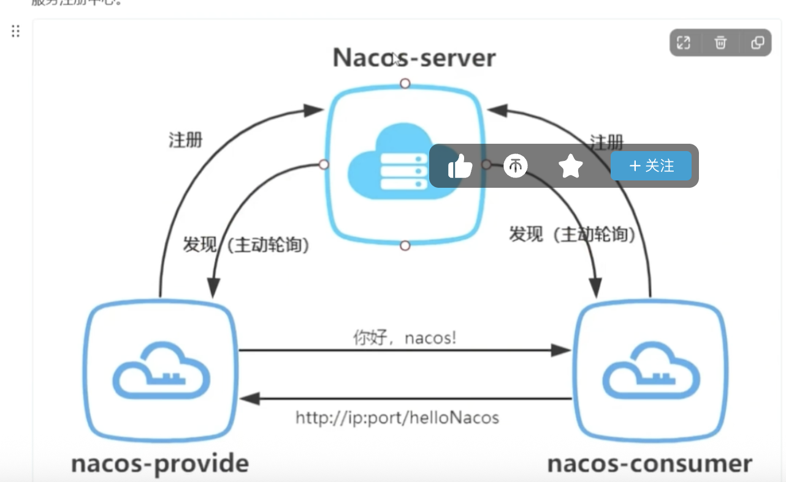

# 微服务
- https://www.bilibili.com/video/BV1apr6YyEGg?spm_id_from=333.788.videopod.episodes&vd_source=74a5ce1d05cd44013f5ebb561caa119a&p=5
- 将APP拆成小型独立的模块的一种开发方式
- 每个模块可以用不同语言不同技术
1. 优点
    1. 模块独立解耦, 独立部署, 快速迭代
        1. A订单模块需要高并发, 可以用Go语言写
        2. B库存服务, 可以分给java程序员来写
    2. 灵活技术栈
    3. 高拓展性
    4. 容错性好
2. 缺点
    - 服务器成本, 开发人员成本, 运维成本

# SpringCloudAlibaba(用于服务治理)
- Spring Cloud 是一套微服务架构的标准 / 规范（可以理解为 “微服务接口定义”）
- Spring Cloud Alibaba 是Spring Cloud 规范的具体实现，同时也是对 Spring Cloud 的扩展和增强。它替换了 Spring Cloud 中原有的 Netflix 组件（如 Eureka、Hystrix 等），提供了更适合国内场景、性能更优的本土化组件，并且完全兼容 Spring Cloud 的标准 API，让开发者可以无缝切换。

1. 如何管理这么多微服务?
    - 服务治理, 注册中心(注册,发现,剔除), `Nacos`
    - Nacos 3.0+
        1. 服务注册中心
        2. 服务配置中心
2. 这么多服务之间如何通讯?
    - feign, 类似于Dubbo, 像访问本地服务一样调用方法
    - 也可以用restTemplate的方式通过HTTP请求调用另一个APP的Controller
    - 新版不推荐使用feign, 默认使用 Spring Cloud LoadBalancer + RestClient / WebClient / Http Interface
    - 或者 `OpenFeign` + SpringCloud LoadBalancer
3. 客户端如何统一访问这些微服务?
    - 网管 gateway, 作为整个微服务集群的大门
    - 统一用 Spring Cloud Gateway, 用Zuul做网关的是老教程
4. 一旦出错, 如何处理
    - 容错 sentinel
    - Sentinel 1.8.9+
5. 出了问题如何排错?
    - 链路追踪 `Skywalking` 10.0+
6. 如何保证同一组事务的一致性?
    - `Seata` 2.5+
    - @Transactional只能确保一个APP中的事务

## Demo项目

1. 网关
    1. 订单服务
        1. 使用seata确保事务一致性
        - 通过 open feign 调用 库存服务
        - 通过 open feign 调用 账户服务
    2. 点赞服务生产者(使用sentinel进行限流和熔断)
        - ->RocketMQ(异步消息)
            - 点赞服务消费者 (消峰)
## SpringCloudAlibaba
1. `引入依赖`, 三者有严格的版本对应关系, 用之前查查
    1. spring-boot-starter-parent
        - 3.2.5
    2. spring-cloud-dependencies (这是微服务的标准)
        - 2023.0.3
    3. spring-cloud-alibaba-dependencies (这是微服务的拓展)
        - 2023.0.1.0
## Nacos注册中心
- 
1. Nacos的配置
    1. 需要下载Nacos
        - https://nacos.io/download/nacos-server/?spm=5238cd80.2ef5001f.0.0.3f613b7cRVYeiB
    2. 有几个地方需要改
        1. nacos配置文件 nacos/conf/application.properties
            - nacos有很多东西需要持久化, 因此需要配置数据库
        2. 创建数据库后, 执行nacos/conf/mysql-schema.sql
            - 生成需要的表格
        3. nacos启动文件 nacos/bin/start.cmd
            - Mode, 默认是Cluster,这里改成standalone
        4. 启动, 端口8848, 直接访问这个地址有前端页面可以用
            - 把Order服务和Stock服务整合进去, 就可以用服务名称进行访问了
    3. 添加依赖
        - spring-cloud-starter-alibaba-nacos-discovery
    4. 在类上添加注解(可选)
        - @EnableDiscoveryClient
    5. 配置文件
        - 配置当前服务的服务名 order-server
        - 配置nacos的地址 localhost:8848
    6. 刷新一下nacos前端页面, 自动会配置上去
2. Loadbalancer组件
    - 现在还不能实现直接使用服务名, 还需加上这个
    1. 向消费者端添加依赖
        - spring-cloud-loadbalancer
        - order要调用stock, 因此加到order里面
    2. 给RestTemplate对象/构造上面加上注解
        - @LoadBalanced
3. `Nacos心跳机制`
    - Stock可能有多台服务器, 如果有几台宕机了, 就不会调用宕机的服务

```java
/**
 * 修改前
 * 不可能给每个服务都写死一个URL, 更何况端口号还会自动变
 */
// Order联动Stock
String result = restTemplate.getForObject("http://127.0.0.1:8081/stock/reduct");

/**
 * 修改后
 * 整合nacos注册服务
 */
String result = restTemplate.getForObject("http://stock-server/stock/reduct");

```

## OpenFeign
- 还是觉得这样通过HTTP调用麻烦, 能不能像`调用本地方法`一样调用?
1. 整合OpenFeign
    1. 添加依赖
        - spring-cloud-starter-openfeign
    2. 在 启动类 中加入注解
        - @EnableFeignClients
    3. 创建Feign接口
        ```java
        /**
         * 接口
         * 为接口创建一个动态代理, 封装了一层, 底层还是HTTP请求 
        */
        @FeignClient(name="stock-server", path="/stock")
        public interface StockFeignServer{
            @RequestMapping("/reduct")
            String reduct();
        }
        /**
         * 调用
        */
        String result = stockFeignServer.reduct();
        ```
## Nacos配置中心
- 主要是把配置文件里的配置信息, 放到nacos的前台进行统一管理
1. 在网页操作
    1. 创建配置, 发布
        - order-server.yaml
    2. 服务接入配置中心
        1. 加入依赖
            - spring-cloud-starter-alibaba-nacos-config
        2. 在配置文件中加入nacos:config的地址
        3. 指定需要导入的配置文件
            - nacos:order-server.yaml
    3. 获取配置中心的配置
        - 直接用@Value("${xxx}")即可
    4. 如果需要实时变化, 需要在类上加注解
        - @RefreshScope

## Gateway 网关
## seata 分布式事务
## sentinel 服务流控,熔断降级
## RocketMQ异步处理和流控