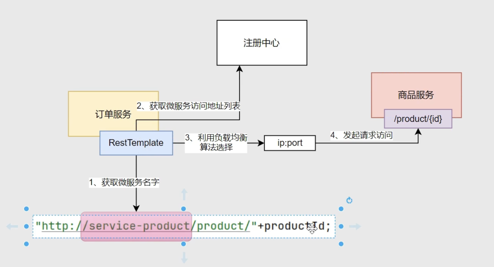

# Nacos 服务注册中心
- 
- 类似于zookeeper, 需要单独下载Nacos服务
- 具体版本可以ctrl+左键, 点击springcloudalibaba的依赖, 看看里面用的哪个版本
    - `<nacos.client.version>2.3.2</nacos.client.version>`
    - docker pull --platform linux/amd64 nacos/nacos-server:v2.3.2
## 启动前准备
1. nacos需要一个数据库来持久化数据, 具体依赖mysql的方式参考`docker-compose`文件
2. 默认是以cluster模式启动, 这里为了测试改成standalone 单机模式
3. http://localhost:8848/nacos
    - 服务管理 -》 服务列表 查看nacos的服务

# 服务注册和服务发现
- 将orders服务和stock服务整合进nacos,这样就不需要通过远程地址和端口来访问服务了
- 直接通过服务名进行访问
1. 配置
    1. 需要给该服务导入 `spring-cloud-starter-alibaba-nacos-discovery`
    2. 配置 `spring.cloud.nacos.discovery.XXX`相关配置
        - 只要配置了nacos的服务地址, 启动时就会自动连上nacos
            - 这一步就是`服务注册`
        - 注意如果配置了命名空间,则nacos中需要有这个命名空间
            1. 命名空间: 不同命名空间会隔离
            2. 分组: 只是个tag,用于区分业务
    3. 在`启动类`上加上`@EnableDiscoveryClient`
        - 开启发现客户端, 用于开启`服务发现`的功能
    4. 启动项目后, 应该可以在nacos控制面板看到这两个服务
        - 可以看到`服务名`
2. 还需要配合 `LoadBalancer` 才能实现`通过服务名直接访问`
    - 放在需要远程调用的消费者端
        - 这里应该导入到`order`中, 因为需要在`order`中远程调用`stock`的服务
    1. 在`order`中导入`spring-cloud-starter-loadbalancer`
    2. 在`order`启动类的RestTemplate上面加上`@LoadBalanced`注解
        - 启用负载均衡
    3. 将使用restTemplate远程调用的连接修改一下
        - 修改前: http://localhost:8011/stock/reduce
        - 修改后: http://stock-server/stock/reduce
3. 测试
    1. 调用order服务`http://localhost:8010/order/add`
    - 这样nacos注册中心就帮我们管理好了服务,我们不需要再自己维护远程服务的域名和端口


# 服务发现提供的类
- 这个主要是用来测试
1. `DiscoveryClient`, 直接@Autowired进来就能用, SpringCloud提供的
    1. dc.getServices(); 获取当前所有已注册服务的名字
    2. dc.getInstances(serviceId); 根据名字拿到实例
        - 然后再.getHost(), .getPort()等取得主机的地址和端口号
2. `NacosServicesDiscovery`, 也是@Autowired, Nacos提供的
    - 用法一样的

# LoadBalaner组件可以实现负载均衡的功能
- 假如现在有多台orderService, LoadBalancer可以配置负载均衡
1. `LoadBalancerClient` 
    1. lc.getInstances(serviceId), 获取某个微服务的所有实例, 不要用这个
    2. lc.choose(serviceId).getHost(), 这个可以负载均衡地拿一个地址
        - 默认是`轮询`
2. 只要有@LoadBalanced注解, 就会自动负载均衡, 不需要用上面的choose
    - 也不需要getHost了, 因为可以通过服务名直接访问


# nacos的集群
1. Nacos 心跳机制
    - 假如部署了10台stock-server, nacos会自动检测健康状态, 只调用健康实例

# 目前的问题
1. 现在虽然配置了nacos, 但远程调用用的还是restTemplate的方式
    - 先在@Configuration配置类中@Bean return一个restTemplate, 加入容器
    - 直接@Autowired
    - `Order o = restTemplate.getForObject("http://stock-server/stock/reduce", Order.class);`
2. 如果想实现像调用类方法一样调用远程服务, 需要使用`openFeign`


# 面试题
1. 如果nacos宕机了, 还能调用微服务吗?
    1. 分析流程
        1. 向 注册中心 获取已注册的微服务地址列表
            - 然后会缓存下来, 之后直接从缓存中取
            - 注册中心会同步信息给实例
        2. 给对方服务的某个地址发送请求
    2. 所以只要调用过, 由于缓存中有地址, 因此可以调用; 如果是第一次发起远程调用, 则不能


# 如何组织Java微服务的各个模块
- cloud-demo模块
    - services模块
        - order模块
        - product模块
    - model模块
        - 可以把各个Bean的结构汇总在这里

1. 如何把model模块引入其他services中?
    - 可以直接写入公共的 services模块 的pom文件中
    ```xml
    <dependency>
        <groupId>com.xxx</groupId>
        <artifactId>model</artifactId>
    </dependency>
    ```
    - 定义好之后, 在右边的maven按钮那边看一下