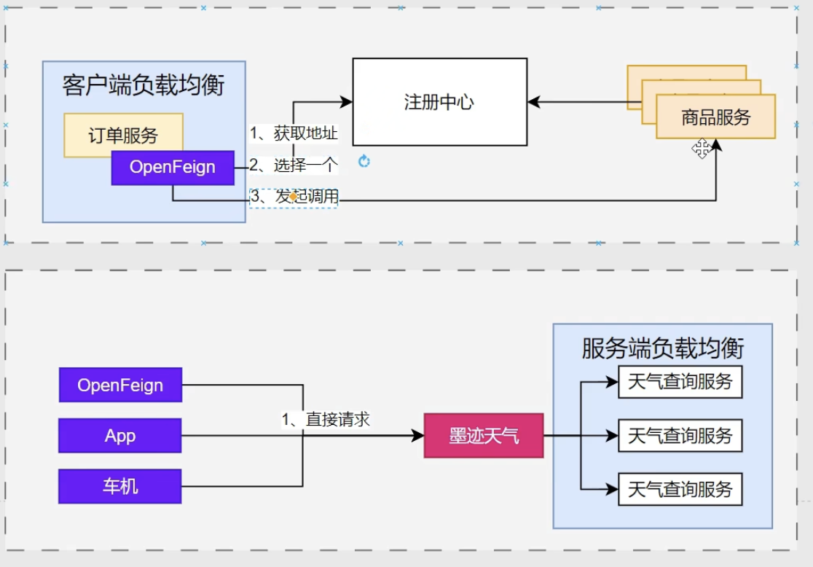
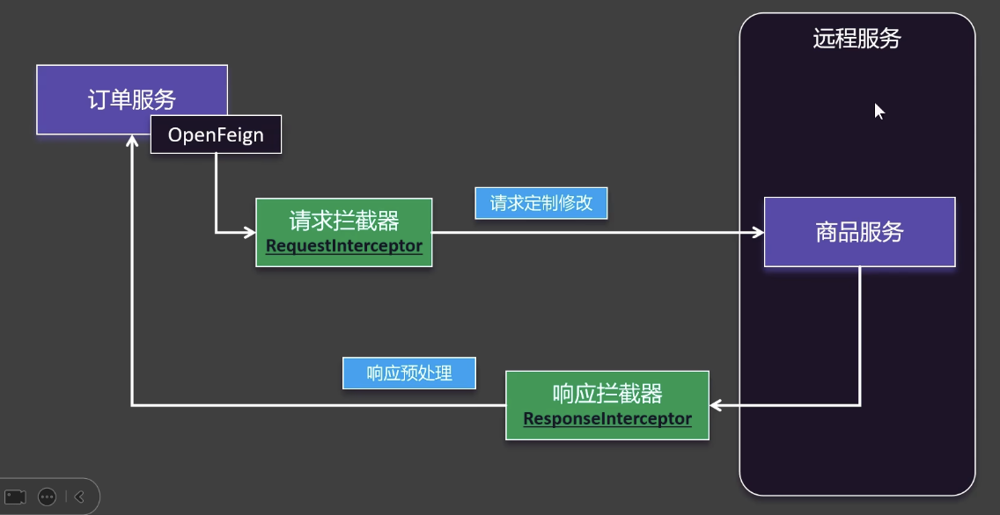

# 目前的问题
1. 现在虽然配置了nacos, 但远程调用用的还是restTemplate的方式
    - `restTemplate.getForObject("http://stock-server/stock/reduce", String.class);`
2. 如果想实现像`调用类方法一样`调用远程服务, 需要使用`openFeign`

# 配置
1. 在order中添加openfeign依赖
    - `spring-cloud-starter-openfeign`
2. 在order的启动类加上`@EnableFeignClietns`注解
    - 开启`远程调用`功能
3. 需要新建一个`自定义接口`StockServiceFeignClient, 然后打上`@FeignClient(name = "stock-server")`
    - 远程调用客户端
    1. 注解的含义
        1. name, 另一个服务的名称, spring.application.name
            - Feign会自动连上注册中心, 找到这个服务的地址
        2. path, 可以作为前缀path
    2. 声明需要调用rest接口对应的`方法`
        1. 注解: 
            - `@RequestMapping("/stock/reduce")`
            - `@GetMapping("....")`
                - 这里的path可以和上面那个拼接
            - 这些是SpringMVC的注解, 如果标注在Controller上, 是用于`接受一个请求`; 如果标注在FeignClient, 则是`发送一个请求`
        2. 要调用的方法签名
            - public String reduceStock(@RequestParam Integer productId);
            - get(@PathVarible("id") Long id, @RequestHeader("token") String token)
4. 修改之前的restTemplate
    1. 改前: 
        1. 注入RestTemplate
        2. restTemplate.getForObject("http://stock-server/stock/reduce", String.class);
    2. 改后: 
        1. 注入StockServiceFeignClient
        2. feignClient.reduce();
# 原理
- 自定义了一个接口, 当然底层用的是动态代理
1. 给这个接口创建一个动态代理, 


# OpenFeign还可以调用第三方API
- 比如一个第三方天气API
1. 需要新建一个`自定义接口`WeatherFeignClient, 
2. 然后打上`@FeignClient(value = "weather-api", url = "xxxx")`
    - 这里`weather-api`在注册中心不存在, 因此需要精确指定`url`
3. 假如说需要发送一个POST请求
    ```java
    @PostMapping("xxx")
    String getWeather(@RequestHeader String auth, //放在请求头上
                      @RequestParam String token, //放在请求参数上
                      @RequestParam cityId);
    ```

# 面试
1. 客户端负载均衡和服务端负载均衡的区别
    - 
    1. 客户端负载均衡
        - 发起调用的这一端, 自己使用负载均衡算法, 选择一个对方的服务进行调用
        - 负载均衡发生在客户端
    2. 服务端负载均衡
        - 直接调用第三方API, 由第三方API的服务端根据负载均衡算法, 选一个服务来处理请求
        - 负载均衡发生在服务端, 唯一入口, 客户端无需关心具体调用哪一个

# OpenFeign的日志功能
1. 在配置文件中启用 
```yaml
logging:
    level:
        com.atguigu.order.feign: debug #debug级别的日志更详细
```
2. 在某个配置类中加入这个Bean
```java
// 注意 Logger 是feign包下的
@Bean
Logger.Level feignLoggerLevel(){
    return Logger.Level.FULL;
}
```
3. 然后就会自动打印了

# OpenFeign超时配置, 重试机制,
1. 分析调用流程
    1. A对B建立连接
        - 连接超时connectTimeout, 有默认值10秒
    2. A对B发送请求
    3. B处理业务
        - 读取超时readTimeout, 有默认值60秒
    4. B对A返回数据
2. 可以通过修改配置来修改默认值, 具体看文档

# OpenFeign的拦截器机制
- 
1. 请求拦截器(用得多)
    - 比如给请求的请求头上加一个token等等
2. 响应拦截器

# OpenFeign的FallBack兜底返回机制
- 超时错误时, 既可以返回错误信息, 也可以返回兜底数据
    - 比如一段通用的默认数据, 或者缓存数据
1. 在@FeignClient()中加入
    - fallback = Fallback.class
    - 具体看看文档