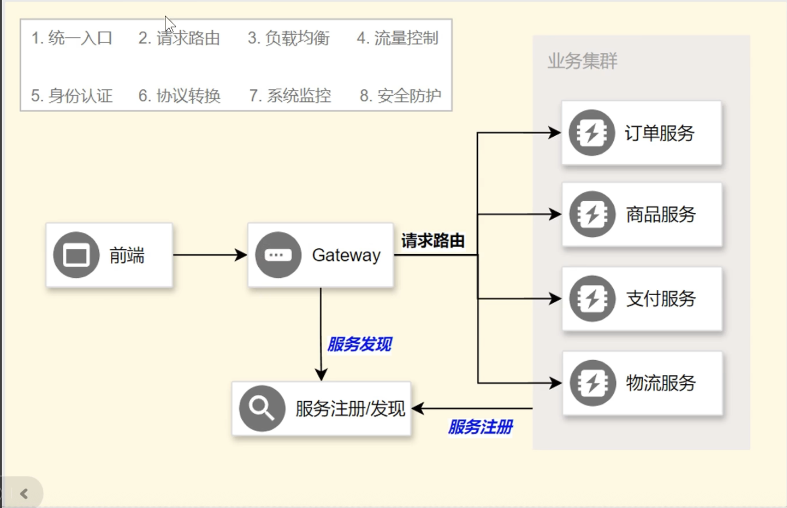
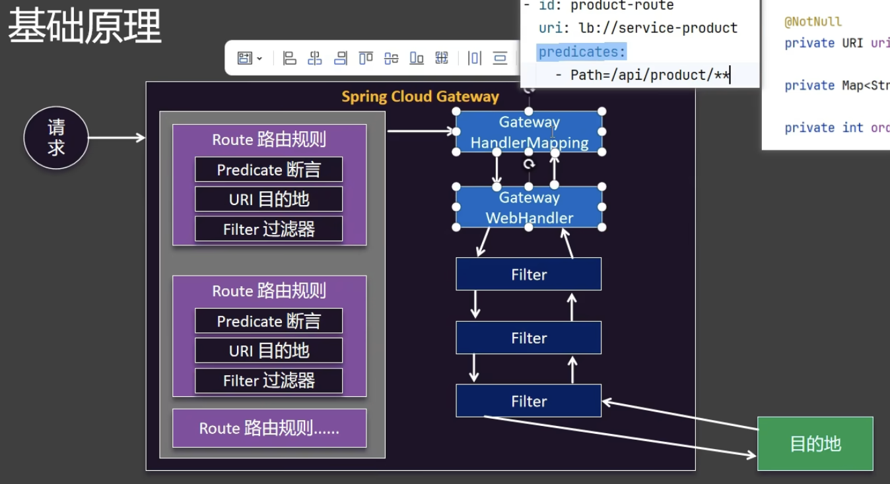

# Gateway
- 主要用于维护给客户端调用的远程地址, 网关是外部请求进入时的`统一入口`,由网关来判断应该分发请求给哪个内部服务
- 
- Gateway也需要从nacos中拉取服务的注册信息, 然后才能分发
1. Gateway网关配置的是 8012
    1. 改前: http://localhost:8010/order/add
        - 这个是内部地址
    2. 改后: http://localhost:8012/order/add
        - 这个地址可以暴露给客户端
2. SpringCloudGateway有两个版本
    1. Reactive Server(推荐)
        - spring-cloud-starter-gateway
        - 响应式网关, 少量资源就能实现高并发
    2. Server MVC
        - spring-cloud-starter-gateway-mcv
        - servlet提供的传统网关


# 配置
- Gateway也是一个单独的服务, 需要新建这个服务
1. 单独创建一个spring项目 gateway, 这个项目就是网关
    1. 修改pom文件中的parent 父maven项目
        - 改成最外面那个文件夹名,统一父pom文件
2. 需要4个依赖
    1. spring-cloud-starter-gateway
    2. spring-cloud-starter-alibaba-nacos-config
        - 如果有用到nacos配置中心, 则需要这个
    3. spring-cloud-starter-alibaba-nacos-discovery
        - 服务发现, 这是注册中心
    4. spring-cloud-starter-loadbalancer
        - 这个负责路由的分发
3. 在Gateway的配置文件中加上
    0. 网关的位置
        - server.port: 80
    1. nacos注册中心
        1. nacos.discovery
        2. nacos.config
    2. 配置中心 
        1. spring.config
    3. 网关陆游规则
        ```yaml
        spring:
            cloud:
                gateway:
                    route:
                        - id: order-route # 全局唯一
                          uri: lb://order-serveic #lb是load balancer
                          predicates: #断言, 定义一些规则
                            - Path=/api/order/**
                          # 上面三个是必须的
                          filter: # 可以配置过滤器
                          metadata:
                          order: # 配置顺序
        ```
    - 
    4. filter,过滤器
        - 过滤器都是带`前置方法`和`后置方法`的
        - 可以用于路由重写,比如去掉`/api/`这样的基础路径等等
    5. 除了内置的`断言工厂`和`过滤器工厂`, 也可以自定义
4. 为了服务发现
    1. 在启动类上加上`@EnableDiscoveryClient`
    2. 启动


# 面试题
1. 微服务之间的调用经过网关吗?
    - 不经过网关