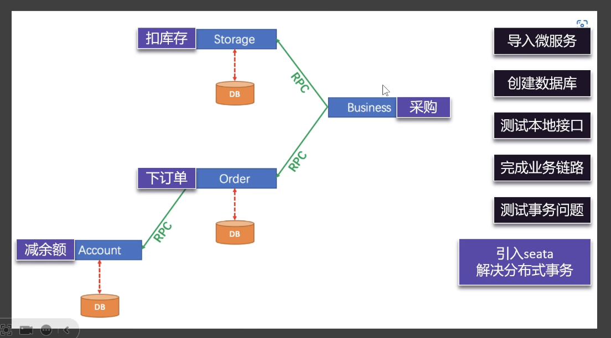
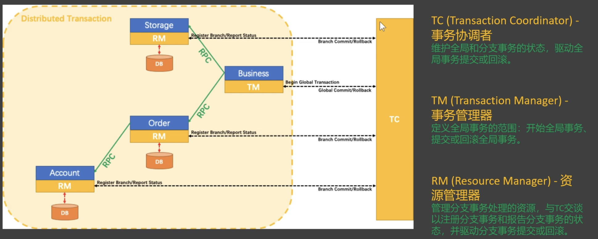
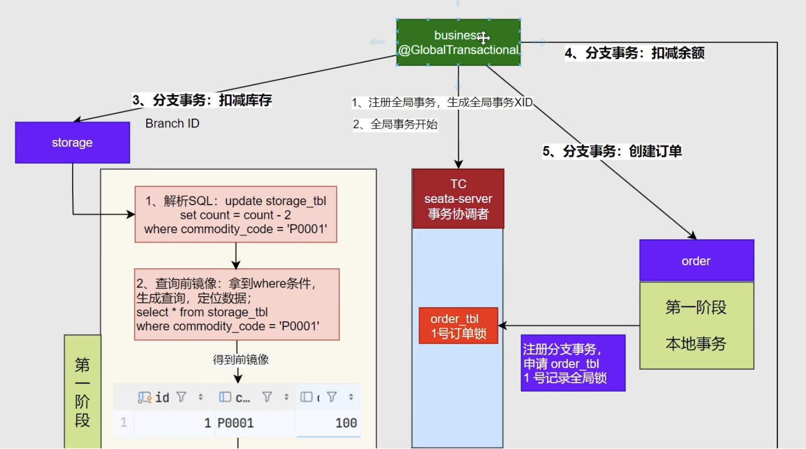

# Seata
- 主要用来处理分布式事务
- 一条数据库连接只能连接一个数据库, 当一个业务需要涉及多个不同作用的数据库时, 使用分布式事务来管理各个事务的统一提交和回滚
1. 示例
    - 
    1. 有四个微服务: 采购, 库存, 下单, 账户(扣减余额), 分别有各自的数据库
    2. 购买时, 需要控制多个库的事务统一提交和回滚

# 本地事务: Spring声明式事务 @Transactional
- 只能确保一个服务下面的事务一致性, 现在需要跨服务实现
1. 开启基于注解的本地事务
    - 主程序添加注解`@EnableTransactionManagement`本地事务注解
2. 给方法上添加`@Transactional`注解, 标记事务方法
    - 这样如果中途抛出了异常, 之前的sql操作会被回滚

# Seata组件
- 需要多个不同微服务的事务协同起来, 彼此能感知对方的状态
1. TC,TM,RM
    - 
2. Transaction Coordinator, 事务协调者
    - 维护全局事务状态, 驱动全局回滚或全局提交
    - TC的稳定性非常重要
3. Transaction Manager, 事务管理器(全局事务)
    - 定义全局事务范围, 开启全局事务, 提交或回滚全局事务
    - 最顶层的微服务开启全局事务GlobalTransaction
4. Resource Manger, 资源管理器(分枝事务)
    - 管理分枝事务的状态, 驱动分枝事务的提交或回滚
    - 也要及时与TC进行通讯, 注册分枝事务, 同步事务状态

# 整合Seata
0. 首先需要一个 Seata服务器(`TC`)
    - Seata启动后有一个web界面: localhost:7091
    - 账号密码都是seata
    - 提供可视化信息
1. 同时在 order 和 stock 中添加seata依赖(添加Seata客户端)
    1. spring-cloud-starter-alibaba-seata
    2. 配置文件
        - seata:tx-service-group: xxxx. # 如果一个seata服务器宕机了, 可以切换同组另一个
    3. 如果不写上面的, seata官网给了一个配置文件`file.conf`, 也可以放在nacos上
        - 配置seata的地址
2. 在之前的业务方法上加注解, 标记`全局事务入口`
    1. `@GlobalTrasactional`
        - 放在最外面的order方法上

# Seata的模式
1. AT
2. TCC
3. Saga
4. XA

# Seata原理
1. 二阶提交协议 + undo_log
    - 
    - https://www.bilibili.com/video/BV1UJc2ezEFU?spm_id_from=333.788.videopod.sections&vd_source=74a5ce1d05cd44013f5ebb561caa119a&p=70

2. 没有 Seata（分布式事务框架），就放弃强一致性，采用最终一致性方案