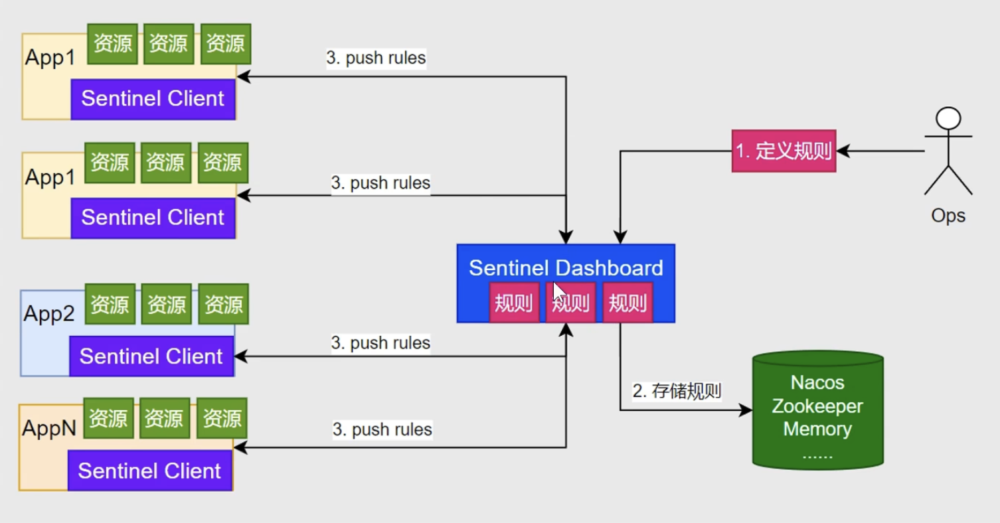
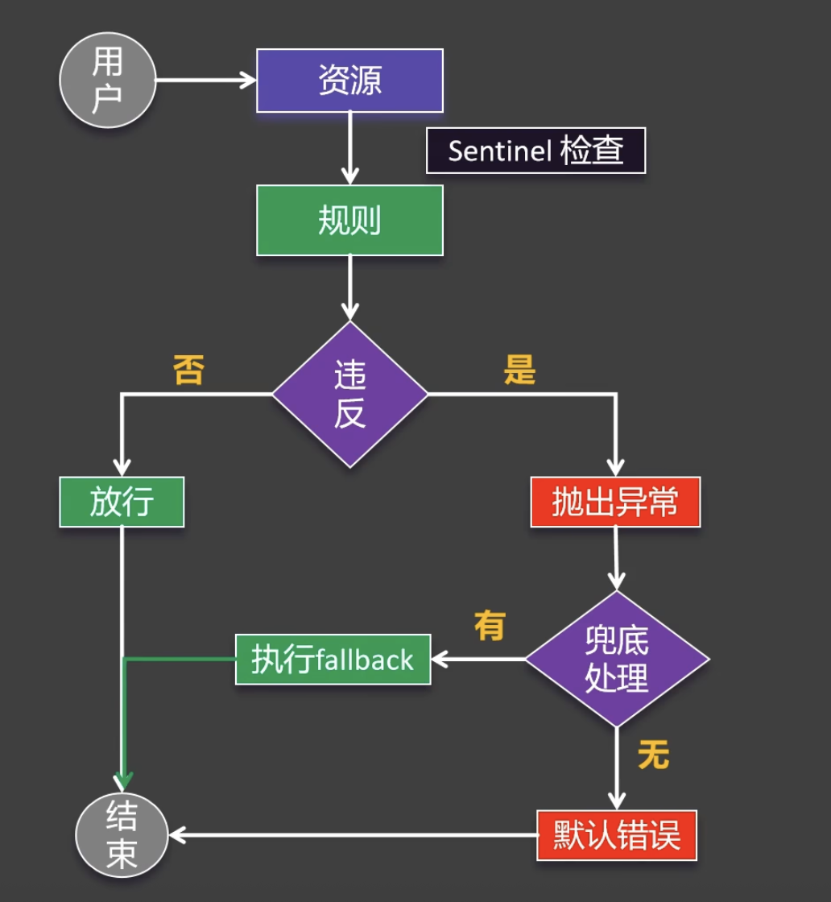
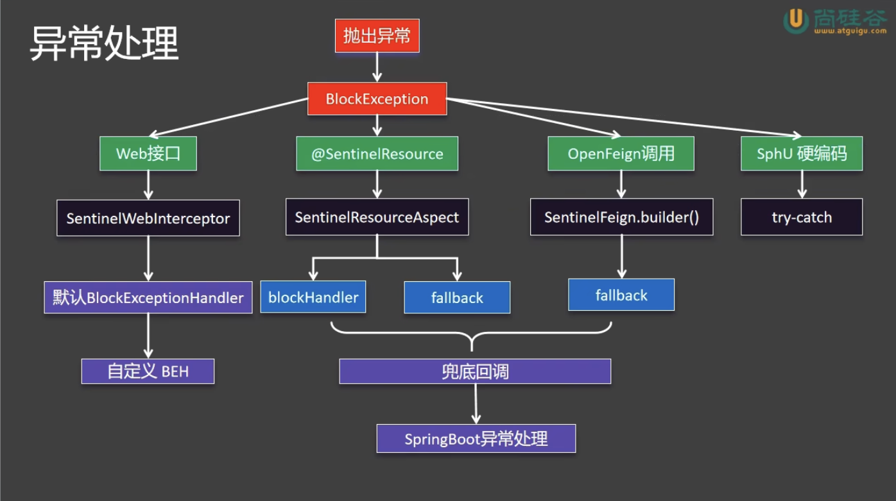

# Sentinel
- 服务保护的常见手段(2个): `服务限流`, `熔断降级`
1. 服务限流:
    1. 让多个请求排队进入(整形)
    2. 请求过多时, 让多的请求直接报错
2. 熔断降级
    1. 在访问第三方API时, 若对方宕机, 会导致我们这边很多请求堆积得不到响应
        - 一个服务不可用导致整个系统不可用(系统雪崩)
        - 对这个服务进行熔断降级
            1. 不再请求该第三方API
            2. 降级: 比如先存redis里面,后续再做补偿
3. 原理
    - Sentinal可以对各个APP的各个资源的访问规则进行定义
        - 所以要定义`资源`和`规则`, 以及违反规则后的`兜底回调fallback`
    - 
    - 
    1. 资源(Sentinel会自动定义规则)
        1. 主流框架会`自动适配`(Dubbo, SpringCloud, gRPC)的`所有WEB接口`均视为资源
        2. 自定义资源
            1. 编程式: SphU API, 设置一段代码为资源
            2. 声明式: `@SentinalResource`, 标注一个方法为资源
    2. 规则
        1. 流量控制 FlowRule
            - 限制每秒只处理100个请求, 多的拒绝
        2. 熔断限流 DegradeRule
            - 失败后
        3. 系统保护 SystemRule
            - 根据当前系统的内存负载, CPU使用率定义规则
        4. 来源访问控制 AuthorityRule
            - 只允许哪些上游来访问下游资源
        5. 热点参数 ParamFlowRule

# 服务整合Sentinel
1. 添加依赖
    - spring-cloud-starter-alibaba-sentinel
2. 添加控制台的配置
    - spring.cloud.sentinel.transport.dashboard: localhost:8077
    - spring.cloud.sentinel.eager: true, 项目一启动自动连上控制台
3. 重启服务后, 应该能在控制台看到这个 server

# Sentinel控制台
- http://localhost:8077/#/login
- 账号密码都是 `sentinel`
1. QPS, 一秒钟内, 限制只能请求的次数
2. 超过限制时
    1. 流控模式
    2. 流控效果

# 使用Sentinel
1. 定义资源, 假设想把service中一个方法定义为资源
    1. 添加@SentinelResource(value = "createOrder")
2. 添加规则
    1. 先调用一次这个方法, 然后就能在`簇点链路`中看到这个资源
    2. 添加规则
        1. 流控
            - QPS, 单机阈值
        2. 熔断
        3. 热点
        4. 授权
    3. 这样违反规则后, 前端会显示`Blocked by Sentinel(cause)`
3. 配置兜底规则, 因为希望给前端返回JSON格式的
    - 对于不同的资源, 有不同的处理方法
    - 
# Sentinel的异常处理
# 流控规则
# 熔断规则
# 热点规则
