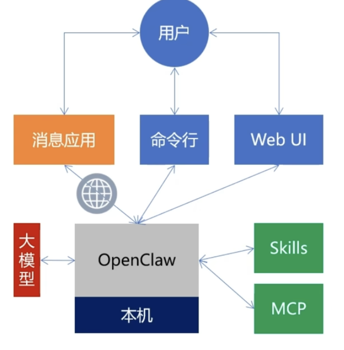
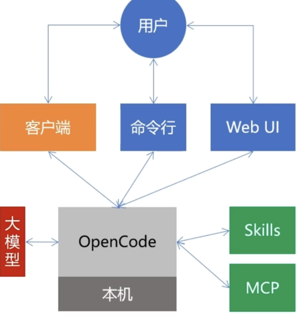

# OpenClaw, OpenCode
1. Openclaw
    - 可本地部署的AI助手应用 
    - 
    1. 所有文件处理都在本地完成, 部分规避隐私安全问题
        - 但是如果需要用到大模型来处理的话,还是需要上传数据
    2. 多平台集成, 通过接入消息应用来操作
        - WhatsApp, 飞书等
        - `你是否有远程通过消息应用来使用本地助手的需求?`
    3. 强执行能力, 能自主完成决策
        - 使用`各种插件`来操作本地的资源, APP, 浏览器
        - 可以通过`插件`, Skill, MCP来扩充能力
2. OpenCode
    - 
    - 和OpenClaw很像, 偏向编程助手, 但不接入消息应用
    - 特点: 根据用户描述`写代码`, 然后`执行代码`完成对本地文件操作和对外部API的调用
        - 每次写代码token消耗很高
    - 插件, Skill, MCP

#
1. AI 赋能开发（提升个⼈效率）
    - GitHub Copilot、Tabnine 等 AI 编程插件
    - Augment Code、Cursor、Windsurf 等 AI 编程 IDE
    - Claude Code 这种命令⾏编程助⼿
    - google Antigravity
2. AI 应⽤集成（创造业务价值）
    - ChatGPT (OpenAI)、Google Gemini 、Claude
    - 需要掌握提问的艺术（Prompt Engineering），能够通过清晰、具体的指令，让 AI ⾼效地为你解决编程和学习中遇到的问题。

##
1. 国内IDE, 插件市场安装ClaudCode
    1. Code Buddy(腾讯)
        - 适配小程序开发
        - 适合从0到1
    2. TRAE, 字节
    3. Lingma, 阿里
    3. Qoder
    4. 美团大模型
        - LongCat-Flash-Thinking-2601
        - https://www.bilibili.com/video/BV1kv3ez2E2B?spm_id_from=333.788.recommend_more_video.0&trackid=web_related_0.router-related-2479604-9kkcc.1770822339836.251&vd_source=74a5ce1d05cd44013f5ebb561caa119a
2. opencode, 开源AI编程工具
3. KIRO, 支持文档
4. DROID