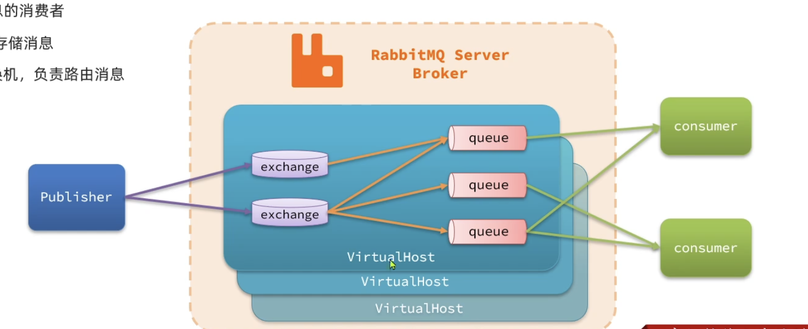

- https://blog.csdn.net/m0_62128476/article/details/140756277
# RabbitMQ
1. 拉取镜像
    - docker pull rabbitmq:4.2.4-management
2. 检验
    - docker images | grep rabbitmq
3. 新建文件夹
    - cd /Users/peihanggu/Server/RabbitMQ
    - mkdir -p {data,log,conf}
    - chmod -R 777 .
4. 创建 docker-compose.yml文件
    - touch docker-compose.yml
5. 启动
    - docker-compose up -d

## 出问题了
1. docker stop rabbitmq-4.2.4
2. docker rm rabbitmq-4.2.4

## 启动完毕
- open http://localhost:15672

## 基础介绍
1. 基础介绍
    1. publisher, 消息发送者
        - 先发给交换机
    2. RabbitMQ Broker
        1. exchange, 交换机, 负责路由消息, 没有存储消息的能力
            - 交换机把消息路由给队列
        2. queue, 队列
    3. consumer, 消息消费者
        - 消费者 监听/绑定 队列 (java代码)

2. 公司里可能就一台MQ, RabbitMQ提供类似于database那样的数据隔离机制
    - `VirtualHost`, 虚拟主机, 起到数据隔离的作用
    - 不同的虚拟主机有不同的交换机和队列

- 

## 快速入门
1. 发送消息
    1. 新建队列 hello.queue1, hello.queue2
        - 直接新建即可
    2. 向默认的 amp.fanout 交换机发送一条消息
        1. `Bindings`, 配置路由
        2. `Payload 负载`, 就是消息的内容
    3. 看看消息是否到达两个队列
2. 消息隔离
    1. 新建用户test
    2. 为该用户创建 虚拟主机

