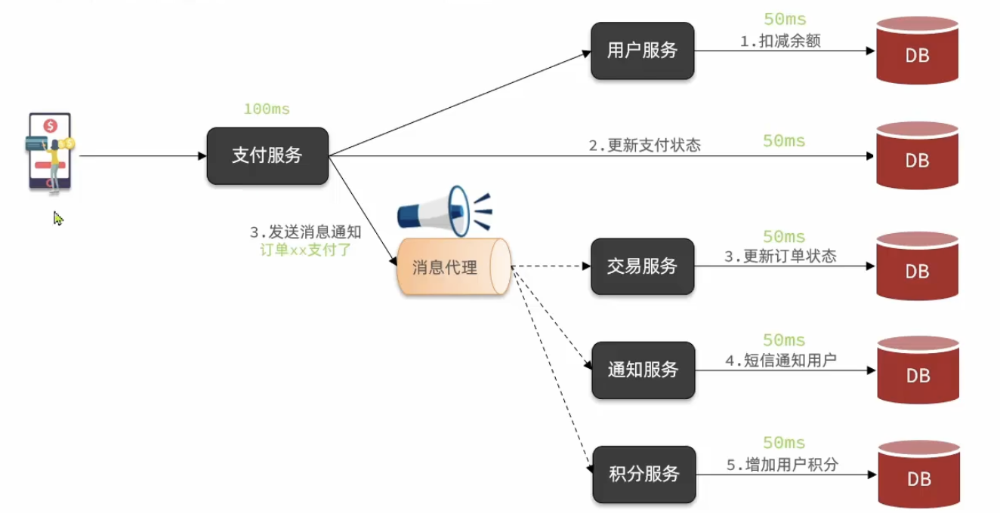

## 异步调用
1. 异步调用是基于`消息通知`的方式
    1. 消息发送者
        - 即服务的调用方
    2. 消息代理(`Broker`)
        - 管理, 暂存, 转发消息
        - Broker的可靠性非常重要
    3. 消息接受者
        - 即服务的提供方
2. 
3. 什么时候要使用异步调用?
    1. 对该服务执行结果不关心
        - 接下来的操作不依赖于该服务的结果

## 技术选型, 为什么选RabbitMQ
1. 开发语言
    1. RabbitMQ使用`Erlang`,面向并发语言, 性能更好
    2. RocketMQ使用`Java`
2. 协议支持
    1. RabbitMQ支持`各种协议`, 对微服务友好
        - 微服务不一定都用Java实现
        - Spring默认支持的MQ也是RabbitMQ
    2. RocketMQ支持自定义协议, 但是主要是Java
3. 单机吞吐量(并发能力)
    1. RabbitMQ, 10万以下
    2. RocketMQ, 10万以上
    3. Kafka, 百万级别, 消息可靠性略差, 因此常用于日志收集
4. 延迟
    1. RabbitMQ, 微秒级
    2. RocketMQ, 毫秒级
5. 消息可靠性
    - 都支持消息确认, 可靠性都很高
    1. RabbitMQ
        - 有一套完善的消息确认机制确保消息不丢失
    2. RocketMQ
        - 底层有一套消息表, 类似于内部数据库, 可以确保消息安全