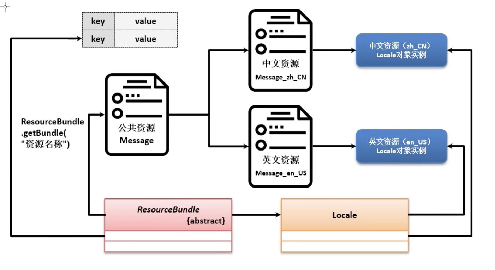

# 国际化
- 使用Resource文件,Locale类,ResourceBundle类,融合在一起实现国际化
- 要求有各种语言的资源文件定义,同时这些不同语言的资源文件的key必须相同
1. 首先不能把中文写死在代码里
    1. 不同的用户应该有不同的语言文字配置文件,程序运行时通过配置文件来加载相关数据
    2. 动态取得当前用户的国家和语言
    3. 如何有效加载文件里的语言文字
#
1. java.util.Locale
2. ロケール情報の取得と構築
3. java.util.Properties
4. プロパティファイル
5. native2ascii
6. 文字コード
7. java.nio.charset.Charset
8. java.util.ResourceBundle
9. 日付、数値のフォーマット（書式化）
# 1. java.util.Locale
- 用于描述当前区域,进行国家和语言切换
1. 自带一些常量对象
    1. china,PRC,taiwan
        - public static final Locale CHIAN
    2. 想手动实力化一个Locale需要有对应的语言编码和所在国家编码
        - 对于一些小众的区域可能需要手动编码
2. 常用编码
    1. 中国: language="zh",country="CN",zh_CN
    2. 美国: language="en",country="US",en_US
    3. 日本: language="ja",country="JP",ja_JP
3. 获取一个Locale对象
    1. `Locale loc = new Local("zh","CN")`
        - 打印loc的话会打印出“zh_CN”,"en_US"
    2. 根据操作系统自动获得
        - `Locale loc = Locale.getDefault()`
    3. 使用常量
        - sout(Locale.CHINA)
# 4. プロパティファイル
- 资源文件,*.propertie
    ```properties
    # 这是注释 com.hitokui.reresource.XXX
    message.info = "123456"
    ```
    1. 除此以外,搜索idea的echod ing,确保是“UTF-8”
    2. 完整名称格式`com.hitokui.reresource.XXX`
# 8. java.util.ResourceBundle
- 用于读取CLASSPATH下面指定的properties文件
1. 具体方法
    1. ResourceBundle.getBandle(String baseName, Locale locale)
    2. rb.getString()
        ```java
        ResourceBundle rb = ResourceBundle.getBandle("com.hitokui.reresource.XXX")
        sout(rb.getString("message.info"))
        ```
2. 相关异常
    1. 资源文件不存在
        - MissingResouceException,....
    2. key不存在
        - MissingResouceException,....
3. 实现国际化
    1. 需要准备以下文件,注意格式
        1. Message.properties
            - 这个是公共资源,用于被ResourceBundle操作
        2. Message_zh_CN.properties
        3. Message_en_US.properties
    2. 示意图
        - 
    3. 为了区分公共资源和文字资源,可以追加一个其他文件没有的key
        ```properties
        # 这是注释 com.hitokui.reresource.XXX
        message.info=123456
        file.info=这是公共资源
        ```
    4. 读取不同的信息
        ```java
        /*  
            1.有了具体的国家文件后就不会再读取公共文件了
            由于当前环境是zh_CN,因此默认打印zh_CN的资源文件
        */
        ResourceBundle rb = ResourceBundle.getBandle("com.hitokui.reresource.XXX")
        sout(rb.getString("message.info"))

        /*  
            2.中文环境读英语
            若指定的key不存在,则会向上查找公共文件
        */
        ResourceBundle rb = ResourceBundle.getBandle("com.hitokui.reresource.XXX", Locale.US)
        sout(rb.getString("message.info"))//打印英文文件
        sout(rb.getString("file.info"))//打印公共文件
        ```
# 9. 日付、数値のフォーマット（書式化）
1. 格式化你的message
    - login.info=Welcome "{0}", Please access"{1}" webset.
    1. 如果想实现国际化,则两个国家文件中都需要有{0}和{1},
        - login.info=欢迎登录,公共的不要有占位符
        - login.info=登录成功,欢迎"{0}",请访问网站"{1}".
        - login.info=Welcome "{0}", Please access"{1}" webset.
    2. java.text.format.MessageFormat类,抽象类
        ```java
        //实现自动填充
        MessageFormat.format(rb.getString("message.info"),"小李","XXX.com")
        //因此公共的那个最好不要有占位符
        ```
2. 简化数字的读取,NumberFormat,抽象类
    1. 简单的数字的格式化可以直接用DecimalFormat,不常用
        ```java
        DecimalFormat nf = (DecimalFormat)NumberFormat.getInstance();
        sout(nf.format(1234567.1234));
        // 1,234,567.123
        ```
    2. NumberFormat.getInstance(Locale loc),指定loc
    3. getPersentInstance(Locale loc),得到百分比实力
    4. getCurrencyInstance(Locale loc),得到当地货币实力
        ```java
        NumberFormat nf = new DecimalFormat();//不要这样写
        sout(nf.format(1234567.1234));
        // 1,234,567.123
        ```
3. 日期的格式