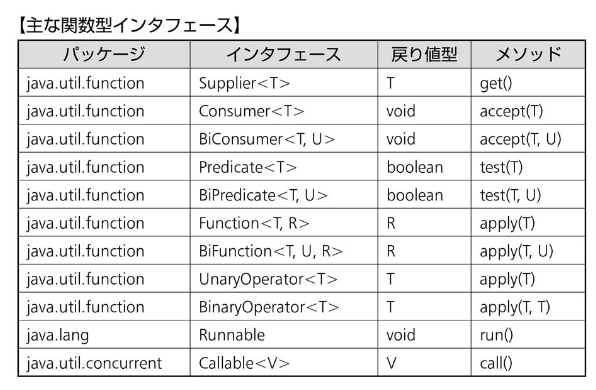

#
1. java.util.functionパッケージの関数型インタフェース
2. 関数型インタフェース定義と記述
3. ラムダ式
# 主要的interface一览

# 
1. Consumer
    1. 
        1. Consumer<T>
            - void accept(T t)
        2. BiConsumer<T, U> , 就是消耗两个传入的参数
            - void accept(T t, U u)
    2. Comsumer也可以使用`andThen()`和`compose()`
    
2. Predicate
    1. 可以和or(),and()结合使用,本来返回的就是一个boolean
        ```java
        Predicate<Integer> p1 = x -> x>0;
        Predicate<Integer> p1 = x -> x<=100;
        sout(p1.or(p2).test(100));
        ```
3. Function
    1. 衍生的接口
        1. Function<T, R>
            - R apply(T t)
        2. BiFunction<T, U, R>, 传入`两个参数`,范型里必须标明三个参数的类型
            - BI,两个的
            - R apply(T t, U u)
        3. UnaryOperator<T>,继承Function,注意这个东西的名字叫`XXOperator`
            - unary,一元的
            - T apply(T t), `返回值`与`参数类型`相同
        4. BinaryOperator<T>,继承BiFunction
            - binary,二元的
            - T apply(T t1, T t2), `返回值`与`两个参数`的类型都相同
    2. 规定function执行顺序的方法
        - 注意,不是`before()after()`
        1. `a.compose(b).apply(10)`,先执行b,再把结果传给a执行a
        2. `a.andThen(b).apply(10)`,先执行a,再把结果传给b执行b
# メソッド参照　方法参照
- 。（ドット）　：：コロン二つ
- 类名::static方法名
- 两个要求
    1. 必须参照函数型接口
    2. 必须参照Static方法
    ```java
    //1.普通的lambda
    Function<String Integer> f = t -> t.length()
    //2.去掉前面的t,然后把.变成::,当然这样肯定会报错,因为t没有定义
    Function<String Integer> f = t::length()
    //3.把t换成类,完成
    Function<String Integer> f = String::length()

    //若t是提前定义好的,则可以写成下面这样
    String str = "abc";
    ToIntFunction<String> index = str::indexOf;
    ```

# 总结补充
1. 判断是否符合函数式接口
    1. @FunctionalInterface
        - 有且仅有一个能被继承的抽象方法,default和static数量随意
        1. 这个方法不能是Object的方法(不能重名)
            1. toString()
            2. equals()
        2. 有时可以看到里面有两个抽象方法,一个自定义一个Object
            - 由于Object方法不算,因此这个也算是函数式接口
2. 与范型的结合使用
    ```java
    //1.抽象方法
    public void test(Integer a);
    //使用时需要把范型写左边,右边不需要强调n是Integer
    Test<Integer> t = n->sout(n);

    //2. int与Integer
    public int test(int a);
    //使用时需要把范型写左边,右边不需要强调n是Integer
    Test t = n->Integer.valueOf(i);//没问题,Integer会自动变成int
    ```
3. 与异常结合使用
    ```java
    //3. 虽然要求返回int类型
    public int test(int a);
    //但明示抛出一个异常是没问题的
    Test t = n->{throw new RuntimeException()};
    ```
4. 关于return
    - 如果想使用return关键字的话,就必须带上{},否则编译错误
    - ()-> {return 10;}
    - ()-> 10
5. ArrayList与Lambda
    1. 特殊,ArrayList的replaceAll()方法可以使用UnaryOperator作为参数
        - 表示对所有成员进行这个函数的操作
        - 但是要注意范型是否一致