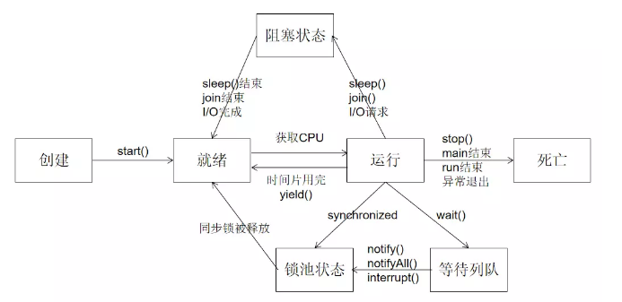

# 多线程
- 线程的创建方法
- 线程的常用方法
## A.线程的创建与使用(4种)

1. 继承Thread类(1.5之前的方法)
2. 实现Runnable接口(1.5之前的方法)
3. 实现Callable接口(1.5之后)
4. 线程池静态方法

----

### 1. Thread

#### 1.1 实现方法

```java
//1.继承Thread,重写run()
class MyThread extends Thread {
    @Override
    public void run() {
        System.out.println(Thread.currentThread().getName());
    }
}

public class ThreadTest {
    public static void main(String[] args) {
        //2.new *多个* 子类对象
        MyThread myThread1 = new MyThread();
        MyThread myThread2 = new MyThread();
        //3.用子类对象调用start()方法
        myThread1.start();
        myThread2.start();
    }
}
```

#### 1.2 memo

- start()方法能启动一个线程并调用run()方法
- 不能直接调用run(),因为会变成普通方法,不启动多线程

----

### 2. Runnable

#### 2.1 实现方法

```java
//1.实现Runnable接口,重写run()方法
class MyRunnable implements Runnable {
    @Override
    public void run() {
        System.out.println(Thread.currentThread().getName());
    }
}

public class RunnableTest {
    public static void main(String[] args) {
        //2.new *一个* 实现类对象
        MyRunnable myRunnable = new MyRunnable();
        //3.使用实现类对象来new多个Thread对象
        Thread thread1 = new Thread(myRunnable);
        Thread thread2 = new Thread(myRunnable);
        //4.用Thread对象调用start()方法
        thread1.start();
        thread2.start();
    }
}
```

#### 2.2 与继承Thread类相比

1. 没有单继承的局限性
2. 实现的方法更适合多个线程间共享数据(只有一个实现类对象,共享数据不需要static)

----

### 3.Callable<T>

#### 3.1 实现方法

```java
//1.实现Callable<T>接口,重写T call()方法
class MyCallable implements Callable<Integer> {
    @Override
    public Integer call() throws Exception {
        int sum = 0;
        System.out.println(Thread.currentThread().getName());
        return sum;
    }
}

public class CallableTest {
    public static void main(String[] args) {
        //2. new一个实现类对象
        MyCallable myCallable = new MyCallable();
        //3. new一个FutureTask对象用来接收返回结果
        FutureTask<Integer> futureTask = new FutureTask<>(myCallable);
        //4. 使用实现类对象来new多个Thread对象,然后调用start()方法
        Thread thread1 = new Thread(futureTask);
        Thread thread2 = new Thread(futureTask);
        thread1.start();//执行线程
        thread2.start();

        //5. 使用futureTask.get()获得返回结果
        try {
            Integer o = futureTask.get();    //获取结果
            System.out.println(o);
        } catch (InterruptedException e) {
            e.printStackTrace();
        } catch (ExecutionException e) {
            e.printStackTrace();
        }
    }
}
```

#### 3.2 memo

----

### 4.线程池

#### 4.1 实现方法

```java
public class ExecutorsTest {
    public static void main(String[] args) throws ExecutionException, InterruptedException {
        //1. 用工厂方法创建线程池
        ThreadPoolExecutor executorService = (ThreadPoolExecutor) Executors.newFixedThreadPool(10);
        //2.1 对于Runnable,使用execute()
        executorService.execute(new MyRunnable());
        //2.2 对于Callable,使用submit来获得
        Future future = executorService.submit(new MyCallAble());
        Object o = future.get();
    }
}

```

#### 3.2 memo

## B.方法
### 1.常用方法
```java
/**
 * yield(),释放cpu的执行权,让别的线程执行(但也可能会立即再次抢到执行权)
 * b.start();b.join();,在当前线程中加入b线程,需要等b线程跑完,当前线程才能继续跑,当前线程处于阻塞状态,InterruptedException
 * stop(),已过时,停止线程
 * sleep(long millstime),休眠,当前线程处于阻塞状态,但要注意这个方法是一个静态方法,主要看在哪里调用,而不是看谁调用,会使当前线程休眠
 * isAlive(),判断run()函数是否跑完,可以和stop结合使用
 * setPriority(),0~10,设置优先级只是提高概率,不是一定会优先执行,因此没什么用
 */

```

### 4. 守护线程
* 线程分为用户线程(默认)和守护线程
* 在start之前使用thread.setDaemon(true)来把一个用户线程变成一个守护线程
* Java垃圾回收就是一个守护线程
* 若JVM都是守护线程时,当前JVM退出
```java
public class T07_Shouhuxiancheng {
    public static void main(String[] args) {
        DaemonThread daemonThread = new DaemonThread();
        Thread t1 = new Thread(daemonThread);
        t1.setDaemon(true);//这样主线程结束后,这个守护线程也会立即结束
        t1.start();
        try {
            Thread.sleep(3000);//主线程3秒后结束,守护线程也会跟着结束
        } catch (InterruptedException e) {
            e.printStackTrace();
        }
        System.out.println("程序结束");
    }
}
```

#### 3.线程的生命周期
- 新建
- 就绪
- 运行
- 阻塞
- 死亡

