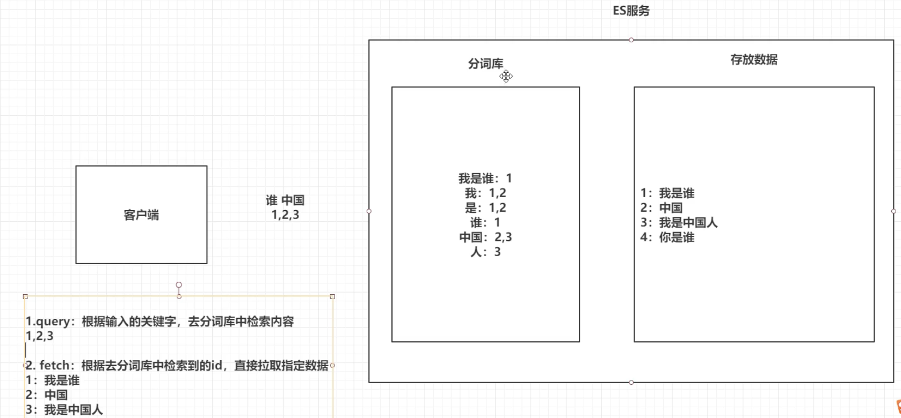

# ElasticSearch
1. 场景一: 海量数据执行搜索功能 
    - 在淘宝搜索“手机壳”, 提示说有近100万条数据, 点击搜索后, 很快就会跳转到商品界面, 如何实现?
    1. MySQL的模糊查询
        - SELECT * FROM items WHERE name LIKE %手机壳11%;
        - 效率极低
    

2. 场景二: 输入的关键字不精确, 但是一样能拿到数据, 且能以红色字体显示
    - 搜索“壳手机”, 仍然能正常返回“手机壳”相关的商品, 且“手机壳”三个字高亮红色
    1. 一定不是直接使用MySQL的模糊查询
    2. 输入的“壳手机”似乎被拆开了, 然后以某种方式匹配到了“手机壳”

# ES介绍
1. ES是一个使用Java语言, 并且基于Lucene编写的搜索引擎框架, 提供了`分布式的全文搜索功能`, 并提供了统一的基于`RESTful`风格的API接口, 支持多种语言

2. 分布式
    - 主要是突出ES的横向扩展, 搭建集群的能力, 只需要修改配置文件即可

3. 全文检索
    - 将一段词语进行拆分, 然后将分出来的单个词语, 放到一个统一的分词库中, 然后根据输入的关键字, 到分词库中检索
    - 示例: “壳美士 苹果6s/6手机壳磨砂防摔男女款iPhone6/6s/plus全包超薄情保护套苹果六”
    1. 拆分
        1. “壳美士”, 牌子名, 但是没有知名度
            - 拆成三个字"壳","美","士"
        2. “苹果”, 著名牌子, 不拆分
        3. “手机壳”, “手”,“手机”,“机壳”,“手机壳”
    2. 之后输入的“壳手机”因为拆分后与上面匹配, 所以展示了手机壳

4. 应用广泛:
    - github的代码, wiki百科, 也都是用ES检索的
    - 在云计算和大数据方面也有应用

5. 倒排索引
    - ES全文检索的方式是倒排索引
    1. query,直接拿输入的关键词到分词库去匹配
        - 先直接查, 然后分词查, 能查到存放数据的索引id 1,2,3
    2. fetch, 根据去分词库查到的id, 拉取制定的数据
    3. 所谓倒排: 不会直接去数据库检索, 而是先检索分词库
    - 