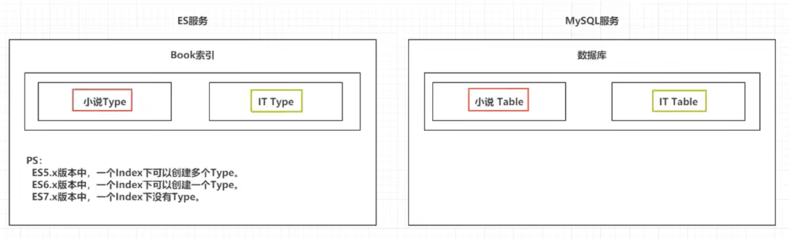
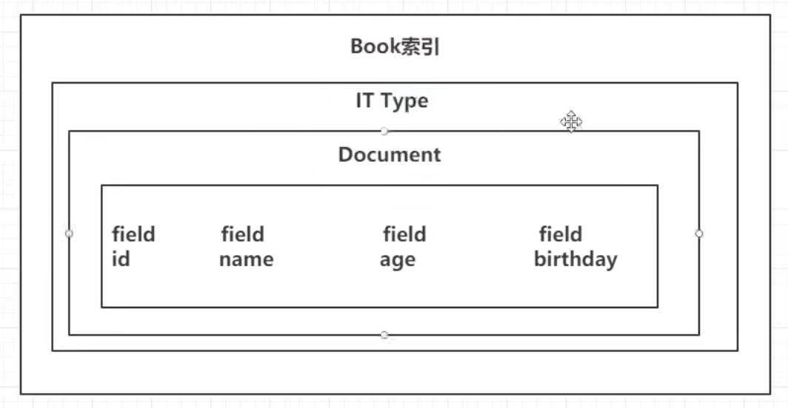

# ES工作原理
- 假如说我有一亿条数据
1. 首先ES会对索引进行`分片处理`, 提升查询效率和容量
    1. 一个Book索引
    2. ES默认为一个索引建立`一个分片`, 放在另外一台服务上, 这样一个分片中只有2000万条数据
        - 7.x版本后都是默认一个分片
2. ES会对索引进行`备份`, 高可用, 防止数据丢失
    - 防止某一个分片down了
    - 
    1. 所以每个分片都有其他分片的数据, 但是不查询, 备份分片称为`从分片`
    2. 如果查询压力特别大, 或者特定分片宕机才会查询

# ES和MySQL的名词区别
1. ES的`索引`, 相当于MySQL的`数据库`
    - 
2. ES索引里面的`Type`, 相当于MySQL的数据表`Table`
3. ES的Type下面的有多个`文档document`, 相当于MySQL一条数据`record`
4. 一个document里面有多列, 被称为`属性field`
    - 

# Field有哪些类型
1. 核心数据类型
    1. 字符串类型 分成两种
        1. text
            - 常用于全文检索, 会自动被分词
            - 商品名, 商品描述
        2. keyword
            - 北京, 上海等不可拆分的词
    2. 数值类型
        1. long, integer, short, byte, double, float
        2. half_float
        3. scaled_float
    3. 时间类型
        1. date类型
            - 在定义时可以指定`format`, `yyyy-MM-dd HH:mm:ss`
    4. 布尔类型 boolean
    5. 二进制类型 binary
        - 支持Base64的字符串
    6. 范围类型
        - 有数字范围, 时间范围, ip地址范围等等
        - 定义时指定 gt, lt, gte, lte
2. 地理类型
    1. geo_point: 存储经纬度
        - 比如计算两个地址的距离
3. 其他类型
    1. ip类型
        - 支持 ipv4, ipv6
