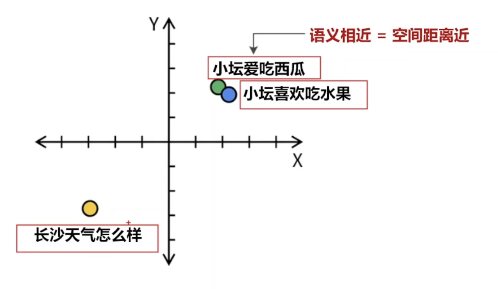

# RAG（Retrieval-Augmented Generation，检索增强生成）
- 解决`企业私有数据`问答， 一般的大模型不知道公司内部的产品信息
-  "Chunking" 与“切分”、"Embedding" 与“嵌入”、"Chunk" 与“块” 含义相同
RAG 是什么、为什么需要它；
检索、增强、生成三个环节怎么配合；
Embedding 和相似度度量到底在做什么；
RAG 和传统搜索、微调、长上下文分别适合什么场景；
RAG 的优势和坑分别在哪里。
1. 把`信息检索`和`大语言模型`绑在一起用
    - 系统先从`知识库`里检索出和当前问题相关的`文本片段(Chunk)`，知识库可以是数据库、文档集合，也可以是企业内部系统。然后把这些片段和原始问题一起喂给 LLM，让模型基于`检索内容`回答，而不是只靠训练时记住的知识
    1. 用户问题 -》 向量数据库根据`相关性`检索到`Chunk`
        - 先检索，再生成
    2. 把检索到的`Chunk和用户问题`组合成`Prompt`,
    3. LLM根据Prompt生成答案
2. RAG 最适合“答案依赖外部资料，并且资料会变化或很长”的场景

## 传统RAG核心工作流程
1. 数据准备阶段（业务线）
    - 拿到一本几百页的pdf手册
    1. 第一步： `Chunking分片`
        1. 可以按字数，段落，章节来切分
        2. 总之把长文变成碎片
    2. 第二步： `Embedding`，文字转向量
        1. 目标是把切分后的碎片存入`向量数据库`， 但向量数据库看不懂文字
        2. 使用`Embedding模型`将文字翻译成`高维坐标`
            - 用户爱吃西瓜
            - 用户爱吃水果
            - 语义相近，因此空间距离近
            - 
    3. 第三步：`Indexing`索引
        - 以 `向量：原始文本` 的格式存入向量数据库
2. 回答生成阶段（用户线）
    - 提问： 用户喜欢吃什么？
    1. Retrieval`召回`
        1. Query Processing
            1. 将问题也过一遍Embedding模型，翻译成一个 `带坐标的向量`
        2. 在向量数据库中计算`向量相似度`
            - `余弦相似度`，`欧式距离`，`点积`，计算得出那几片知识碎片距离用户的问题最近
            - 找出Top-k个片段, 召回的准确率挺低的，只适合初步筛选
        3. `重排`
            - cross-encoder，精挑细选
    3. `合成`： 将Top-k个片段组成context 和 用户问题打包成prompt，发给LLM大模型
        - 一般是： 请严格根据这几个片段来回答问题

## 传统RAG的问题
1. 文档解析
    - 直接用开源解析器读取的话很可能出现错位，乱码
    - 需要一套专门的版面分析模型 + OCR文字识别 + 人工复核反馈（RLHF）
2. 如何切片，颗粒度
    - 切太大：噪音多； 切太小：语义丢失
    - 需要根据业务测试分片策略
3. 向量数据库检索的准确率
    - 如果是上面的朴素RAG，可能有60%准确率，用户问10个问题，有4个连参考资料都没找对
    1. 混合检索： 向量 + 关键词
    2. 在丢给大模型之前，再过一遍rerank模型进行打分排序，把有用的排前面
4. 优化用户提问
    - Query Rewrite 查询重写，对口语化，指代不明的提问翻译成严密的话
5. 大模型选型问题
    - 不是所有模型都适合做RAG的基座

## 进阶方案
- Graph RAG
- Agentic RAG

# Embedding
1. 向量
    - 有大小，有方向的量
    - 可以用数组表示[1.0, 2.3, 3.14]，可以表示三维空间中一个向量,三维向量
    - 维度： 数组中数字的个数
    - 一般来讲维度越大，一个向量包含的信息就越丰富
2. Embedding
    - 文字转向量的过程
    - 含义相近的文本经过embedding后，对应的向量也是相似的
    - 由专用的Embedding模型完成
        - huggingface.co/spaces/mteb/
3. 向量数据库
    - 向量：原始文本
    - 存储和查询向量
    - 还提供了计算向量相似度的函数
4. 相似度计算
    1. 余弦相似度
        - 计算向量夹角，夹角越小，相似度越高
    2. 欧式距离
        - 计算两个向量顶尖处的距离，距离越小，相似度越高
    