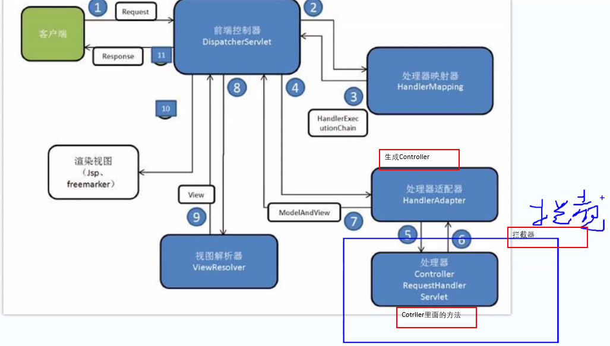

## idea快捷操作
1. 生成实体类
    1. 连接数据库,选中表格右键
    2. Scripted Extensions -> Generate POJOs.groovy
    3. 选择entity路径,生成实体类
    4. 把基础类型改成Long,重新创建GetterSetter
2. 快速创建Select 所有字段
    1. 在sql console里写 SELECT * 
    2. 光标放在*后面,使用`alt + enter`
    3. 生成的列名是竖着的,全选后`ctrl shift J`
3. 快速打印`emp.empno.soutv`
4. 快速接收对象`prop.propertyName().var`

## SpringMVC工作流程与工作原理
1. SpringMVC开发流程
    1. entity
    2. mapper和DAO接口
    3. 测试
        - @SpringJUnitConfig(locations = "classpath:beans.xml")
        - @Autowired
    4. service 就是Test的内容
    5. controller 配置网站的转发
    6. 输入网址看JSON测试
    7. JSP
        - c标签空间,bootStrap包,jquery包
        - 

2. SpringMVC原理

    1. 通过浏览器发送请求
    2. `DispatcherServlet` 分配处理器, SpringMVC统一的入口, 拦截Http请求
    3. `HandlerMapping` 处理器映射器, 根据映射名,寻找有对应的controller
        - 找不到抛异常
        - 找到了把控制器返回DispatcherServlet
    4. `HandlerAdapter` 处理器适配器, 负责创建controller对象
        - controller的创建方式有很多种,注解,接口,继承,适配表示的是适配创建controller的方法
    5. 拦截器,调用Controller之前调用
    6. `Controller RequestHandler Servlet` 处理器,调用Controller返回一个ModelAndView对象
    7. `ViewResolver`视图解析器,解析返回结果,加上后缀前缀,把最终的返回结果构建出来
        - 除了JSP还会返回其他什么的
    8. 整理到响应报文种返回给客户端

## mapper文件多表映射
1. 以前写的单表查询
    1. `parameterType`表示参数类型,如果是int之类的可以不写
    2. `resultType`表示返回类型
```xml
<mapper namespace="com.gsd.dao.EmpDao">
    <insert id="addEmp" parameterType="com.gsd.entity.Emp">
        INSERT INTO emp VALUES (0, #{ename}, #{job}, #{mgr}, now(),{sal}, {comm}, #{deptno}, 1)
    </insert>
    
    <select id="findAll" resultType="com.gsd.entity.Emp">
        select empno,ename,job,mgr from emp
    </select>
</mapper>
```
2. 如果涉及到JOIN,可能会遇到的问题
- 比如这个多表查询
    ```sql
    select sceid,t_scenery.scename,t_scenery.scetypeid,start_time,t_scetype.scename name -- name是t_scetype.scename的别名
    from t_scenery
    LEFT JOIN t_scetype
    ON t_scenery.scetypeid = t_scetype.scetypeid;
    ```
- 遇到问题:
    1. `start_time下划线项目为null`
    2. `t_scetype.scename的值为null`
    3. 两个表都有scename项目,导致主表的数据自动映射到子表上(使用别名)
- 原因:映射的本质是调用setter方法,而`resultsType`是自动映射,一旦找不到对应的setter方法就无法赋值

    1. 下划线项目
        1. 项目`start_time`生成的entity是`startTime`,setter叫做`setStartTime()`,名字不一样导致无法自动映射
            ```java
            private String startTime; //start_time
            ```
        2. 这个可以看一下Mybatis设定里面是有处理这个问题的参数的
            - 在初始化MyBatis的Bean.xml里面设置
        ```xml
        <bean id="sqlSessionFactory" class="org.mybatis.spring.SqlSessionFactoryBean">
            <!--    1.数据源（DataSource接口    -->
            <property name="dataSource" ref="dataSource" />
            <!--    2.Mapper文件    -->
            <property name="mapperLocations" value="classpath*:mapper/*.xml" />

            <!-- Mybatis配置 -->
            <!--   这个要看一下sqlSessionFactory类,根据设置mapUnderscoreToCamelCase的   setter方法来写     -->
            <property name="configuration">
                <bean class="org.apache.ibatis.session.Configuration">
                    <!--   3.设置驼峰命名转换     -->
                    <property name="mapUnderscoreToCamelCase" value="true"/>
                    <!--   4.开启延迟加载     -->
                    <property name="lazyLoadingEnabled" value="true"/>
                </bean>
            </property>
        </bean>
        ```
    2. 子表项目
        1. 新建子表的entity,在主表里创建这个对象属性
        ```java
        private Scetype scetype;
        ```
        - 想靠自动映射设置`t_scetype.scename`是做不到的,应该找对象的setter`scetype.setScename()`,需要使用手动映射
    3. 手动映射方法1(不推荐)
        1. `resultMap`开启手动映射
        2. 里面的`<id>`用于主键,`<result>`用于其他column,不能用错
        3. `property`表示setter方法,`column`表示字段名(别名也可以)
            ```xml
            <!-- 1.主表查询,使用JOIN,开启手动映射 -->
            <select id="findAll" resultMap="sceneryMap">
                select sceid,t_scenery.scename,t_scenery.scetypeid,start_time,t_scetype.scename name
                from t_scenery
                LEFT JOIN t_scetype
                ON t_scenery.scetypeid = t_scetype.scetypeid;
            </select>

            <!-- 2.手动映射表 -->
            <!-- autoMapping表示主表的字段还是自动映射,但是分表的关联字段需要手动配置 -->
            <resultMap id="sceneryMap" type="com.gsd.entity.Scenery" autoMapping="true">
                <association property="scetype"><!-- 聚合属性 -->
                    <id property="scetypeid" column="scetypeid"/><!-- 调用t_scetype.scetypeid -->
                    <result property="scename" column="name"/><!-- 这里的name是个别名 -->
                </association>
            </resultMap>
            ```
        4. 但这种方法在两个表有相同字段时比较麻烦(使用别名之类的)

    4. 手动映射方法2(推荐)
        - 类似于相关子查询,先查主表,再根据主表的每一行去查分表
        - 在`<resultMap>`上设置
            1. select: 表示子查询语句,跨包查询要带上路径
            2. column: 主表给子查询传的参数
        1. 主表的Mapper文件
            ```xml
            <!-- SceneryMapper.xml -->
            <!-- 1.只查主表,不要使用JOIN -->
            <select id="findAll" resultMap="sceneryMap">
                select sceid,scename,scetypeid,context,pic,recommend,areaid,ticket,favorite,season,collection,sce_grade,location,start_time,tic_count
                from t_scenery
            </select>
            <!-- 2. 手动映射表,select和column -->
            <resultMap id="sceneryMap" type="com.gsd.entity.Scenery">
                <!-- 聚合属性的property,column是传给聚合属性的select的参数 -->
                <association property="scetype" select="com.gsd.dao.ScetypeDao.findScetypeBytypeId" column="scetypeid">
                    <id property="scetypeid" column="scetypeid"/>
                    <result property="scename" column="scename"/>
                </association>
            </resultMap>
            ```
        2. 分表的Mapper文件
            - 子查询的语句
            - 可以把mapper看作一个类,select是里面的方法
            ```xml
            <!-- 跨包调用时要注意namespace别写错 -->
            <mapper namespace="com.gsd.dao.ScetypeDao">
                <!--  这个方法只是在mapper里面用的话,可以不写interface ScetypeDao的方法  -->
                <select id="findScetypeBytypeId" resultType="com.gsd.entity.Scetype" parameterType="int" >
                    select scetypeid, scename from t_scetype WHERE scetypeid = #{scetypeid}
                </select>
            </mapper>
            ```
        3. 这种方法会触发myBatis的一级缓存,假如scetypeid为1的查了一次后,会保存在缓存里,若下次id还是1,直接从缓存里取
            - 假如有6种type,那么最多子查询只进行6次
    5. 懒加载
        1. 使用方法2时,使用findAll()总是会调用相关子查询,希望能仅在使用子表数据的时候才会触发相关子查询
        2. 在上面的bean.xml文件里配置的
            ```xml
            <!--   4.开启延迟加载     -->
                <property name="lazyLoadingEnabled" value="true"/>
            ```
        3. 但这个方法似乎会导致一级缓存失效

    
