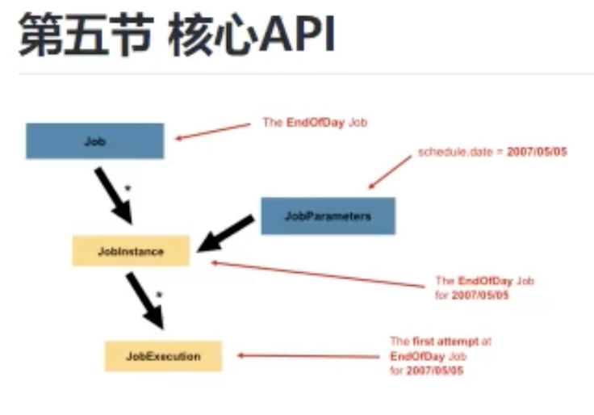

##
1. SpringBatch是一个批处理应用框架,而不是调度框架(schuedling框架),需要结合调度框架来使用
    - 无需用户交互即可最有效地处理大量信息的自动化
    - 在非常大的数据集中重复处理复杂业务规则的定期应用
2. 批处理的流程:
    1. 从数据库，文件或队列中读取大量记录
    2. 处理数据
    3. 以修改之后的形式写回数据
2. 核心4个:
    1. Joblaucher,任务启动器
    2. `Job`,任务
        - 在 spring batch 的体系当中只是一个最顶层的一个抽象概念
        - 体现在代码当中则它只是一个最上层的接口
        1. 一个或多个`Step`,步骤
            - Tasklet
            1. ItemReader(读取数据)
            2. ItemProcessor(处理数据)
            3. ItemWriter(写回数据)
    3. JobRepository
        1. 可以看作是一个数据库的接口,在JOB和Step执行时可以通过这个来持久化一些信息
## 配置
1. SpringBoot项目,导入SpringBatch依赖
2. 配置需要数据源
    1. properties
    ```
    spring.datasource.driverClassName=com.mysql.jdbc.Driver
    spring.datasource.url=jdbc:mysql://localhost:3306/springbatch?serverTimezone=GMT&useSSL=false
    spring.datasource.username=root
    spring.datasource.password=admin
    spring.batch.jdbc.initialize-schema=always
    ```
    2. 在mysql中创建springbatch数据库
3. 创建JOB和STEP
    1. 两个注解
        - @Configuration
        - @EnableBatchProcessing
    2. 创建JOB
        1. JobBuilderFactory
            1. get("JOBname")
            2. start()
            3. build()
    3. 创建Step
        2. StepBuilderFactory
            1. get()
            2. 两种方式
                1. tasklet(new Tasklet(){...})
                2. chunk()
                    1. ItemReader,读取数据
                    2. ItemProcessor,
                    3. ItemWriter
            3. build()

4. 再次运行SpringBoot可以自动创建一些表
    1. BATCH_JOB_INSTANCE
        1. 执行过的job记录在这里
    2. BATCH_STEP_EXECUTION
        2. 执行过的job以及里面包含的Step会包含在这里

## 核心API
1. 
2. JobInstance,任务的每一次执行都会生成一个instance
    1. id,jobname,job_key
3. JobParameters,可以给任务传递参数
    1. 同一个JOB传递不同的参数会生成不同的instance
4. JobExecution,job的每次执行状态会记录在里面
    1. 开始时间,结束时间
    2. status
    3. 注意JobInstance失败后再执行,还是那一条instance,但是JobExecution里面会加一条新的
5. StepExcution,
    1. 开始时间,结束时间
    2. status
6. ExecutionContext,step和job都有
    1. 执行的上下文,用于存储JOB或者Step执行时的数据
## JOB的创建与使用
1. 