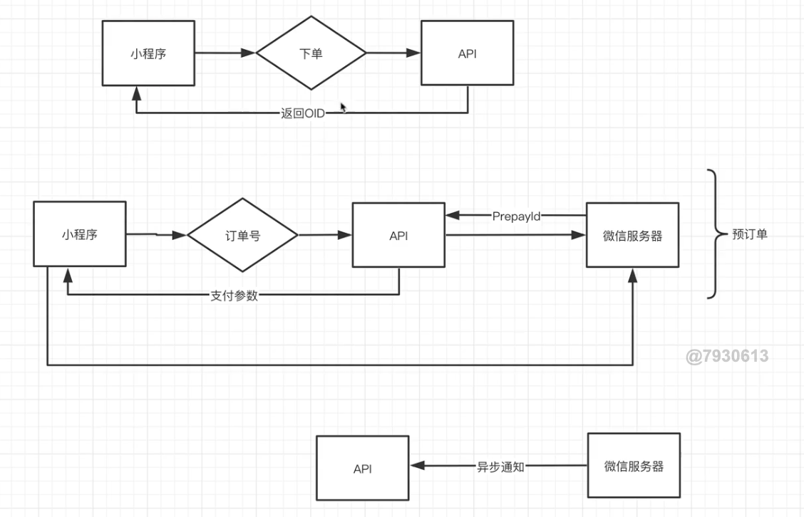

#
## Demo
- https://github.com/wechatpay-apiv3/wechatpay-java
- https://github.com/wechatpay-apiv3/wechatpay-java/tree/main/service/src/example/java/com/wechat/pay/java/service

1. 企业资质小程序 开通微信支付
2. 微信商户平台 提供key
## 流程
- 
1. 用户进入小程序, 调用小程序登录API, 然后下单
    - (官方)返回`OpenID`用于标识用户唯一身份
    - (自己)用自己的`userID`序列化出来一个`JWT Token`
    - (自己)生成用户订单(商户订单/业务订单), `oID`
        - `模块1: 生成业务订单`
    - 将oID传给小程序, 小程序用这个oID再次调用后端支付API, 发起微信支付
2. 预支付prepay,需要在微信的服务器生成一个订单
    - (后端)调用微信预支付API, 获得`prepayID`(微信订单ID)
        - `模块2: 生成预订单`, `/v3/pay/transactions/jsapi`
    - (后端)包装(加密)prepayID和其他东西, 发给前端
        - `模块3: 参数组装和签名`, 微信提供了一些加密算法的SDK
2. 参数返回给小程序, 小程序直接连接微信服务器
    - (前端)拉起微信支付, 调用`wx.requestPayment(OBJECT)`,
3. 微信服务器知道已经支付成功了, (微信)通过`异步通知`后端
    - `模块4: 确保后端正确处理了结果`,(微信)间隔时间(24h内)轮询`后端提供的API`
4. 库存, 订单状态的更改

## 1. API分为 V3 和 V2
## 微信小程序支付
- 后端和JSAPI支付一个样