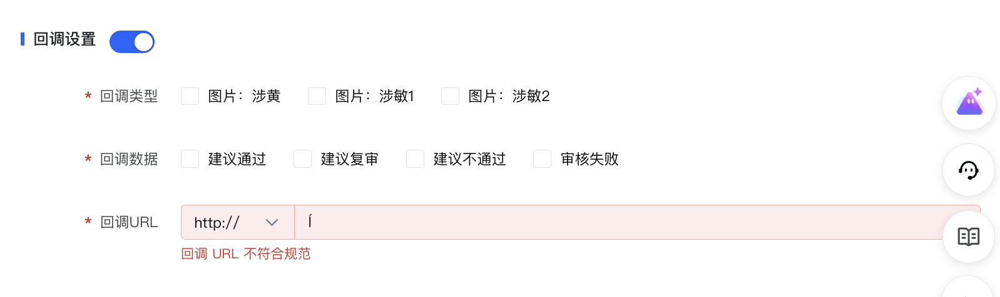

您可以使用火山引擎veImageX的智能审核功能对TOS中的图片进行涉黄、涉政、暴力内容审核，步骤如下：
1. 开通veImageX服务并完成https://www.volcengine.com/docs/508/1262340#%E5%BC%80%E9%80%9A%E6%99%BA%E8%83%BD%E5%A4%84%E7%90%86%E8%AE%A1%E8%B4%B9%E9%85%8D%E7%BD%AE。
2. 通过控制台或API创建审核任务：
* 控制台：进入veImageX的AI能力组件→智能审核，选择TOS来源，配置审核维度（涉黄porn、涉政sensitive2、暴力sensitive1等）。
* API：调用https://www.volcengine.com/docs/508/1160401，指定TOS图片Uri和审核维度。
3. 查看审核结果或设置回调接收通知。
详细操作可参考https://www.volcengine.com/docs/508/134676。

# veImageX的存储和tos的区别
1. veImageX：适用于对图片处理有强需求的场景，如电商、社交、媒体等需要快速、高质量处理并分发图片的应用。
2. 对象存储TOS：适用于需要存储海量数据的各种场景，如大数据分析、备份归档、静态网站托管、以及作为veImageX等上层服务的基础存储。
3. 简单来说，veImageX是在TOS提供的稳定存储能力之上，构建了专业的图像处理服务。如果你的业务核心是图片的处理与分发，应选择veImageX；如果主要是存储和管理各类文件，则TOS是更基础且通用的选择。

我要对上传至tos中的图片进行智能审核

我想在veImageX控制台创建处理模板，然后对上传至tos中的图片进行智能审核

已完成回答
目前ImageX的图片处理模板暂不支持直接配置智能审核功能。不过您可以先创建其他图片处理相关的临时模板（如添加水印、调整图片质量等），我可以为您创建这类模板。如果您有具体的图片处理需求（例如“添加文字水印并压缩图片”），可以告诉我，我会为您创建临时模板。

你好, 我看到veImageX有一个`智能审核`的功能, 我想接入我的项目里面对用户上传的媒体进行审核
最后把合规的图片,音频,视频文件 存储在火山云的tos对象存储里面
1. 想咨询一下能支持这样的功能吗?
2. 我想咨询一下实现流程
    1. 先把文件上传到veImageX上面, 再由veImageX分发给tos
    2. 先把文件上传到tos上面, 然后让veImageX获取这些文件, 处理完成后再传回tos上面呢?
    - 最佳实践
        - https://www.volcengine.com/docs/508/1185248?lang=zh

## veImageX功能
1. 必须把将图片资源从TOS`迁移至veImageX`进行存储，以便一站式使用veImageX提供的全部图片处理能力
    1. 方法1: 直接通过API将媒体`上传至veImageX`
        - ApplyImageUpload：首先调用此接口获取临时的上传地址和凭证4。
        - CommitImageUpload：在将文件数据成功上传到指定地址后，调用此接口完成整个上传流程3。
        - 使用服务端SDK：这是更简便的方式。veImageX提供了多种语言的SDK（如Golang、PHP、Python、Java、Node.js），SDK已封装了签名和上传细节，您无需手动计算签名即可轻松实现文件上传
    2. 方法2: 使用veImageX读取 tos 存储图片 (提交工单开启`存储授权`)
        - 配置模版可以自动压缩图片
3.  方法2具体: 使用veImageX读取 tos 存储图片
    - https://www.volcengine.com/docs/6349/108661?lang=zh
    1. 提交工单开启`存储授权`
        - 处理TOS图片时，仅支持veImageX的基础处理能力和高效压缩能力，暂不支持附加组件
        - 请确保已开通 veImageX 的`存储授权`能力，以便可以让 veImageX 访问到 Tos 存储桶内图片文件。
            - 存储授权能力，以便可以让 veImageX 访问到 Tos 存储桶内图片文件
            - 存储授权功能目前处于邀测状态，您需要先`提交工单`申请试用权限
    2. 开启持久化功能来保存处理后的图片
        - 在创建或编辑图像`处理模板`时，找到是否持久化配置项并开启

## 智能审核功能
1. 只有`新增文件审核任务`和`已存文件审核任务`
    - 新增文件审核任务会自动审核上传到veImageX的图片
    - 或者配置`存储授权`申请工单, 让veImageX读取 tos 存储图片
2. 冻结措施
    1. 对应审核问题图片的安全处理措施，不支持下发该图片。
    2. 建议不通过：对应内外部接口返回为建议不通过/违规，建议直接拦截；
    3. 建议复审：对应内外部接口返回为建议复审/可疑，建议人工审核。
3. 回调设置 这不是有嘛!
    1. 回调类型,回调数据,回调URL
    2.     
    3. 回调 URL
        - 支持自定义回调协议（http / https），并输入回调地址，接收图片审核结果。详情请见回调内容。
        - https://www.volcengine.com/docs/508/134676?lang=zh#%E5%9B%9E%E8%B0%83%E5%86%85%E5%AE%B9
