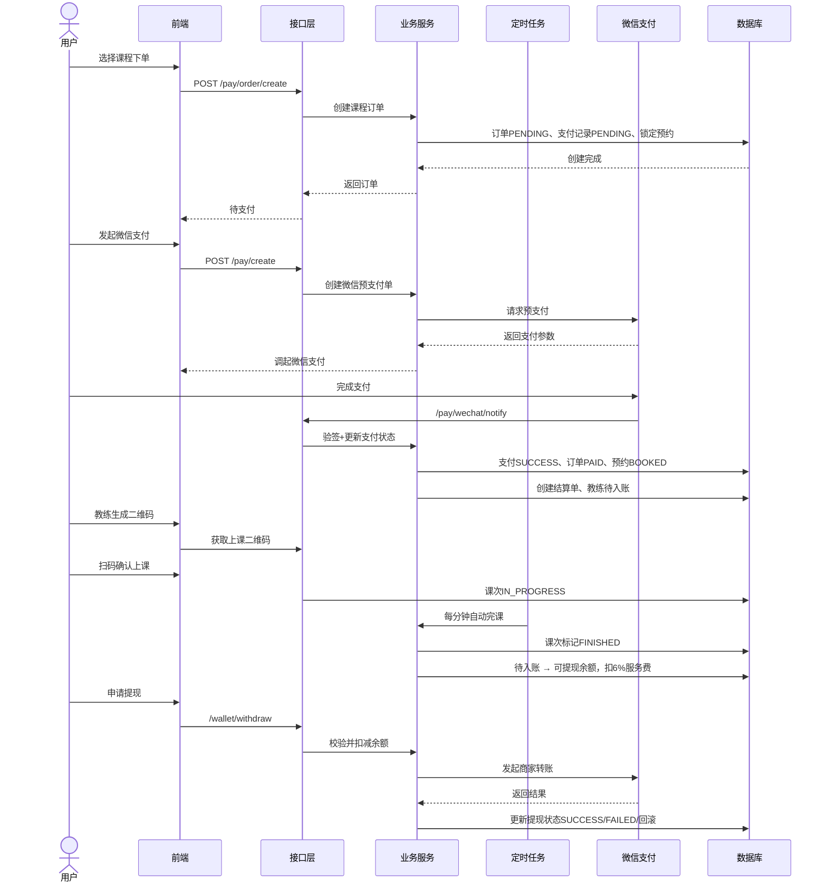

# 网球教练上课支付与钱包结算业务流程文档
## 一、业务链路总览
### 1.1 核心业务链路
用户下单 → 微信支付 → 扫码上课 → 自动完课 → 教练钱包入账（待入账 → 可提现） → 提现到微信零钱

### 1.3 核心接口清单
- 下单创建订单：`POST /pay/order/create`
- 发起支付：`POST /pay/create`
- 微信支付回调：`POST /pay/wechat/notify`
- 上课扫码相关：`/bookings/track-settings/lesson/*`
- 提现接口：`POST /wallet/withdraw`、`GET /wallet/withdraw/{transactionId}/status`

---

## 二、端到端详细流程说明
### 2.1 第一步：用户下单（创建待支付订单）
1. 用户选择课程并提交预约
2. 后端接口 `/pay/order/create` 接收请求
3. 执行业务校验：
   - 不允许购买自己发布的课程
   - 女性友好课程限制校验
   - 单次课必须绑定预约时间
4. 数据库操作：
   - 创建订单 `orders`，状态 `PENDING`
   - 创建支付记录 `payment_records`，状态 `PENDING`
   - 锁定预约时间槽 `booking_records` 状态为 `LOCKED`
5. 返回订单信息，前端进入支付页面
6. 钱包入账特殊规则
    1. 支付成功后：金额先进入教练钱包 **待入账** 状态
    2. 每节课自动完课后：对应课次金额从待入账转为 **可提现余额**
    3. 入账时自动扣除 **6% 技术服务费**

### 2.2 第二步：发起微信支付
1. 用户选择微信支付
2. 调用 `/pay/create`，指定支付渠道 `WECHAT`
3. 后端调用微信支付接口创建预支付单
4. 返回 JSAPI 支付参数，前端调起微信支付
5. 用户完成扫码/密码支付

### 2.3 第三步：微信支付回调与支付成功处理
1. 微信异步回调 `/pay/wechat/notify`
2. 后端验签、解密微信支付报文
3. 更新支付记录为 `SUCCESS`
4. 更新订单状态 `PENDING → PAID`
5. 更新预约记录 `LOCKED → BOOKED`
6. 发布支付成功事件 `PaymentSuccessEvent`
7. 异步后置处理：
   - 创建课次结算单 `payment_lesson_settlements`
   - 为教练生成待入账钱包记录（状态 `PENDING`）
   - 记录用户支出流水
8. 回复微信 `SUCCESS`，完成回调

### 2.4 第四步：扫码上课
1. 教练生成一次性上课二维码（10 分钟有效）
2. 学员扫码并校验：密钥、订单归属、二维码有效性
3. 学员确认上课后，创建课次明细 `course_lesson_details`，状态 `IN_PROGRESS`
4. 课程进入上课中状态

### 2.5 第五步：自动完课与钱包入账（核心逻辑）
1. 定时任务每分钟扫描超时课程，自动标记为 `FINISHED`
2. 触发课次结算：`READY_TO_SHARE`
3. 执行钱包结算：
   - 找到对应待入账金额切片
   - 从待入账余额转入可提现余额
   - 扣除 6% 技术服务费，生成费用流水
4. 更新结算单状态为 `CLOSED`
5. 结算失败支持每 2 分钟重试任务

### 2.6 第六步：钱包提现
1. 用户发起提现 `/wallet/withdraw`
2. 后端校验：登录状态、可提现余额、openid、最低提现金额
3. 数据库操作：
   - 扣减可用余额
   - 创建提现交易记录 `wallet_transactions`
   - 创建提现单 `wallet_withdrawals`
4. 调用微信商户转账到零钱接口
5. 结果处理：
   - 成功：标记提现完成
   - 失败：自动回滚余额
   - 处理中：等待定时任务自动查账
6. 支持主动查询提现状态 + 每分钟自动查账兜底

---

## 三、接口时序图

---

## 四、数据状态机说明
### 4.1 订单状态
`PENDING`（待支付） → `PAID`（已支付） → `PENDING_REVIEW/COMPLETED`（课次结束待评价）

### 4.2 支付记录状态
`PENDING` → `SUCCESS`（支付成功） / `CLOSED`（超时关闭）

### 4.3 课次明细状态
`IN_PROGRESS`（上课中） → `FINISHED`（已完成）

### 4.4 课次结算单状态
`WAIT_LESSON_FINISH` → `READY_TO_SHARE` → `CLOSED`（已结算入账）

### 4.5 钱包提现状态
`PENDING` → `SUCCESS`（提现成功） / `FAILED`（提现失败并回滚）

---

## 五、幂等与兜底补偿机制
1. **支付接口幂等**：使用 `Idempotency-Key` 防止重复创建订单和重复支付
2. **支付成功后置处理幂等**：通过 Redis 打点避免重复入账、重复结算
3. **失败补偿队列**：支付后置处理失败进入 Redis 队列，定时重试
4. **结算重试**：课次结算失败每 2 分钟自动重试
5. **提现双保险**：主动查询状态 + 每分钟自动查账任务，确保状态最终一致

---

## 六、业务核心结论
1. 当前代码完整支持：**用户下单 → 微信支付 → 扫码上课 → 自动完课 → 钱包入账 → 提现** 全链路
2. 教练收入并非支付后立即可提现，而是 **按课次完课逐笔入账**
3. 上课扫码仅标记开始，真正触发结算的是 **定时任务自动完课**
4. 入账时自动扣除 6% 技术服务费，财务逻辑闭环
5. 全流程具备幂等、失败重试、自动查账，生产环境稳定性有保障

---
