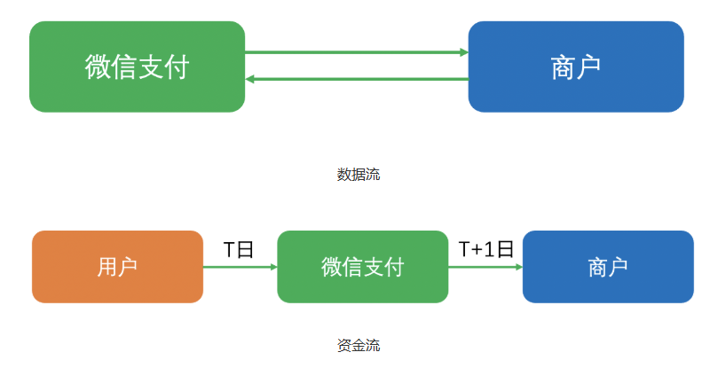
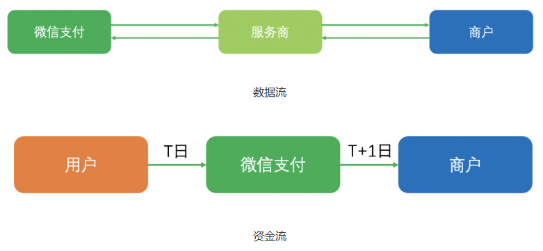

# 接入模式
1. 普通商户（不符合）
    - 用户 -> 微信支付 -> 商户
2. 服务商模式
    - 服务商模式是指针对市面上一些中小型且没有开发能力的商户，由已在微信支付官方注册入驻的系统开发商或解决方案提供商协助这些商户完成入驻，开发及日常运营工作的模式。服务商可前往 服务商平台 完成注册入驻。
    - 商户（教练） -> 服务商（我们） -> 微信支付
    - 用户（学员） -> 微信支付（在这里分账6%） -> 商户（教练）
## 服务商模式
1. 参数名称
参数名	说明
AppID	服务商应用载体的 AppID，可以是公众号或小程序
mchid	服务商在微信侧申请入驻的收款账号（注意：服务商收款账号并不具备收款能力）
API v3 密钥	服务商在服务商平台设置的 API v3 密钥，主要用于对敏感字段信息的加密或解密，具体设置流程请参考各产品接入前准备说明
商户 API 证书	服务商在服务商平台下载的证书，主要用于 API 请求的签名生成及验证，具体下载操作说明请参考各产品接入前准备说明
OpenID	用户在直连商户应用下的用户标示
sp_openid	用户在服务商应用下的用户标示
sub_appid	子商户应用载体的 AppID，可以是公众号，小程序或 App
sub_mchid	子商户在服务商下开通的微信支付收款账户
sub_openid	用户在子商户 sub_appid 下的 OpenID

## 分账
- https://pay.weixin.qq.com/doc/v3/merchant/4012068033

该分支开发清单（你这个分账功能完整闭环）
1. 特约商户（小微）相关
小微商户进件接口（无营业执照个人教练入驻）
进件状态查询接口
分账接收方绑定接口（把平台设为可分账方）
2. 支付下单相关
微信支付统一下单（JSAPI / 小程序支付）
支付结果异步通知（处理订单已支付）
支付结果查询接口（兜底）
3. 分账核心（你要的抽 6%）
单次分账接口（上完一节课分一次）
分账结果查询接口
分账回退接口（退款时用）
4. 订单 & 退款配套
退款申请接口
退款结果查询
数据库建议加的表（顺便给你）
wx_sub_merchant 特约商户 / 小微进件信息
wx_profit_sharing_order 分账单
course_enroll 课程报名 / 上课记录（控制分账时机）

## 1. 特约商户（小微）相关
1. 小微商户进件接口（无营业执照个人教练入驻）
    - https://pay.weixin.qq.com/doc/v3/partner/4012165177
    1. 服务商收集商户资料后，调用小微商户进件提交申请单接口，提交创建入驻申请单；
        1. 不应该让人进来就选role为教练，应该加一个教练认证页面，让教练成为我们的子商户
            1. 步骤 1：基本信息（无需加密）
                1. 教练姓名（后续会加密，这里先收集）
                2. 身份证号码（后续加密）
                3. 手机号（后续加密）
                4. 邮箱（后续加密）
            2. 步骤 2：身份证信息 + 上传
                1. 身份证有效期开始
                2. 身份证有效期结束
                3. 身份证人像面上传（正面）
                4. 身份证国徽面上传（反面）
                - 注意：图片必须前端先调用微信图片上传 API拿到 media_id 再传给后端
            3. 步骤 3：线上经营信息（前端不用让用户填，固定值）
                1. 店铺名称：固定 = 教练姓名
                2. 平台名称：固定 = 上海搭个教练科技有限公司
            4. 步骤 4：结算银行卡（核心）
                1. 开户银行（前端调用微信银行 API 展示下拉框）
                2. 银行卡号（加密）
                3. 开户人姓名（自动回填，不可修改）
            5. 步骤 5：确认提交
                1. 勾选协议
                2. 提交入驻
        2. 需要再加一个子账户状态显示页
            - 微信审核中：请等待微信支付审核
            - 微信审核通过：微信返回一个“商户签约链接”，引导教练去公众号点击确认
            - 教练认证通过： 我们从微信那边拿到了教练的 sub_mch_id 可以下单了

    2. 后端调用小微商户进件API
        1. business_code， 业务申请编号，后端生成
        2. contact_info， 　超级管理员（教练）需在开户后进行签约
            1. contact_name, 教练真名， 该字段需要使用微信支付公钥加密
            2. contact_id_number， 教练身份证号码， 该字段需要使用微信支付公钥加密
            3. mobile_phone， 教练手机号， 该字段需要使用微信支付公钥加密
            4. contact_email， 教练邮箱， 该字段需要使用微信支付公钥加密
        3. subject_info 　教练的营业主体资料
            1. subject_type， 固定为 SUBJECT_TYPE_MICRO
            2. micro_biz_info， 小微辅助证明材料
                1. micro_biz_type， 应该是MICRO_TYPE_ONLINE（线上商品/服务交易）
                2. micro_online_info， 经营场景为“线上商品/服务交易”时填写
                    1. micro_online_store， 填写商家的线上店铺名称（就固定为教练真名好了）
                    2. micro_ec_name， 电商平台名称， 固定为"上海搭个教练科技有限公司"
                    3. micro_qrcode/micro_link, 店铺二维码或店铺连接必须二选一， 先固定填我们的url好了： https://www.dagejiaolian.com
            3. identity_info, 经营者身份证件
                1. id_doc_type， 固定为 IDENTIFICATION_TYPE_IDCARD
                2. id_card_info， 这里的信息必须使用微信的图片上传API， https://pay.weixin.qq.com/doc/v3/partner/4012760490
                    - 可上传1张图片，请填写通过图片上传API预先上传图片生成好的MediaID。
                    1. id_card_copy，String， 身份证人像面照片
                    2. id_card_national，String， 身份证国徽面照片
                    3. id_card_name， 　身份证姓名， 该字段需要使用微信支付公钥加密
                    4. id_card_number 　身份证的号码， 该字段需要使用微信支付公钥加密
                    5. card_period_begin, 身份证有效期开始时间
                    6. card_period_end, 身份证有效期结束时间
        5. business_info, 填写商家的商家简称、客服电话。
            1. merchant_shortname,  在支付完成页向买家展示
            2. service_phone, 客服电话, 教练电话
        6. settlement_info， 结算规则
            - 需要参照《费率结算规则对照表》： https://kf.qq.com/faq/220228IJb2UV220228uEjU3Q.html
            1. settlement_id， 结算规则ID， 固定为 703
            2. qualification_type， 所属行业名称， 固定为 全角空格
        7. bank_account_info， 商家提现收款的银行账户信息
            1. bank_account_type， 账户类型， 固定为 BANK_ACCOUNT_TYPE_PERSONAL
            2. account_name， 开户名称， 开户名称必须与“经营者证件姓名”一致， 该字段需要使用微信支付公钥加密
            3. account_bank， 开户银行
                - 对私银行调用：查询支持个人业务的银行列表API， https://pay.weixin.qq.com/doc/v3/partner/4012697583
                - 对公银行调用：查询支持对公业务的银行列表API， https://pay.weixin.qq.com/doc/v3/partner/4012697626
            4. bank_branch_id，bank_name， 有些银行可能需要支行信息
            5. account_number， 银行账号， 该字段需要使用微信支付公钥加密

    2. 创建申请单后，可通过查询申请单状态接口，获取特约商户签约链接，让商户扫码确认联系信息，后续申请单进度可通过公众号自动通知超级管理员
    3. 微信完成审核后，判断为“待签约”状态，则查询申请单状态接口返回“商户签约链接”。
    4. 服务商引导超管使用微信打开该链接，根据页面指引完成签约。
## 2. 支付下单相关
1. 微信支付统一下单（JSAPI / 小程序支付）
2. 支付结果异步通知（处理订单已支付）
3. 支付结果查询接口（兜底）
## 3. 分账核心（抽 6%）
0. 添加分账接收方
1. 单次分账接口（上完一节课分一次）
2. 分账结果查询接口
3. 分账回退接口（退款时用）
## 4.订单 & 退款配套
退款申请接口
退款结果查询

## 微信分账API
1. 确认接入模式
    - 参考： https://pay.weixin.qq.com/doc/v3/merchant/4012068443
    1. 普通商户模式（境内商户）
        - 
        1. 支付
            - 现在用的就是这个普通商户模式，自己收款，不需要 sub_mchid
        2. 分账
            - 普通商户模式的分账文档： 支持通过openId直接分账给个人微信钱包
                - 文档： https://pay.weixin.qq.com/doc/v3/merchant/4012067962
                - 但最高分账比例为30%， 无法把94%的钱给教练，理由是保护商户资金安全
    2.  服务商模式（合作伙伴平台）
        - 
        1. 支付
            - 但是服务商商户号`本身不具备结算功能`。所有交易资金会直接结算至其特约商户（需要进件）的商户号账户，服务商`无法直接为自己收款`。
            - 也就是说通过服务商商户号调用微信支付接口， `sub_mchid`是必填参数，这会导致教练必须申请 小微商户进件
                - 参考： 服务商商户号支付文档： https://pay.weixin.qq.com/doc/v3/partner/4012085810
                - 测试使用服务商商户号交易商品也会报错： "message":"受理机构必须传入sub_mchid"
                - 开发必要参数说明： https://pay.wechatpay.cn/doc/v3/partner/4013080340?f_link_type=f_linkinlinenote&flow_extra=eyJpbmxpbmVfZGlzcGxheV9wb3NpdGlvbiI6MCwiZG9jX3Bvc2l0aW9uIjowLCJkb2NfaWQiOiJkMTM4MmJiMjQ1YzY4YjBlLWU5MmZiNmZjMDI5NmM0ZGUifQ%3D%3D
        2. 分账
            - 订单收款成功后，资金将被冻结并转入子商户基本账户的不可用余额。服务商可通过请求分账API，将收款资金分配给服务商或其他商户及用户。完成分账操作后，可通过接口解冻剩余资金，或在支付成功30天后自动解冻。
                - 参考 https://pay.weixin.qq.com/doc/v3/partner/4012759974
                    - profit_sharing 字段的描述
            1. 服务商请求分账接口文档： https://pay.weixin.qq.com/doc/v3/partner/4012690683?f_link_type=f_linkinlinenote&flow_extra=eyJpbmxpbmVfZGlzcGxheV9wb3NpdGlvbiI6MCwiZG9jX3Bvc2l0aW9uIjowLCJkb2NfaWQiOiJmMjE0ZTE0N2VkMmQwYjZlLWQzNGMyOTRiNzgwODlmMzcifQ%3D%3D
                - `sub_mchid`是必填参数
2. 服务商模式下的分账流程
    - 参考文档： https://pay.weixin.qq.com/doc/v3/partner/4012072582?f_link_type=f_linkinlinenote&flow_extra=eyJpbmxpbmVfZGlzcGxheV9wb3NpdGlvbiI6MCwiZG9jX3Bvc2l0aW9uIjowLCJkb2NfaWQiOiIyN2U2YjJkNTY4YWU2ZDA4LWFmNjMzZDg4YTdhMWI2NDQifQ%3D%3D
    1. 用户与特约商户（教练）交易
        - 交易成功后，订单资金扣除微信支付手续费后先冻结，等待分账
    2. 当服务商或商户判断已达到分账条件，比如用户确认收货后，服务商发起分账指令（分6%给服务商），订单资金解冻分给相关分账方。
    3. 服务商分账功能需要特约商户`授权`且`设置`允许服务商分账的最大比例
        - 教练授权，但是我们会要求他接受百分之六的比例