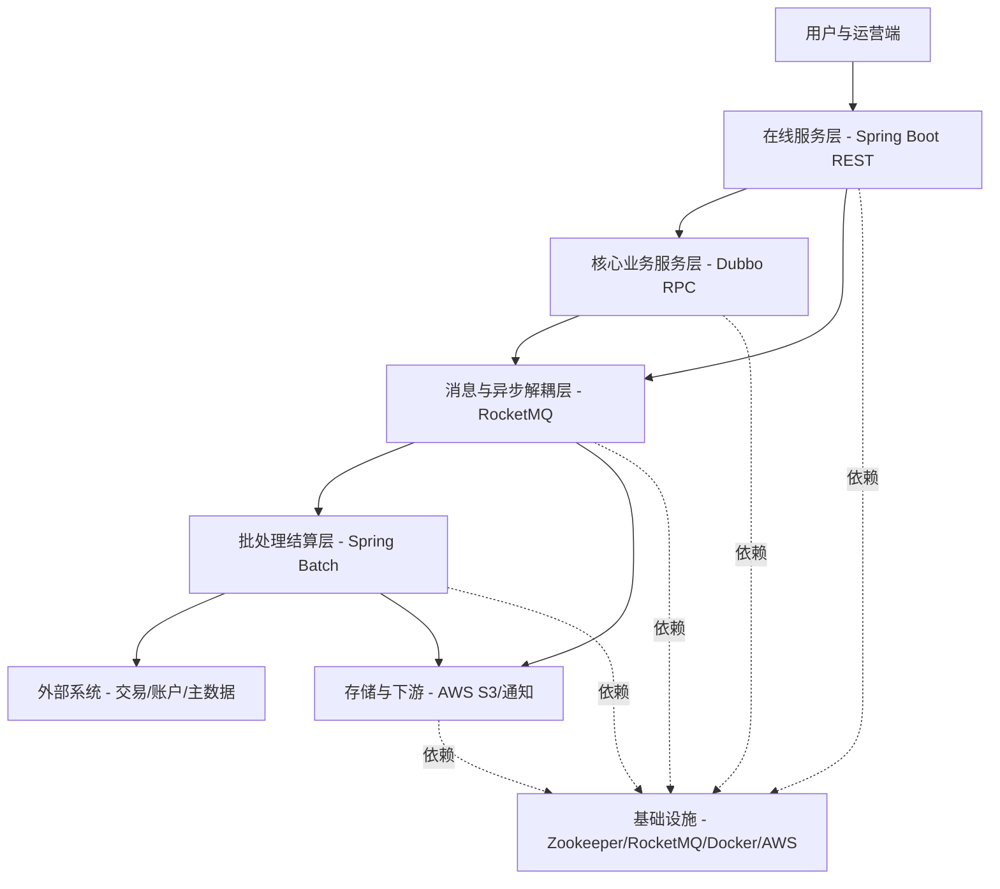

#

# 简历
- 项目名称：加盟商收益结算平台
- 项目介绍：公司线下业务拓展的核心结算平台，覆盖加盟商入驻申请、签约、日终收益自动精算、月度对账结算与支付的全生命周期管理， 确保资金结算准时、订单可追溯、系统易运营。
- 涉及技术：Spring Boot，Spring Batch，Dubbo（RPC），RocketMQ（事件/定时/异步解耦），Docker / Docker-Compose，AWS（S3 等），Zookeeper（Dubbo 注册中心），分布式任务与批处理。
1. 我的工作:
    1. 高可靠批处理与对账精算模块（
        1. 负责基于 Spring Batch 的批处理模块开发，通过 RocketMQ 定时/延迟消息触发日终精算，形成稳定的任务调度链路.
        2. 批处理过程中通过 Dubbo 远程调用交易服务与账户服务获取原始数据，完成清洗汇总与核算计算，并输出日/月报结果供下游流程使用。
    2. 核心业务 API 与服务开发
        1. 参与基于Spring Boot + 构建加盟商管理服务，对外Dubbo提供RPC接口供内部系统调用，对内通过REST API支撑加盟商端与运营后台，实现了收益查询、结算明细、入驻审核等核心业务的全链路闭环。
        3. 针对高频查询接口进行滚动加载处理，提升查询稳定性与响应速度。
    3. 云平台部署与分布式环境支持
        1. 使用 Docker-Compose 搭建本地分布式联调环境（Dubbo 服务、RocketMQ、业务应用等），提升联调与问题复现效率。
        2. 参与 AWS 测试环境的配置与部署，维护 Zookeeper 注册中心与 RocketMQ 集群接入，保障服务治理与消息链路稳定。

# 面试
- 我最近做的项目是一个加盟商收益结算平台。就是公司线下业务扩张以后，加盟商每天会产生交易，我们要把这些交易记录下来，每天计算出精算结果，到月末再做月度结算和打款。这个系统就是把从“加盟商入驻、签约”一直到“每天算钱、月底结算”的流程都串起来。

- 主要分成三大模块, 加盟商在线服务、定期的批处理结算、外部的主数据系统。

- 第一块是加盟商在线服务, 我们用 Spring Boot 做 后台接口 给加盟商和内部管理使用，比如结算明细查询、收益一览, 收益分成申请这些。
    - 这层的特点是“响应要快、接口要稳定”，所以像一些复杂统计查询我会尽量下沉，避免把重计算都放在在线请求里。
    - 为了保护加盟商信息等核心业务数据的安全，我对系统进行了服务化拆分。将加盟商信息、合同管理等敏感且独立的业务模块拆分为专门的服务进行部署，并通过 Dubbo 的 RPC 接口对外提供能力。前端（包括加盟商端和内部管理后台）的 REST API 仅处理界面交互和简单逻辑，涉及核心数据或复杂统计的业务（如收益分成申请、结算明细查询、收益总览）均通过 Dubbo 调用后方独立的服务完成。这样既保障了数据安全与模块化，也提升了接口的职责清晰度和系统可维护性。

- 第二块是定期执行的批处理模块，也是这个系统最关键的部分。核心用 Spring Batch 跑每日精算、月度汇总之类的任务。定时触发Batch的功能, 是用 RocketMQ 的定时/延迟消息队列来触发。
    - 任务跑起来后，会通过 Dubbo的RPC接口 去 外部的交易服务、账户服务模块, 把原始数据拉回来（不同支付渠道规则不一样，比如 nanaco、WAON、交通系），然后做对账和收益计算，最后生成日/月报的 CSV 文件 并且上传到 AWS 的S3存储服务上 ，我们会再发一个“报表好了”的消息，下游服务收到后，然后通知业务方。

- 第三块是存放 加盟商信息、合同管理信息等敏感信息的主数据系统，我们用 Dubbo 去对接的。
    - 像是Batch任务跑起来后，会通过 Dubbo的RPC接口 去 外部的主数据系统进行交互, 把需要处理的原始数据拉回来（不同支付渠道规则不一样，比如 nanaco、WAON、交通系），然后做对账和收益计算.
    - 这样做的好处是：主数据由外部主数据系统进行统一管理，我们这边只做结算和运营支撑，职责更清晰，也便于复用和治理。

- 总结一下: 在线服务模块用Spring Boot 负责实现后端接口，批处理模块用Spring Batch 负责周期性地跑金额精算处理，Dubbo 负责把我们和外部主数据系统连起来, 这样的一个系统

# 主链路示例
1. 加盟商在线查询“结算明细”（在线层为主）
    1. 加盟商端发起请求：调用 Spring Boot 的 REST API（结算明细/收益一览）。
    2. 若需要加盟商状态/合同条款/分成规则等基础数据，在线服务直接查询数据库后返回结果, 
    3. 如果涉及加盟商的详细信息、合同信息等等, 则需要通过 Dubbo 调用外部主数据管理系统获取。
    4. 在线服务将查询到的结果做分页封装 与 VO 转换，返回给加盟商前端展示。
2. 日终精算→产出结果→供在线查询（批处理层为主）
    1. 到指定的执行时间点，RocketMQ 定时/延迟消息触发 Spring Batch 任务启动。
    2. 批处理任务, 通过 Dubbo 的接口 调交易服务/账户服务获取原始交易流水与账户信息, 然后讲原始数据进行汇总、对账与收益核算，把结果保存到数据库，并生成日/月报文件上传到AWS的S3里面。
    3. 批处理完成后发送“报表就绪/结算完成”事件（RocketMQ），由下游服务异步上传到 S3 并通知业务方（如果你们有这段）。
    4. 次日加盟商端查询时，在线服务直接读“已算好的结果”（而不是现场计算），保证查询稳定、响应快。

# 问答
1. 为什么用 RocketMQ 触发？
    - 主要是为了自动化和解耦。到点触发、失败重试、下游处理都更顺，批处理也不用跟接口服务绑死。
2. 为什么不用Status保存JOB的状态
    - 我想主要原因是为了减少查询数据库的次数, 毕竟为了只是为了一个Status字段就频繁地查询数据库可能对前端的性能有影响
    - 使用RocketMQ之后, 就等收到完成消息后再去更新返回状态结果, 确保在Batch运行期间, 查询的操作只发生一次
2. 怎么算“没算错”？
    - 一方面按渠道规则拆开算，避免混在一起；另一方面结果落库和报表输出前会做一致性校验，任务也有记录，方便追溯。
3. RocketMQ, 重复消息怎么办？
    - 我用的是一套统一的数据库唯一约束的方案确保Batch只执行一次, 用一些当前的Batch任务的唯一字段组成一个组合键,  アクワイアラー番号 + 业务ID + 执行日期
        - アクワイアラー番号”在您的年金申请中，极有可能就是指向您的收款银行信息
    - 消费者(Batch系统)收到消息后，第一步不是执行业务，而是先去数据库插入一条“去重记录”
        - 如果插入成功，说明这件事第一次处理，才继续跑后面的结算/取消/上传；
        - 如果插入失败（唯一键冲突），说明已经处理过了，就直接返回，保证不会重复执行。
    - 如此一来, 数据库唯一约束保证只有一个插入成功，另一个会收到唯一键冲突，直接判定为重复处理并退出

# 我的问题
1. RocketMQ有定时队列功能吗?
    - 学一下RocketMQ
2. SpringBatch分两种
    - 复习一下SpringBatch
    - Chunk?

