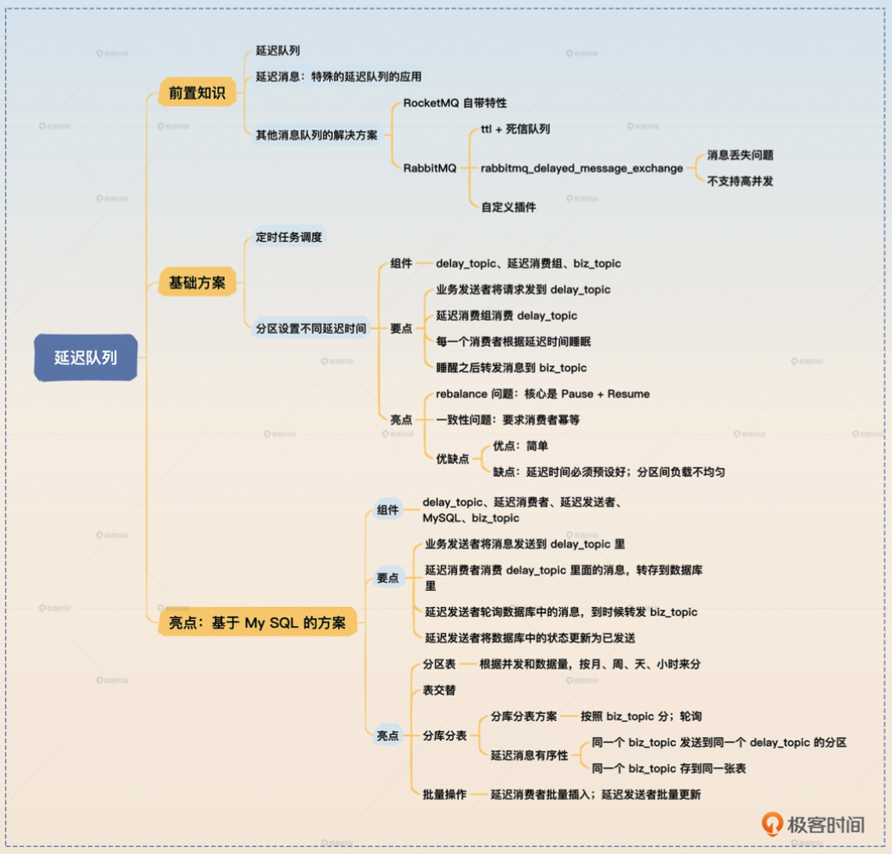

- 
## 你在做这个项目时遇到过哪些问题
    - https://wx.zsxq.com/group/48418884588288/topic/185425252544152

## 自我介绍
1. 请做自我介绍
    1. 您好，我叫谷沛航，拥有 6 年 Java 后端开发经验，负责过`分布式与微服务架构系统`开发与落地，尤其在`类金融清算结算和电商交易平台`等领域有丰富实战经验。
    2. 我之前开发过过多个Java项目：
        1. 比如在最近的「`加盟商收益结算平台`」，我主要负责`精算与对账的日终批处理模块`的开发, 
            - 这是一个基于 Spring Batch 搭建批处理模块，首先通过 RocketMQ 延迟消息队列`触发调度`，再借助 Dubbo 的RPC接口从`外部主数据系统`获取原始数据，再对数据进行`清洗、汇总与核算`后，将数据结果输出日报 / 月报并上传云端, 以供下游业务使用.
        2. 除了批处理模块以外, 我还开发了`收益查询、结算明细等 查询类API`，针对高频查询场景, 做了分页与滚动加载优化处理，显著提升了接口响应性能与稳定性。
    4. 除了这个项目以外，我还参与过云平台 Kubernetes 环境构建，以及电商交易系统中`订单超时取消`与`库存补充回滚`等关键功能的实现。
    5. 这些经历让我对批处理、分布式事务处理，以及数据一致性与补偿机制的实现有着丰富的实践经验。
    6. 基于以上经历，我认为我的技术栈和项目经历与贵司岗位要求高度契合，因此非常希望能加入团队，期待后续进一步沟通！

2. 请介绍一个你最近的项目
    1. 我之前做过最有挑战性的项目，是加盟商收益结算平台的开发，
    2. 我在其中核心负责`精算与对账的日终批处理模块`，从业务设计书撰写、代码开发，到后续的单元测试、联调全流程都是独立完成的。这个模块基于 Spring Batch 搭建，核心是通过 RocketMQ 延迟消息队列触发任务调度，再通过 Dubbo RPC 接口从外部主数据系统拉取原始数据，完成数据清洗、汇总与精算后，生成日报、月报并上传云端，供下游业务系统调用，是整个结算平台的核心底层模块。
    3. 这个项目的挑战主要集中在`新技术落地`和`保障业务稳定性`两方面，也是我重点解决的核心问题：
        1. 新技术落地
            1. 首次用 RocketMQ，业务上要求下单后, 根据下单时间到晚上0点的时间差的来做一个延迟触发Job, 但是后来发现RocketMQ不支持任意指定延迟时间, 而是用一个默认延迟级别, 比如...
            - 无法按小时精准触发批处理，我通过自定义 Broker 延迟级别配置，重映射时长并封装枚举类，解决了精准触发问题
        2. 业务稳定性
            - RocketMQ 怎么保证`消息不丢失`？`消息不重复`
            - `Dubbo` 调用外部时，遇到过`服务调用超时`或者`服务不可用`

## 问题
### 一、 技术深度类（针对项目核心技术栈）
0. 如何用RocketMQ进行触发调度批处理
    1. 计算延迟时长`匹配` RocketMQ 延迟级别, 按小时计算, 并不会精确到某一分钟
        - 我们项目的延迟级别的配置是自定义的,1级就是一小时
        - 修改Broker的 messageDelayLevel的参数
    2. 月末则是根据第一次执行的JOB来计算一下具体的处理日期
1. RocketMQ 怎么保证`消息不丢失`？`消息不重复`?如果`job失败`怎么办
    0. 首先有两次发送行为
        1. 第一次是用户登记数据后, 使用延迟消息队列来触发晚上batch执行
            - `同步发送`,  
        2. 第二次是batch执行后, 通知前端修改发票状态
            - `事务消息`, 
    1. 消息不丢失
        - 核心是按 `至少一次投递`（at-least-once）+ 可重试 + 幂等 来设计
        1. `同步发送`, 等待消息返回后再继续执行后续操作, 发送失败要重试
        2. `事务消息`, 确保业务落库后再发触发消息
    2. 消息不重复(消息是可能重复的)
        1. 消费端触发幂等
            - 有一个专门存储batch各个job状态的表格, 用`job_name, biz_date, attempt(尝试次数)`组成一个唯一键, 若无法插入唯一键, 则判定为重复消费, job无法执行
            - job开始后将`状态`改成processing
        2. 若job失败, 如果失败, 通常是第二天再执行, 也可以手动修改job的参数(次数)来重跑

2. 用 `Dubbo` 调用外部交易与账户服务时，遇到过`服务调用超时`或者`服务不可用`的问题吗？当时是怎么解决的？有没有用到 Dubbo 的降级、熔断机制？
    - 保护自身 + 保证可恢复 + 不影响核心链路”来设计
    1. API接口模块
        1. 超时: 缩短超时 + 快速失败 + 返回可控错误
            - API模块对主数据强一致要求很高, `不便于做缓存`, 因此我们是“快速失败型降级”：`设置很短的超时(5s)并快速返回`. 但并没有熔断的操作, 下一步如果要系统化提升，我会补上基于错误率的熔断与并发限流，让故障期间不再持续打穿外部服务。
    2. Batch模块
        1. 读取数据时:
            - 作业开始先把当日需要的主数据一次性拉取下来(通过Dubbo接口)，生成`本地快照`(也是数据库中一个表格), 后续都读取这个快照的数据, 
            - 如果执行失败, 则由于后续Job操作的SELECT不能为空, 自动失败
3. 你提到对高频查询接口做了`分页和滚动加载优化`，除了这个，还有哪些提升接口性能的手段？在你的项目里有没有实际落地过？
    1. 为什么有两套
        1. 分页`pageNo/pageSize`, `运维员查询: 某个地区的加盟商一览`筛选条件多、用户会频繁改筛选并在结果中跳页
        2. 滚动`start/count`, `加盟商查询: 收益流水、结算明细`, “浏览型”的明细列表
    2. 还有哪些?
        1. 可能会给 merchant_id,  update_time等`高频字符做索引`
        2. 如果对`数据一致性`要求不高的情况下, 会做`缓存`, 然后从缓存查询
## K8S
4. 在 K8s 云平台构建项目中，你是怎么设计多环境（开发 / 测试 / 生产）的`隔离策略`的？
    1. `集群方面`: 开发 / 测试环境复用一套 K8s 集群（节省资源），生产环境单独部署独立集群（保障安全性和稳定性）
    2. `命名空间级隔离`: 即使开发 / 测试复用集群，也会按环境划分专属 Namespace：dev-清算平台、test-清算平台、prod-清算平台（生产集群单独的命名空间）。每个 Namespace 配置`独立的资源配额`（Resource Quota），比如开发环境限制 CPU / 内存使用量
5.  Helm Chart 打包时，你是怎么管理不同环境的配置差异的？
    - Helm是K8s 的包管理工具，将 K8s 资源（如 Deployment、Service）打包成 “Chart”
    1. 基础层：默认 Values.yaml 维护通用配置
        - 服务端口、镜像基础路径、容器启动命令
    2. 环境层：拆分环境专属 Values 文件：
        - values-dev.yaml（开发）, 主要是数据库端口
        - values-prod.yaml（生产）
    3. 部署时通过-f参数指定环境专属配置文件
        - helm install 清算平台 ./chart -f values-prod.yaml -n prod-清算平台

5. 电商订单系统里，你做的`订单超时取消`与`库存补充回滚`吧，是怎么保证数据一致性的？有没有遇到过库存回补失败的情况？怎么处理的？
    1. 订单超时取消:
        1. 用的是Redis的`键空间通知`, 下单成功后，写入一个带超时时间的Key。Redis key 过期后，通过`键空间通知`接收过期事件，触发订单取消逻辑, 关闭未支付订单。
            - 选择原因：实现简单、延迟触发成本低、无需额外调度系统；并发下由数据库条件更新兜底保证一致性。
        2. 其次, 在各个查询订单的页面, 都有当前时间小于过期时间的查询条件, 避免消息消费失败
    2. 库存补充回滚
        1. 一方面是订单取消后会触发会滚逻辑
        2. 另一方面是使用`Spring Schedule`, 每天校验订单状态
            - @Scheduled(fixedRate = 24 * 60 * 60 * 1000)

### 二、 项目细节类（深挖你负责的模块）
1. 加盟商结算平台的日终精算模块，具体的核算规则是怎样的？数据量大概有多大？批处理任务如果执行失败，你是怎么设计重试和告警机制的？
    1. 核算规则: 基础收益+补贴
        1. 通过 Dubbo 从主数据系统获取加盟商当日门店交易流水（如订单量、客单价）、基础佣金比例；
        2. 算核心收益：基础收益 = 交易流水 × 佣金比例，再叠加平台补贴（如新店补贴、业绩达标奖励）；
        3. 我口述比较简单, 实际上加盟商分为nanaco, 永旺, 交通系等等不同品牌, 不同品牌的计费方式也有所不同
    2. 数据量
        - 这个涉及商业机密, 不过考虑到加盟商分为nanaco, 永旺, 交通系等等不同品牌, 每个加盟商可能又有上千家门店, 一个区域的数据可能在200万条以上 
    3. 重试
        - SpringBatch分为 `拉取数据`->`清洗核算`->`生成台账`这三步, 每一步都会生成一个切片文件上传至AWS的S3里面, 因此失败后, 只需要从失败的步骤重跑即可, 没有自动重跑机制, 失败后需要人工干预
2. 你在结算平台里输出的日报 / 月报 CSV 文件，是怎么保证数据准确性的？有没有做过数据校验？如果下游业务反馈数据有问题，你是怎么排查的？
    - 生成 CSV 后，先统计文件中所有加盟商的总结算金额，与数据库中当日精算总金额比对，误差超过 0.01 元就触发拦截，重新生成文件，确保总量一致。
    1. 一旦出现数据错误的话
        - 可以通过 CSV 文件中的`唯一标识`（加盟商 ID + 结算日期）来锁定出错的加盟商信息, 然后调取该加盟商的全量中间数据 —— 包括原始交易流水、精算 Step 的每一步计算结果、状态表记录，锁定异常环节（比如是基础数据拉取错误，还是核算规则应用错误）；
3. 在 K8s 环境部署 Pega 系统时，有没有遇到过第三方组件兼容性问题？你是怎么和 Pega 原厂沟通解决的？
    1. K8s 集群部署 3 个 Pega Platform 节点 + 2 个 Constellation 节点后，前端调用UI接口时，有概率请求出现 “会话失效” 报错，刷新页面后又恢复；
    2. 通过 K8s 的 Pod 日志和 Pega 的节点监控发现，Constellation 的 WebSocket 连接会绑定固定 Pega Platform 节点，但 Platform 集群的会话同步在 8.8 版本中对 Constellation 的会话标识支持不全，跨节点调用时无法识别会话，触发失效。
    3. 解决:
       1.  整理完整的环境信息（K8s 版本 1.24、节点资源配置、网络策略）、问题复现步骤（如触发结算核算的操作路径）、日志片段（会话失效的具体报错码），通过 Pega 原厂的企业级支持通道提交，明确标注 “8.8 版本集群下 Constellation 与 Platform 会话同步冲突”；
       2. 原厂确认是 8.8 版本的已知兼容性缺陷，提供临时修复补丁
4. 电商订单的补偿回滚链路里，你是怎么设计 “订单取消 - 库存回补 - 优惠券释放” 这个流程的？有没有考虑过分布式事务的场景？

### 三、 业务迁移能力类（针对保险岗的核心痛点）
1. 你没有保险行业经验，但你做的类金融清结算和保险理赔的 “算理核损” 有相似性，你觉得这两个业务在技术实现上最大的异同点是什么？
2. 如果让你把加盟商结算的批处理精算逻辑，迁移到保险理赔的 “案件理算” 场景，你会重点关注哪些改造点？
3. 保险理赔系统对数据的准确性和可追溯性要求极高，你过往的项目里，有没有做过相关的数据审计或日志追溯的功能？具体是怎么做的？

### 四、 综合软实力类
1. 你在项目里是偏向独立开发，还是会参与团队的技术方案评审？如果评审时和同事的技术方案有分歧，你是怎么处理的？
2. 你觉得从开发一个类金融系统，到开发一个保险核心系统，最大的挑战是什么？你打算怎么快速弥补保险业务知识的短板？
3. 你未来 3 年的技术规划是什么？如果加入我们公司，你希望在哪些技术方向上深入发展？
    1. 技术深耕方向：目前已熟练掌握 Dubbo+Spring Batch 等微服务相关技术，未来 3 年想重点深耕 Spring Cloud 生态（如 Nacos 服务注册发现、Sentinel 流量控制、Seata 分布式事务），因为 Spring Cloud 在微服务治理的扩展性、兼容性上更适配复杂业务场景（比如类金融清结算平台的多服务协同、流量峰值管控）；同时会持续学习云原生技术（GCP/AWS 上的 K8s 进阶用法、容器化部署优化），提升从 “代码开发” 到 “云端交付” 的全链路能力，目标是成为微服务 + 云原生领域的技术专家。
    2. 职业角色发展：短期（1-2 年）：结合带新人的经验，主动承担 “技术导师” 角色，比如主导团队内微服务技术分享、协助新人解决批处理 / Dubbo 相关技术问题，积累团队协作和知识传递经验；中期（3-5 年）：希望转型为团队 Leader 或技术型项目经理，不仅负责核心模块开发，还能参与项目需求拆解、任务分工（比如基于成员技术背景分配微服务模块 / 批处理任务），推动团队技术规范落地（如统一 Helm Chart 配置管理、批处理故障排查流程），同时协调前后端 / 测试资源，保障项目高效交付，最终成长为能兼顾技术深度和团队管理的复合型人才。

### 面向不懂技术的
1. Dubbo 是高性能 Java RPC 框架，核心用来解决微服务架构下 `服务间远程调用` 的问题，对比传统的 HTTP 接口，它基于 `TCP 协议`通信，调用效率更高，特别适合高并发、低延迟的业务场景。
我在加盟商结算平台项目中深度用过 Dubbo：比如批处理模块需要从外部主数据系统拉取加盟商交易流水，就通过 Dubbo 的服务注册发现（注册中心用 Zookeeper），`让消费端快速找到主数据服务的提供者`；同时配置了超时控制（5 秒）、失败降级、重试机制，避免外部服务不可用导致批处理任务中断；还用到了 Dubbo 的序列化（Hessian2）和监控功能，保障调用的稳定性和可观测性。
简单说，Dubbo 的核心优势是高性能、易扩展、配套能力全，能很好支撑微服务间的远程通信，也是国内微服务架构中非常主流的技术选型。
2. 什么情况要用微服务框架
    1. 主要是看业务规模, 看看是不是`单体架构已无法支撑当前业务`
    2. 其次看业务内容, 是不是类似于电商平台那样有交易高峰期, 某个时间点有`高并发、高流量`的情况, 微服务可以做水平扩容
    3. 再然后看是不是跨团队协作的项目, 项目间的通讯, 流量的转发需要用到微服务框架
3. 你最近一年主要负责的模块是什么？线上QPS/数据量/故障类型各是什么？
    1. QPS 就是每秒查询率，简单说就是系统每秒能处理的请求数量，是衡量系统接口 / 服务处理能力、并发性能的核心指标，数值越高，说明系统扛高并发的能力越强。
        - 由于我离开项目时,项目尚未上线, 因此我不确定有多少
    2. 故障
        1. 外部依赖类故障
            1. Dubbo 接口超时, RocketMQ重复消息等问题
        2. 数据校验类异常
            1. 一开始开发的时候有遇到过加盟商交易流水存在错误数据(金额为负), 
                - 将整个Job分为 `拉取数据`->`清洗核算`->`生成台账`, 每一步都会生成当前数据的切片文件保存, 从而降低了出现错误数据后的排查难度以及批处理重跑的难度

4. 特大BUG
    1. 现象: 有一次新版本上线后, 前端的同事反映说各个查询页面都特别缓慢, 而且在一段时间后返回系统错误信息
    2. 解决:
        - 先看平台监控：发现 Dubbo 调用外部主数据系统的接口超时率异常，其他模块无报错，排除集群 / 服务器资源问题,「加盟商交易流水查询」接口时，大量出现「socket read timeout」，且调用耗时从正常 500ms 飙升至 5s+；
        - 我们根据这次差分更新的内容, 发现当日`交易流水查询接口`新增了「门店类型」筛选条件
        - 通过联系主数据系统团队, 了解到他们团队并没有对该字段对该字段建索引，直接导致查询效率暴跌, 以至于触发了Dubbo的超时时间
    3. 后续
        - 后续协调对方建索引重新推送更新, 我们后端团队和前端团队重新测试, 最终解决了这个问题
5. 你的优点
    1. 我现阶段的核心强项是`稳定性系统的设计`，其次是`业务交付`,原因是我过往的项目（加盟商结算平台日终精算、电商订单 & 库存回滚）都对数据一致性与补偿机制的实现有严格要求, 而且我也见过不同项目针对这类问题的处理办法. 如果我现在来设计一个系统的话
        1. 从设计阶段就植入稳定性思维
            - 比如精算模块依赖外部 Dubbo 接口，就设计本地快照 + 失败降级
            - 电商库存回滚用 Redis 过期通知，就加定时任务兜底 + 分布式锁控并发，
        - 从源头规避线上故障，而非出问题后再补救