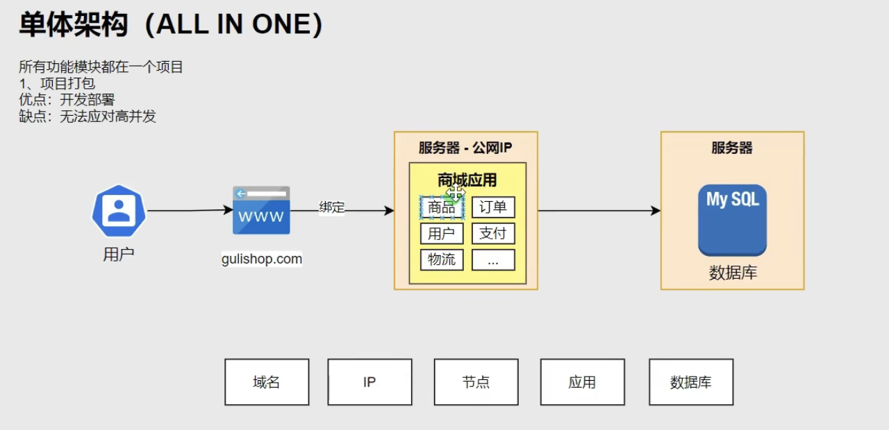
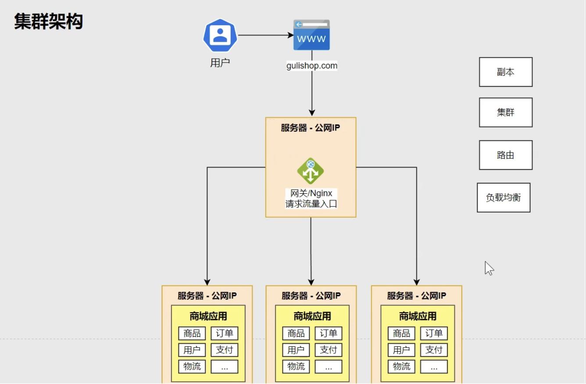
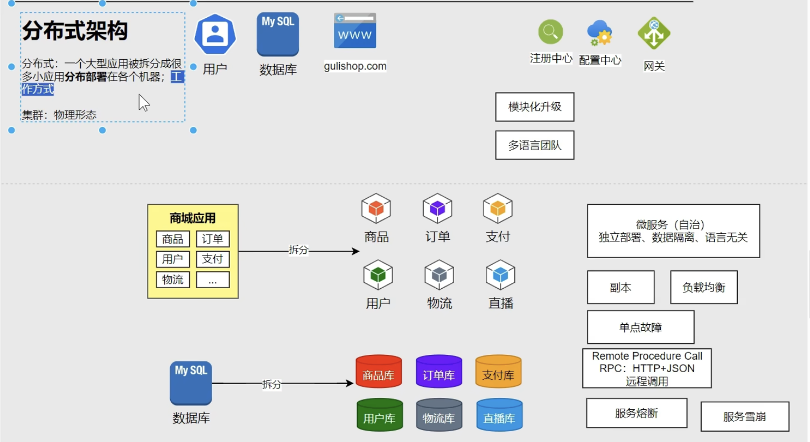
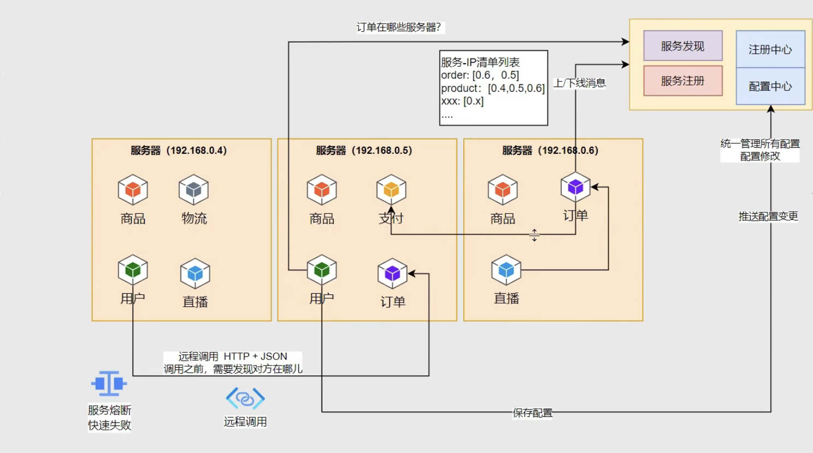
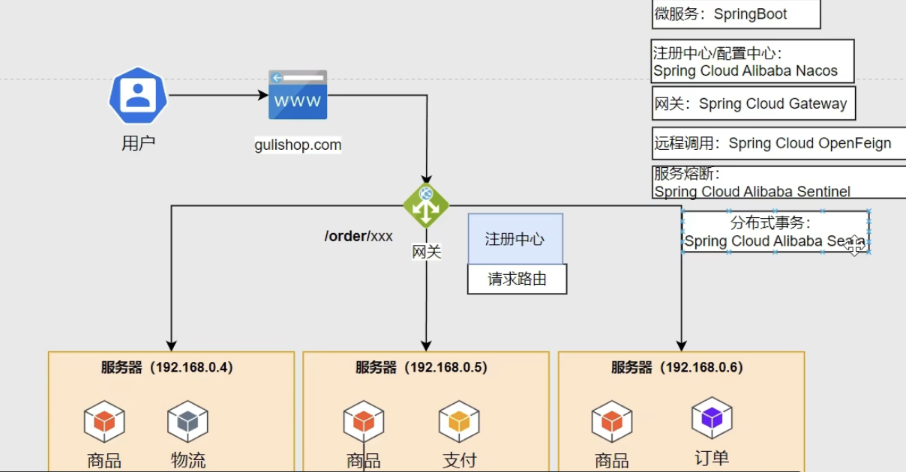

# 单体架构, 集群架构, 分布式架构
1. 单体架构, 大量用户访问时可能卡死
    - 
2. 集群架构, 用户量大的时候可以扩容(增加服务器副本)
    - 副本, 集群, 路由, 负载均衡, 扩缩容
    - 
3. 分布式架构
    - 把整个应用根据功能拆分成多个微服务, 每个微服务都可以独立部署, 数据库也可以进行拆分
    - 服务注册, 服务发现, RPC, 服务熔断, 服务雪崩
    - 注册中心, 配置中心
    - 
    - 
    - 